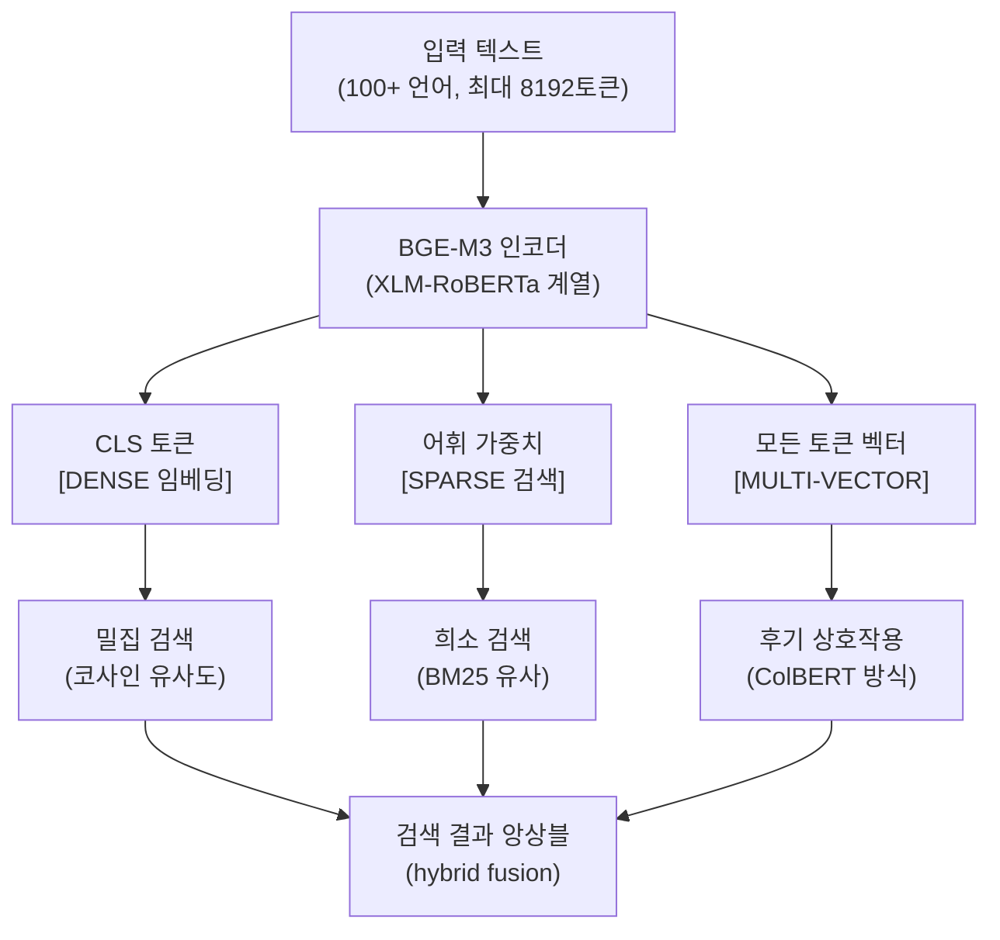
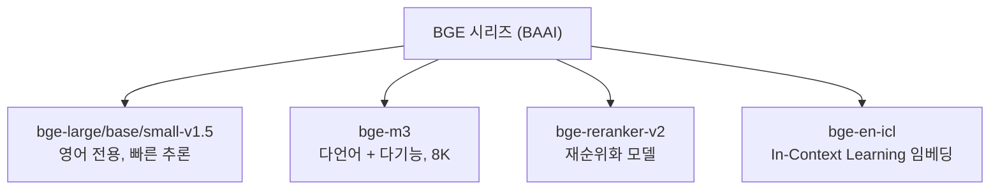

# BGE-M3 - BAAI 다기능 임베딩

## 개요

**BGE-M3**는 중국 인공지능 연구원(BAAI, Beijing Academy of Artificial Intelligence)이 개발한 임베딩 모델로, 이름의 "M3"는 세 가지 다기능성을 뜻한다:

1. **Multi-Lingual** (다언어): 100개 이상 언어 지원
2. **Multi-Functionality** (다기능): Dense + Sparse + Multi-vector 검색 동시 지원
3. **Multi-Granularity** (다입도): 8,192 토큰 장문 처리

단일 모델이 세 가지 검색 패러다임을 모두 지원한다는 점이 가장 독특한 특징이다. [[dense-retrieval]], [[dense-sparse-hybrid-retrieval]], ColBERT 방식의 다중 벡터 검색([[colbert-late-interaction]])을 하나의 모델로 처리할 수 있다.



BGE-M3는 단일 모델로 세 가지 검색 방식을 동시에 지원하며, 앙상블 시 최고 성능을 발휘한다.

---

## 핵심 사양

| 항목 | 값 |
|------|-----|
| 모델 파라미터 | ~570M |
| 임베딩 차원 (Dense) | 1,024 |
| 최대 시퀀스 길이 | 8,192 토큰 |
| 지원 언어 | 100개 이상 |
| 라이선스 | MIT |
| 기반 아키텍처 | XLM-RoBERTa 계열 |

---

## 세 가지 검색 모드 상세

### 1. Dense Retrieval (밀집 임베딩 검색)

CLS 토큰의 표현을 전체 문서의 단일 밀집 벡터로 사용한다. 가장 빠르고 저장 효율이 좋다.

```python
from FlagEmbedding import BGEM3FlagModel

model = BGEM3FlagModel("BAAI/bge-m3", use_fp16=True)

# Dense 임베딩 생성
sentences = ["RAG 시스템 구축 방법", "벡터 검색 최적화"]
output = model.encode(sentences, return_dense=True, return_sparse=False, return_colbert_vecs=False)
dense_vecs = output["dense_vecs"]  # shape: (2, 1024)
```

### 2. Sparse Retrieval (희소 어휘 검색)

각 어휘 토큰에 대한 **중요도 가중치(importance weight)**를 출력한다. BM25와 유사한 방식으로 정확한 키워드 매칭에 강하다.

```python
output = model.encode(sentences, return_dense=False, return_sparse=True, return_colbert_vecs=False)
lexical_weights = output["lexical_weights"]

# 딕셔너리 형태: {토큰_id: 가중치}
# 예: {15234: 0.82, 3456: 0.61, ...}
```

희소 임베딩의 장점:
- 희귀 용어, 고유명사, 코드, 제품명 등 정확 매칭에 강함
- BM25보다 더 정교한 가중치 계산
- Dense와 상호보완적

### 3. Multi-Vector Retrieval (다중 벡터 = ColBERT 방식)

입력 텍스트의 **모든 토큰에 대한 벡터**를 생성한다. 쿼리와 문서 간의 토큰 수준 후기 상호작용(late interaction)으로 정밀한 관련성을 계산한다.

```python
output = model.encode(sentences, return_dense=False, return_sparse=False, return_colbert_vecs=True)
colbert_vecs = output["colbert_vecs"]  # shape: (2, seq_len, 1024)

# MaxSim 스코어 계산
# score = sum(max(q_tok @ d_tok.T) for q_tok in query_tokens)
```

다중 벡터의 장점:
- 세밀한 토큰 수준 매칭으로 최고 재현율
- 단, 저장 공간이 Dense의 seq_len배 필요

---

## 앙상블 전략 (M3-Hybrid)

세 가지 검색 방식을 앙상블하면 단일 방식보다 훨씬 좋은 성능이 나온다:

```python
from FlagEmbedding import BGEM3FlagModel

model = BGEM3FlagModel("BAAI/bge-m3", use_fp16=True)

# 세 가지 검색 결과 동시 생성
output = model.encode(
    queries,
    return_dense=True,
    return_sparse=True,
    return_colbert_vecs=True
)

# 가중 앙상블 (일반적 권장 비율)
def hybrid_score(dense_score, sparse_score, colbert_score,
                 w1=0.4, w2=0.2, w3=0.4):
    return w1 * dense_score + w2 * sparse_score + w3 * colbert_score
```

---

## BGE 시리즈와의 관계

BAAI의 BGE(BAAI General Embeddings) 시리즈는 M3 외에도 여러 모델을 포함한다:



### BGE v1.5 vs M3 선택 기준

| 상황 | 권장 모델 |
|------|----------|
| 영어만, 512토큰 이하, 빠른 속도 | bge-large-v1.5 |
| 다국어, 한국어 포함 | bge-m3 |
| 8K 이상 장문 처리 | bge-m3 |
| Dense + Sparse 앙상블 필요 | bge-m3 |
| 재순위화 | bge-reranker-v2 |

---

## MTEB 성능

BGE-M3는 다국어 MTEB 및 다국어 검색 벤치마크에서 최상위권 성능을 보인다:

- 영어 검색 태스크: 상위권 (Dense 기준)
- 다국어 검색: 한국어, 중국어, 일본어 등에서 특히 강점
- Dense + Sparse + ColBERT 앙상블: 단독 Dense 대비 약 2-5% 향상

---

## 실무 통합

### FlagEmbedding 라이브러리 (공식 권장)

```python
from FlagEmbedding import BGEM3FlagModel

model = BGEM3FlagModel("BAAI/bge-m3", use_fp16=True)

# 대용량 배치 처리
batch_size = 12
outputs = model.encode(
    large_document_list,
    batch_size=batch_size,
    max_length=8192,
    return_dense=True,
    return_sparse=True,
    return_colbert_vecs=False  # 저장 공간 절약
)
```

### Milvus / Qdrant와 통합

BGE-M3는 하이브리드 검색을 지원하는 벡터 DB와 특히 궁합이 좋다:

```python
# Qdrant 하이브리드 검색 예시 개념
# Dense 벡터 + Sparse 벡터 동시 저장 후 검색
from qdrant_client import QdrantClient
from qdrant_client.models import SparseVector, NamedVector

# Dense와 Sparse를 함께 저장하는 컬렉션 구성
# (실제 구현은 Qdrant 공식 문서 참조)
```

---

## 왜 중요한가

BGE-M3는 **단일 모델로 RAG 파이프라인의 모든 검색 패러다임을 통합**한 이정표적 모델이다. 기존에는 Dense 검색 모델, BM25, ColBERT를 각각 따로 운영해야 했다면, BGE-M3 하나로 모두 처리할 수 있다. 특히 한국어를 포함한 다국어 환경에서 8K 컨텍스트와 앙상블 검색이 가능한 몇 안 되는 오픈소스 선택지다.

---

## 관련 문서

- [[embedding-models-for-rag]] - 임베딩 모델 전체 비교
- [[mteb]] - 임베딩 벤치마크 기준
- [[colbert-late-interaction]] - Multi-vector 검색 원리 (ColBERT)
- [[dense-sparse-hybrid-retrieval]] - Dense + Sparse 앙상블 검색
- [[dense-retrieval]] - 밀집 검색 기반 RAG
- [[e5-text-embeddings]] - Microsoft의 유사 범용 임베딩
- [[gte-text-embeddings]] - Alibaba의 다국어 임베딩
- [[token-pooling-strategies]] - CLS vs Mean 풀링 전략
- [[mean-vs-cls-pooling]] - BGE-M3의 CLS 풀링 선택 이유
- [[embedding-finetuning]] - 도메인 특화 파인튜닝
