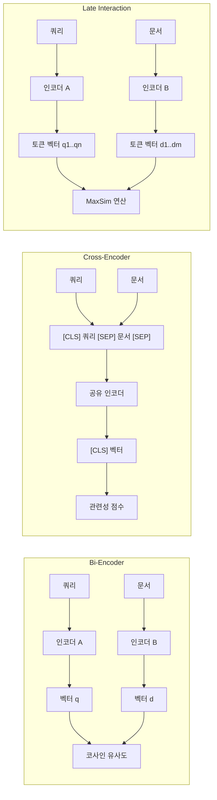

# Bi-Encoder vs Cross-Encoder (검색 아키텍처)

## 정의

정보 검색(Information Retrieval)에서 쿼리와 문서의 관련성을 판단하는 두 가지 핵심 아키텍처가 있다. **Bi-Encoder**는 쿼리와 문서를 독립적으로 인코딩하여 벡터 유사도로 비교하고, **Cross-Encoder**는 쿼리-문서 쌍을 하나의 입력으로 결합하여 관련성 점수를 직접 산출한다. 두 아키텍처의 트레이드오프를 이해하는 것은 [[dense-sparse-hybrid-retrieval|하이브리드 검색]] 시스템 설계의 핵심이다.

## 아키텍처 비교

이 다이어그램은 세 가지 검색 인코딩 아키텍처의 정보 흐름을 비교한다. Bi-Encoder는 독립 인코딩, Cross-Encoder는 결합 인코딩, Late Interaction은 토큰 레벨 지연 상호작용을 수행한다.

## Bi-Encoder (이중 인코더)

### 동작 원리

쿼리와 문서를 각각 독립된 인코더(또는 파라미터를 공유하는 동일 인코더)에 통과시켜 고정 차원의 벡터(임베딩)를 생성한다. 관련성은 두 벡터 간의 코사인 유사도(cosine similarity)나 내적(dot product)으로 계산한다.

### 핵심 특성

- **사전 인덱싱 가능**: 문서 임베딩을 오프라인으로 미리 계산하여 벡터 DB에 저장
- **서브리니어 검색**: ANN(Approximate Nearest Neighbor) 알고리즘으로 수백만~수십억 문서에서 밀리초 단위 검색
- **정보 손실**: 쿼리-문서 간 토큰 레벨 상호작용이 없으므로 단일 벡터로 압축하는 과정에서 의미 손실 발생

대표적인 Bi-Encoder 모델로는 DPR(Dense Passage Retrieval), Sentence-BERT, E5, GTE, NV-Embed 등이 있다. [[embedding-layers|임베딩 레이어]]의 설계가 Bi-Encoder 성능에 직접적으로 영향을 미친다.

### 학습 방법

- **대조 학습(Contrastive Learning)**: 양성 쌍(관련 쿼리-문서)은 가까이, 음성 쌍은 멀리 배치
- **하드 네거티브 마이닝(Hard Negative Mining)**: BM25 상위 결과 중 비관련 문서를 어려운 음성 예시로 사용
- **인-배치 네거티브(In-batch Negatives)**: 같은 배치 내 다른 쿼리의 양성 문서를 음성으로 활용

## Cross-Encoder (교차 인코더)

### 동작 원리

쿼리와 문서를 `[CLS] query [SEP] document [SEP]` 형태로 결합하여 단일 Transformer에 입력한다. 인코더 내부에서 쿼리 토큰과 문서 토큰 간의 풀 어텐션(full attention)이 발생하므로, 토큰 레벨의 정밀한 의미 매칭이 가능하다.

### 핵심 특성

- **높은 정확도**: 모든 검색 아키텍처 중 가장 정밀한 관련성 판단
- **사전 인덱싱 불가**: 쿼리가 주어져야만 점수를 계산할 수 있어, 문서를 미리 인덱싱할 수 없음
- **선형 비용**: N개 문서를 평가하려면 N번의 포워드 패스가 필요 -> 대규모 컬렉션에 직접 적용 불가

[[reranking-and-cross-encoders|리랭킹 모델]]로 주로 사용되며, ms-marco-MiniLM, bge-reranker, Cohere Rerank 등이 대표적이다.

## Late Interaction (지연 상호작용)

Bi-Encoder의 효율성과 Cross-Encoder의 정확도 사이의 절충안이다. **ColBERT**(Colbert-based Late Interaction over BERT)가 대표적이다.

### 동작 원리

쿼리와 문서를 독립적으로 인코딩하되, 단일 벡터가 아닌 **토큰 레벨 벡터 시퀀스**를 생성한다. 관련성은 MaxSim 연산 -- 각 쿼리 토큰에 대해 가장 유사한 문서 토큰과의 유사도를 계산하고 합산 -- 으로 산출한다.

### 핵심 특성

- **문서 사전 인덱싱 가능**: 토큰 벡터를 오프라인으로 계산 가능
- **토큰 레벨 매칭**: 단일 벡터 대비 풍부한 의미 표현
- **저장 비용 증가**: 문서당 벡터 1개가 아닌 토큰 수만큼 벡터 저장 필요

ColBERTv2는 잔차 압축(residual compression)으로 저장 비용을 크게 줄였으며, PLAID 엔진은 ColBERT 인덱스의 효율적 서빙을 지원한다.

## 2단계 검색-리랭킹 패턴

실무에서 가장 널리 쓰이는 패턴은 두 아키텍처를 조합하는 2단계(two-stage) 파이프라인이다.

| 단계 | 모델 | 역할 | 후보 수 | 지연 시간 |
|---|---|---|---|---|
| 1단계: 검색 | Bi-Encoder | 대규모 컬렉션에서 후보 추출 | 수백만 -> 100~1000 | ~10ms |
| 2단계: 리랭킹 | Cross-Encoder | 후보 정밀 재순위 | 100~1000 -> 10~50 | ~100ms |

이 패턴은 검색의 재현율(recall)과 정밀도(precision)를 동시에 확보한다. [[dense-sparse-hybrid-retrieval|하이브리드 검색]]에서 BM25와 Dense Retrieval을 1단계에 결합하고, Cross-Encoder를 2단계에 적용하면 더욱 강력한 파이프라인이 된다.

## 실무 선택 가이드

| 기준 | Bi-Encoder | Late Interaction | Cross-Encoder |
|---|---|---|---|
| 검색 대상 규모 | 수백만~수십억 | 수백만 | 수백~수천 |
| 정확도 | 보통 | 높음 | 최고 |
| 지연 시간 | 최저 (~10ms) | 중간 (~50ms) | 높음 (~200ms) |
| 인덱싱 비용 | 낮음 | 중간 (토큰별 벡터) | 해당 없음 |
| 주요 용도 | 1단계 검색 | 1단계 검색 (정확도 중시) | 2단계 리랭킹 |

소규모 컬렉션(수천 건 이하)에서는 Cross-Encoder만으로도 충분할 수 있다. 대규모 시스템에서는 Bi-Encoder + Cross-Encoder 2단계 파이프라인이 사실상 표준이다.

## 관련 문서

- [[dense-sparse-hybrid-retrieval]] -- 밀집/희소 하이브리드 검색 전략
- [[embedding-layers]] -- 임베딩 레이어 설계와 Bi-Encoder 성능
- [[reranking-and-cross-encoders|reranking-models]] -- 리랭킹 모델 심화 (Cross-Encoder 활용)
- [[colbert-late-interaction]] -- ColBERT Late Interaction 상세
- [[reranker-cross-encoder]] -- Reranker/Cross-Encoder 2단계 재순위 모델
- [[dense-retrieval]] -- 밀집 검색 (Bi-Encoder 기반)
