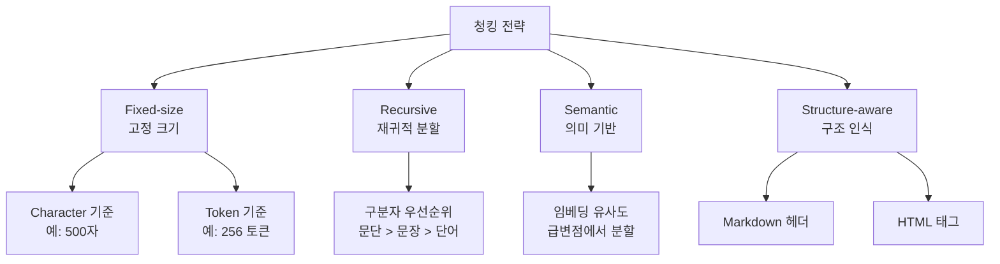
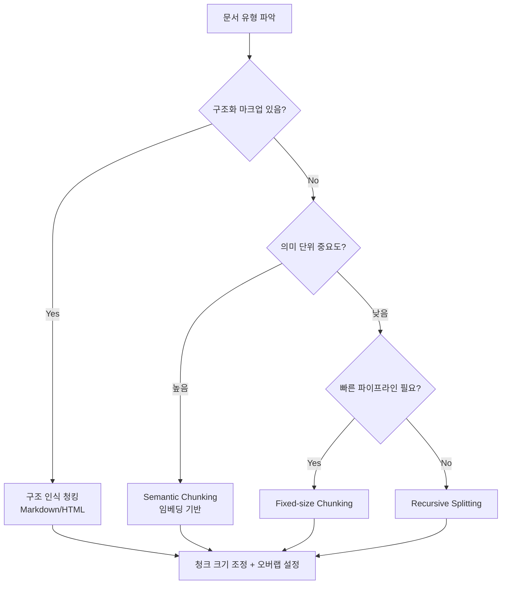

# 청킹 전략 (Chunking Strategies for RAG)

## 개요

청킹(Chunking)은 RAG(Retrieval-Augmented Generation) 파이프라인에서 긴 문서를 임베딩 및 검색 가능한 단위로 분할하는 과정이다. 청킹 전략은 검색 품질에 직접적으로 영향을 미치며, "정보가 분리되지 않고 의미 단위를 유지하는가"가 핵심 기준이다.

## 청킹 전략 분류



## Fixed-Size Chunking (고정 크기)

가장 단순한 방식. 문자 수 또는 토큰 수를 기준으로 균등 분할.

- **장점**: 구현 간단, 예측 가능한 청크 크기
- **단점**: 문장 중간에서 잘릴 수 있음, 의미 단위 무시

```python
# LangChain CharacterTextSplitter 예시
splitter = CharacterTextSplitter(
    chunk_size=500,      # 최대 문자 수
    chunk_overlap=50,    # 겹침 구간
    separator="\n\n"     # 선호 분할 지점
)
```

## Recursive Character Splitting (재귀적 분할)

구분자 우선순위 목록을 순서대로 시도하는 방식. LangChain의 `RecursiveCharacterTextSplitter`가 대표적.

우선순위 예시: `["\n\n", "\n", ". ", " ", ""]`

1. `\n\n`(문단 경계)으로 먼저 분할
2. 청크가 여전히 크면 `\n`(줄바꿈)으로 재분할
3. 그래도 크면 `. `(문장 끝)으로 재분할
4. 계속 반복...

일반 텍스트에 가장 폭넓게 사용되는 방식.

## Semantic Chunking (의미 기반 분할)

임베딩 유사도를 이용해 의미가 급변하는 지점에서 분할. 내용의 토픽이 바뀌는 경계를 자동으로 탐지.

```
과정:
1. 문장 단위로 분리
2. 각 문장 임베딩 생성
3. 인접 문장 간 코사인 유사도 계산
4. 유사도가 급격히 낮아지는 지점 = 청크 경계
5. 경계 기준으로 묶음
```

- **장점**: 의미 단위 보존, 주제 전환 감지
- **단점**: 임베딩 계산 비용, 청크 크기 불균일
- **도구**: LangChain `SemanticChunker`, LlamaIndex `SemanticSplitterNodeParser`

## 구조 인식 청킹 (Structure-Aware Chunking)

문서의 마크업 구조를 활용하여 분할.

### Markdown Header Splitting

```markdown
# Chapter 1     → 새 청크 시작
## Section 1.1  → 새 청크 시작
본문 내용...
## Section 1.2  → 새 청크 시작
```

헤더 메타데이터를 청크와 함께 저장하여 검색 후 컨텍스트 추론 가능.

### HTML Splitter

`<h1>`, `<h2>`, `<p>`, `<table>` 등 태그 구조 기반 분할.

## 최적 청크 크기 가이드

| 사용 사례 | 권장 크기 | 이유 |
|-----------|-----------|------|
| 사실 QA | 256-512 토큰 | 정확한 답변 위치 특정 |
| 요약/분석 | 512-1024 토큰 | 충분한 맥락 필요 |
| 코드 검색 | 함수/클래스 단위 | 논리 단위 보존 |
| 법률/규정 | 조항/항목 단위 | 구조 단위 보존 |

일반적으로 **256-1024 토큰**이 실용적 범위.

## 오버랩(Overlap) 전략

인접 청크 간 일부 내용을 중복하여 경계에서 잘리는 정보 손실 방지.

- 권장 오버랩: **청크 크기의 10-20%**
- 256 토큰 청크 → 25-50 토큰 오버랩
- 과도한 오버랩: 중복 검색 결과, 불필요한 인덱스 크기 증가

## 청킹 결정 트리



## 관련 문서
- [[sparse-retrieval]] -- 희소 검색 (Sparse Retrieval / BM25)
- [[late-chunking]] -- 레이트 청킹 (Late Chunking)

- [[rag-indexing-pipeline]] - 청킹을 포함한 전체 인덱싱 파이프라인
- [[embedding-models-for-rag]] - 청크를 임베딩하는 모델 선택
- [[query-transformation]] - 쿼리 측 최적화로 청킹 한계 보완
- [[dense-retrieval]] - 청크 임베딩 기반 검색
