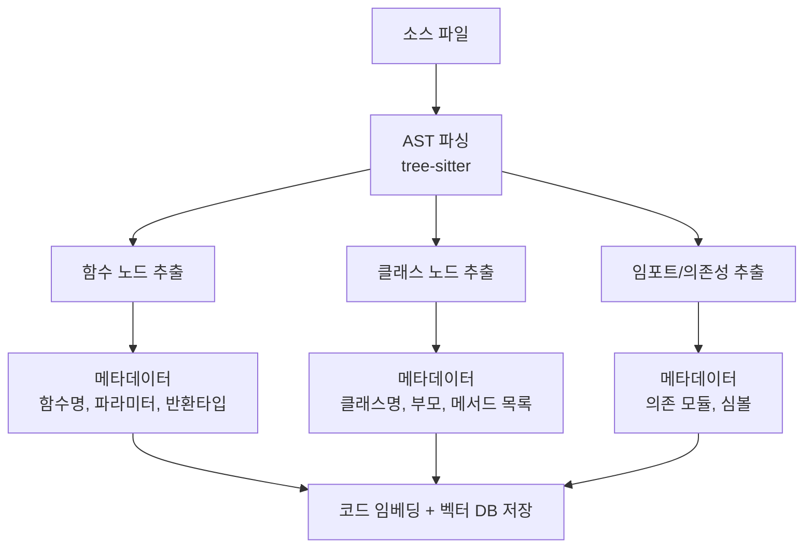
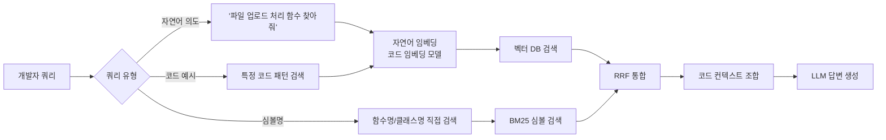

# 코드 RAG (Code RAG)

코드 RAG(Code RAG)는 소프트웨어 코드베이스를 RAG 지식 소스로 활용할 때, **일반 텍스트 청킹 대신 AST(Abstract Syntax Tree) 또는 함수/클래스 단위로 인덱싱**하고 코드 특화 임베딩 모델을 사용하는 기법이다. [[rag-pipeline]]을 코드 검색·생성 도메인에 맞게 특화한 형태로, [[coding-agent]]가 대규모 코드베이스를 탐색하고 관련 코드를 찾을 때 핵심 인프라가 된다.

## 왜 코드 RAG가 다른가

자연어 문서와 코드는 근본적으로 다른 속성을 갖는다:

| 속성 | 자연어 문서 | 코드 |
|------|-----------|------|
| 청크 단위 | 단락, 문장 | 함수, 클래스, 모듈 |
| 의미 단위 | 토픽 | 심볼 (함수명, 변수명) |
| 관계 표현 | 암묵적 | 명시적 (import, call graph) |
| 토큰 분포 | 자연어 어휘 | 예약어 + 식별자 + 연산자 |
| 중복 패턴 | 낮음 | 높음 (반복 패턴, 상용구) |

고정 크기 청킹을 코드에 적용하면 함수가 중간에 잘리거나, 클래스 메서드가 클래스 정의와 분리되는 문제가 발생한다.

## AST 기반 인덱싱



### tree-sitter 활용

tree-sitter는 C, Python, TypeScript, Go 등 100개 이상 언어의 파서를 제공하며, AST 노드를 프로그래밍 방식으로 탐색할 수 있다:

```python
from tree_sitter import Language, Parser
from tree_sitter_languages import get_language, get_parser

def extract_functions(source_code: str, language: str = "python") -> list[dict]:
    parser = get_parser(language)
    tree = parser.parse(source_code.encode())

    functions = []
    for node in traverse(tree.root_node):
        if node.type == "function_definition":
            func_name_node = node.child_by_field_name("name")
            func_body = source_code[node.start_byte:node.end_byte]
            functions.append({
                "name": func_name_node.text.decode() if func_name_node else "",
                "code": func_body,
                "start_line": node.start_point[0],
                "end_line": node.end_point[0],
            })
    return functions

def traverse(node):
    yield node
    for child in node.children:
        yield from traverse(child)
```

## 코드 특화 임베딩 모델

일반 텍스트 임베딩 모델은 코드 의미론을 충분히 포착하지 못한다. [[embedding-layers]] 선택 시 코드 특화 모델을 우선한다:

| 모델 | 지원 언어 | 특징 |
|------|---------|------|
| `voyage-code-3` | 다국어 | 코드 검색 SOTA, Voyage AI |
| `text-embedding-3-large` | 다국어 | OpenAI, 코드에서도 준수한 성능 |
| `CodeBERT` | Python, Java 등 6개 | 마이크로소프트, 오픈소스 |
| `UniXcoder` | 다국어 | 마이크로소프트, 코드 생성·검색 멀티태스크 |
| `StarCoder-embed` | 다국어 | HuggingFace BigCode |

## 쿼리 유형별 검색 전략



심볼명 검색(BM25)과 의미 검색(벡터)을 결합하는 하이브리드 방식이 코드 검색에서 특히 효과적이다.

## 콜 그래프 컨텍스트 활용

AST에서 함수 호출 관계(call graph)를 추출해 인덱싱하면 **관련 함수를 자동으로 확장** 검색할 수 있다:

```python
# 함수 A가 함수 B를 호출하면, B를 검색했을 때 A도 컨텍스트에 포함
def expand_with_callers(func_name: str, call_graph: dict) -> list[str]:
    callers = call_graph.get(func_name, {}).get("called_by", [])
    callees = call_graph.get(func_name, {}).get("calls", [])
    return [func_name] + callers + callees
```

이 확장은 [[knowledge-graph-rag]]의 서브그래프 탐색과 유사한 원리다. 코드에서 콜 그래프는 명시적으로 정의되어 있으므로 LLM 기반 관계 추출 없이 정확하게 구성할 수 있다는 이점이 있다.

## [[coding-agent]]와의 통합

[[coding-agent]]는 코드 RAG를 기반 인프라로 사용해 다음 작업을 수행한다:

- 관련 함수/클래스를 찾아 수정 범위 파악
- 기존 유사 구현을 참조해 새 함수 작성
- 테스트 파일에서 기존 테스트 패턴 학습
- 에러 메시지와 관련 코드를 함께 검색해 디버깅 컨텍스트 구성

## 점진적 인덱스 업데이트

코드베이스는 지속적으로 변경되므로 전체 재인덱싱 없이 **변경된 파일만 갱신**하는 증분 인덱싱이 필수다:

```python
def incremental_index_update(changed_files: list[str], indexer: CodeIndexer):
    for file_path in changed_files:
        # 기존 해당 파일 임베딩 삭제
        indexer.delete_by_file(file_path)
        # 새로 파싱·임베딩·저장
        functions = extract_functions(open(file_path).read())
        indexer.index_functions(file_path, functions)
```

Git 훅이나 파일 시스템 이벤트(watchdog)로 변경 감지를 연동하면 실시간에 가까운 인덱스 동기화가 가능하다.

## 한계와 주의사항

- **컨텍스트 창 압박**: 관련 함수를 다수 검색해 프롬프트에 포함하면 컨텍스트 창이 빠르게 찬다. 청크 크기와 검색 개수를 신중히 조정해야 한다.
- **언어별 파서 필요**: 모든 프로그래밍 언어에 tree-sitter 문법이 존재하지 않을 수 있다. 레거시·DSL 언어는 정규식 기반 폴백이 필요하다.
- **미니파이/난독화 코드**: 압축된 코드는 AST 분석이 어렵고 임베딩 품질도 저하된다.
- **동적 언어 한계**: Python의 동적 속성 접근, JavaScript의 프로토타입 패턴 등은 정적 AST 분석으로 추적하기 어렵다.

## 관련 문서

- [[rag-pipeline]] - 코드 RAG가 적용되는 전체 RAG 파이프라인
- [[coding-agent]] - 코드 RAG를 핵심 인프라로 활용하는 에이전트
- [[embedding-layers]] - 코드 특화 임베딩 모델 선택 기준
- [[knowledge-graph-rag]] - 콜 그래프 기반 코드 관계 탐색과 유사한 접근
