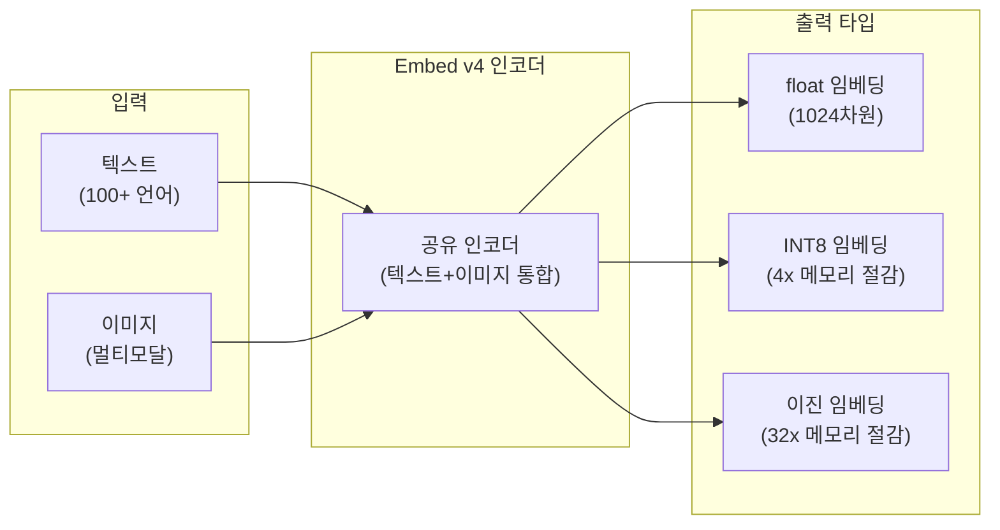
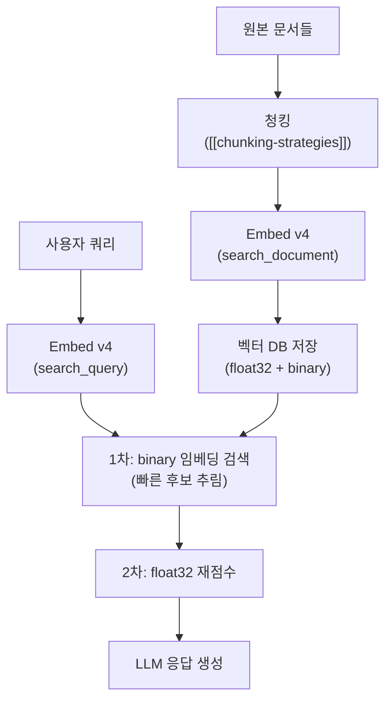

# Cohere Embed v4 모델

Cohere Embed v4는 Cohere가 2024년 출시한 엔터프라이즈 지향 임베딩 모델이다. 100개 이상의 언어를 지원하는 다국어 텍스트 임베딩과 함께 이미지 임베딩도 통합 제공하는 멀티모달 모델이다. 특히 이진(binary) 임베딩과 INT8 양자화 임베딩을 네이티브로 지원하여 메모리 효율적인 RAG 파이프라인 구축에 적합하다. Cohere의 RAG 산업 표준 임베딩 솔루션으로 포지셔닝되어 있다.

## 모델 아키텍처 개요



## 핵심 특성

| 항목 | 사양 |
|------|------|
| 임베딩 차원 | 1024 (기본) |
| 지원 언어 | 100개 이상 |
| 최대 입력 토큰 | 512 토큰 (텍스트) |
| 이미지 지원 | 예 (멀티모달) |
| 출력 타입 | float32, int8, binary (ubinary) |
| 압축 임베딩 | Matryoshka 스타일 지원 |

## 다국어 임베딩 성능

Embed v4는 MIRACL(Multilingual Information Retrieval Across a Continuum of Languages)과 같은 다국어 검색 벤치마크에서 높은 성능을 보인다. 특히 영어 외 언어(한국어, 일본어, 아랍어 등)에서 다른 영어 중심 임베딩 모델 대비 우수한 검색 품질을 제공한다.

## 멀티모달 임베딩

텍스트와 이미지를 **동일한 벡터 공간**에 임베딩한다. 이를 통해:

- 텍스트 쿼리로 이미지 검색 가능
- 이미지 쿼리로 텍스트 검색 가능
- 텍스트+이미지 혼합 문서를 단일 임베딩으로 표현

이는 멀티모달 RAG([[multimodal-rag]])에서 별도의 이미지 임베딩 모델 없이 통합 처리할 수 있게 해준다.

## 양자화 임베딩

Embed v4는 세 가지 정밀도의 임베딩을 네이티브로 출력한다:

| 타입 | 비트 | 메모리 절감 | 성능 손실 |
|------|------|-----------|---------|
| float32 | 32 | 기준 | 없음 |
| int8 | 8 | 4배 | 매우 낮음 (<1% 재현율) |
| binary (ubinary) | 1 | 32배 | 낮음 (재현율 10-15% 하락) |

이진 임베딩은 [[embedding-quantization|임베딩 양자화]]의 극단적 형태로, 해밍(Hamming) 거리를 XOR 비트 연산으로 계산할 수 있어 검색 속도가 극적으로 빠르다.

**실무 권장 패턴**: 이진 임베딩으로 초기 후보 검색 후, float32로 재랭킹하는 2단계 방식.

## Cohere API 사용 예시

```python
import cohere

co = cohere.Client("YOUR_API_KEY")

# 텍스트 임베딩 (검색 쿼리)
response = co.embed(
    texts=["What is machine learning?"],
    model="embed-v4.0",
    input_type="search_query",   # "search_query" | "search_document" | "classification" | "clustering"
    embedding_types=["float", "int8", "binary"]
)

# 각 타입별 임베딩 접근
float_embedding = response.embeddings.float[0]
int8_embedding = response.embeddings.int8[0]
binary_embedding = response.embeddings.binary[0]

# 이미지 임베딩 (Base64 또는 URL)
response_img = co.embed(
    images=["data:image/jpeg;base64,..."],
    model="embed-v4.0",
    input_type="image",
    embedding_types=["float"]
)
```

## input_type 파라미터

Embed v4는 태스크에 따라 `input_type`을 명시적으로 지정해야 한다. 비대칭 검색(asymmetric retrieval)에서 쿼리와 문서에 다른 임베딩을 사용하는 패턴이다:

| input_type | 사용 상황 |
|-----------|---------|
| `search_query` | 검색 시 사용자 쿼리 임베딩 |
| `search_document` | 인덱싱 시 문서 임베딩 |
| `classification` | 텍스트 분류 태스크 |
| `clustering` | 클러스터링 태스크 |

쿼리와 문서에 동일한 `input_type`을 사용하면 검색 품질이 크게 저하될 수 있다.

## RAG 파이프라인에서의 위치



## Cohere Rerank와 연계

Cohere는 Embed v4와 함께 Rerank API를 제공한다. 일반적인 RAG 파이프라인:
1. Embed v4로 초기 벡터 검색 (top-100 후보)
2. Cohere Rerank로 교차 인코더 기반 정밀 재랭킹 (top-5 선택)
3. LLM에 top-5 문서 주입하여 응답 생성

이 패턴은 [[reranker-cross-encoder]] 개념의 실용적 구현이다.

## 가격 및 가용성

Cohere API를 통해 토큰 수 기반 과금으로 제공된다. 배치 처리 API로 대량 문서 임베딩 비용을 절감할 수 있다. AWS, Azure, GCP Marketplace에서도 제공된다.

## MTEB 벤치마크

Embed v4는 MTEB(Massive Text Embedding Benchmark)에서 다국어 검색(retrieval) 태스크에서 상위권을 유지한다. 특히 `MIRACL` 다국어 검색 태스크에서 강점을 보인다. 최신 순위는 [[embedding-leaderboard-shakeup-2026]] 참조.

## 관련 문서

- [[embedding-models-for-rag]] - RAG용 임베딩 모델 전반
- [[embedding-quantization]] - 임베딩 양자화 기법
- [[matryoshka-embeddings]] - 가변 차원 임베딩 (Embed v4 지원)
- [[voyage-ai-embeddings]] - 도메인 특화 임베딩 대안
- [[embedding-leaderboard-shakeup-2026]] - 최신 임베딩 벤치마크 현황
- [[multimodal-rag]] - 멀티모달 RAG 파이프라인
- [[reranker-cross-encoder]] - 재랭킹 기법
- [[hybrid-search-rrf]] - 하이브리드 검색 전략
- [[dense-retrieval]] - 밀집 벡터 검색
