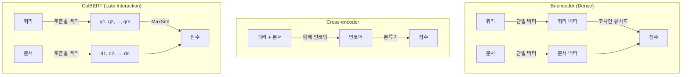
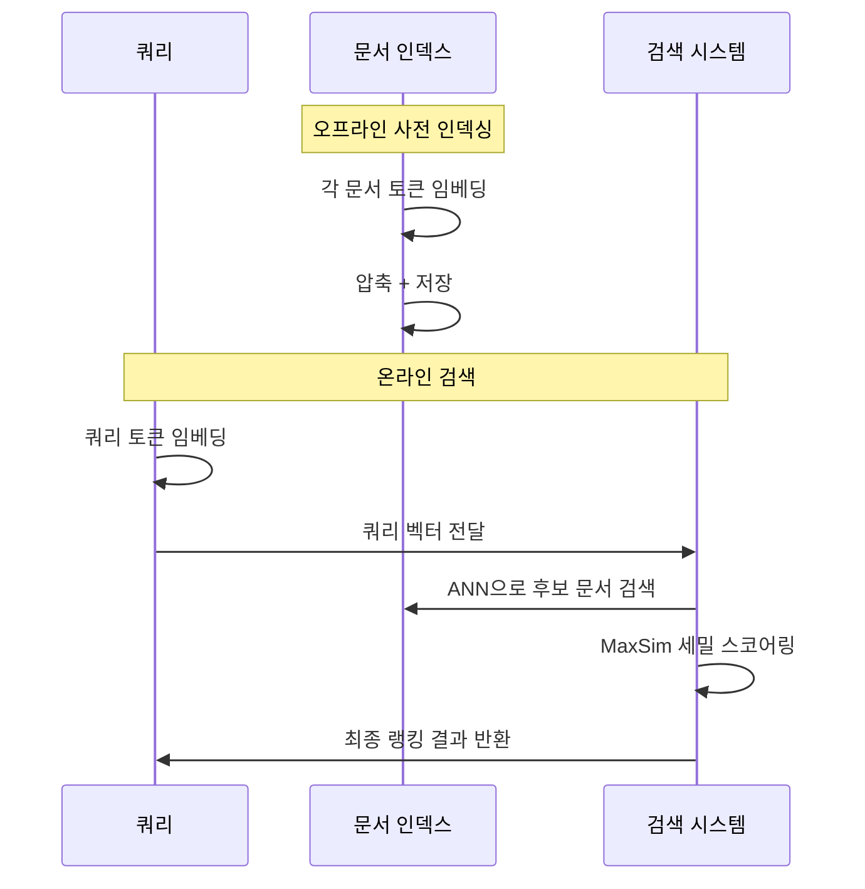

# ColBERT와 레이트 인터랙션 (ColBERT & Late Interaction)

## 개요

ColBERT(Contextualized Late Interaction over BERT)는 쿼리와 문서 각 토큰을 독립적으로 임베딩한 뒤, 검색 시점에 MaxSim 연산으로 세밀한 매칭을 수행하는 검색 패러다임이다. 빠른 Bi-encoder와 정확한 Cross-encoder 사이의 효율적인 중간점을 제공한다.

## 검색 패러다임 비교



- Bi-encoder: 빠르지만 세밀도 낮음
- Cross-encoder: 정확하지만 모든 쌍을 재계산해야 함
- ColBERT: 문서 벡터를 사전 계산하고, 검색 시 MaxSim만 수행

## MaxSim 연산

각 쿼리 토큰이 문서의 모든 토큰 중 가장 유사한 토큰과의 유사도를 찾아 합산한다.

$$\text{Score}(q, d) = \sum_{i \in q} \max_{j \in d} \mathbf{q}_i \cdot \mathbf{d}_j$$

- 쿼리 토큰 $q_i$가 문서 어디에 있든 최선의 매치를 찾음
- 단일 벡터 비교보다 정보 손실이 적음
- 쿼리와 문서를 독립적으로 인코딩 → 문서 오프라인 사전 인덱싱 가능

## ColBERT v2의 개선

Santhanam et al. (2022). 원본 ColBERT 대비 저장 공간과 성능 동시 개선.

- **Residual Compression**: 벡터를 중심점(centroid)과 잔차로 압축
- **Denoised Supervision**: 하드 네거티브(hard negative) 증류로 학습 품질 향상
- 토큰당 4바이트(FP32) → 1바이트(INT8) 수준으로 압축
- 원본 대비 저장 공간 6-10배 절감

## ColBERT 아키텍처 흐름



## RAGatouille

ColBERT를 쉽게 사용할 수 있는 Python 라이브러리.

```python
from ragatouille import RAGPretrainedModel

RAG = RAGPretrainedModel.from_pretrained("colbert-ir/colbertv2.0")
RAG.index(
    collection=documents,
    index_name="my_index",
)
results = RAG.search("검색 쿼리", k=5)
```

- LangChain, LlamaIndex 통합 지원
- 인덱싱 + 검색을 4줄로 구현 가능

## Bi-encoder vs Cross-encoder vs ColBERT 비교

| 항목 | Bi-encoder | Cross-encoder | ColBERT |
|------|-----------|---------------|---------|
| 인코딩 시점 | 개별 사전 인코딩 | 쿼리+문서 함께 | 개별 사전 인코딩 |
| 검색 속도 | 매우 빠름 (ANN) | 느림 (재계산) | 빠름 (MaxSim) |
| 정확도 | 보통 | 높음 | 높음 |
| 저장 공간 | 적음 | N/A | 많음 (토큰별) |
| 사용 위치 | 1차 검색 | 리랭킹 | 1차+리랭킹 |

## 실무 활용 패턴

**2단계 파이프라인:**
1. Dense retrieval(Bi-encoder)로 100개 후보 검색
2. ColBERT MaxSim으로 상위 10개로 정밀 리랭킹

또는:
1. ColBERT 단독으로 1차 + 리랭킹 통합 수행

## 관련 문서

- [[embedding-models-for-rag]] - Bi-encoder 임베딩 모델
- [[reranker-cross-encoder]] - Cross-encoder 리랭킹
- [[hybrid-search-rrf]] - 하이브리드 검색과의 결합
- [[dense-retrieval]] - Dense retrieval 기본 개념
