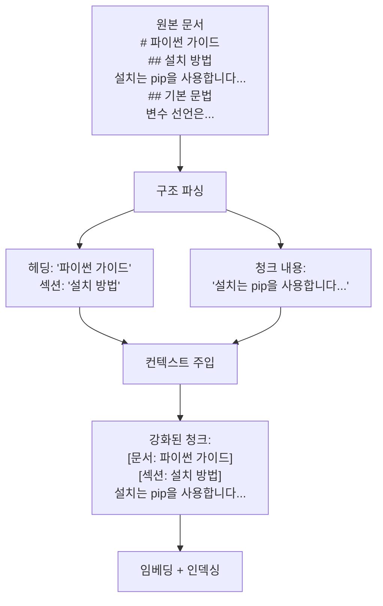

# 컨텍스트 인식 청킹

## 정의

컨텍스트 인식 청킹(context-aware chunking)은 문서의 **구조적 메타데이터(헤딩, 섹션, 메타데이터)**를 청크에 보존하고, 청크 앞뒤의 **주변 컨텍스트를 함께 저장**함으로써 청크가 독립적으로 검색되어도 원래 문서에서의 위치와 의미를 파악할 수 있도록 하는 청킹 전략이다.

Anthropic이 2024년 "Contextual Retrieval" 기법으로 발표한 접근법이 이 범주를 대중화했다. 기존 청킹의 핵심 문제인 **탈맥락화(decontextualization)**를 해결한다.



위 다이어그램은 헤딩과 섹션 정보가 청크에 주입되어 탈맥락화 문제를 해결하는 흐름이다.

---

## 탈맥락화 문제

### 문제 사례

다음과 같은 청크를 생각해보자:

```
"이 방법은 기존 방법보다 처리 속도를 30% 향상시킬 수 있다."
```

이 청크만으로는 "이 방법"이 무엇인지, "기존 방법"과 비교해서 무엇이 좋아진 건지 알 수 없다. 검색 쿼리 "성능 개선 방법"과 매칭되어 검색되더라도, LLM이 답변을 생성할 때 의미 없는 청크가 된다.

### 컨텍스트 인식 청킹의 해결

같은 청크가 컨텍스트 인식 청킹을 거치면:

```
[문서: 파이썬 비동기 프로그래밍 가이드]
[섹션: asyncio와 threading 비교]
[직전 문단 요약: asyncio를 활용한 비동기 I/O 처리 방식 설명]

이 방법(asyncio 비동기 I/O)은 기존 방법(threading)보다 처리 속도를
30% 향상시킬 수 있다.
```

이제 독립적으로 검색되어도 의미가 명확하다.

---

## 핵심 기법들

### 기법 1: 헤딩 경로 보존

마크다운 등 구조화된 문서에서 헤딩 계층을 추적해 청크에 주입:

```python
import re
from dataclasses import dataclass, field

@dataclass
class HeadingContext:
    h1: str = ""
    h2: str = ""
    h3: str = ""
    h4: str = ""

    def to_prefix(self) -> str:
        parts = [h for h in [self.h1, self.h2, self.h3, self.h4] if h]
        return " > ".join(parts) if parts else ""


def extract_with_heading_context(markdown: str) -> list[dict]:
    """마크다운 문서에서 헤딩 컨텍스트를 보존하며 청크 추출."""
    lines = markdown.split("\n")
    context = HeadingContext()
    chunks = []
    current_content = []

    for line in lines:
        # 헤딩 감지 및 컨텍스트 업데이트
        if line.startswith("#### "):
            context.h4 = line[5:].strip()
            if current_content:
                chunks.append(_make_chunk(current_content, context))
                current_content = []
        elif line.startswith("### "):
            context.h3 = line[4:].strip()
            context.h4 = ""
            if current_content:
                chunks.append(_make_chunk(current_content, context))
                current_content = []
        elif line.startswith("## "):
            context.h2 = line[3:].strip()
            context.h3 = ""
            context.h4 = ""
            if current_content:
                chunks.append(_make_chunk(current_content, context))
                current_content = []
        elif line.startswith("# "):
            context.h1 = line[2:].strip()
            context.h2 = ""
            context.h3 = ""
            context.h4 = ""
        else:
            current_content.append(line)

    if current_content:
        chunks.append(_make_chunk(current_content, context))

    return chunks


def _make_chunk(content_lines: list[str], context: HeadingContext) -> dict:
    heading_prefix = context.to_prefix()
    content = "\n".join(content_lines).strip()
    return {
        "content": content,
        "heading_context": heading_prefix,
        "enriched_text": f"[{heading_prefix}]\n\n{content}" if heading_prefix else content,
        "metadata": {
            "h1": context.h1,
            "h2": context.h2,
            "h3": context.h3,
        }
    }
```

### 기법 2: Anthropic Contextual Retrieval

Anthropic이 제안한 방식: LLM을 활용해 각 청크에 대한 **짧은 상황 설명**을 자동 생성한 뒤 청크 앞에 주입한다.

```python
from anthropic import Anthropic

client = Anthropic()

CONTEXT_GENERATION_PROMPT = """<document>
{full_document}
</document>

다음 청크는 위 문서에서 발췌한 내용입니다:
<chunk>
{chunk_content}
</chunk>

이 청크가 문서 전체에서 어떤 위치와 역할을 하는지 2-3문장으로 설명하세요.
검색 시 이 청크가 올바르게 찾아질 수 있도록 핵심 컨텍스트를 포함하세요.
답변만 제공하고 다른 말은 하지 마세요."""


def generate_chunk_context(full_document: str, chunk: str) -> str:
    """청크에 대한 상황 설명을 LLM으로 생성 (Anthropic Contextual Retrieval)."""
    response = client.messages.create(
        model="claude-3-haiku-20240307",  # 빠르고 저렴한 모델 사용
        max_tokens=200,
        messages=[{
            "role": "user",
            "content": CONTEXT_GENERATION_PROMPT.format(
                full_document=full_document[:4000],  # 문서 일부만 (비용 절감)
                chunk_content=chunk,
            ),
        }],
    )
    return response.content[0].text


def contextual_retrieval_chunking(
    document: str,
    chunk_size: int = 512,
    chunk_overlap: int = 64,
) -> list[dict]:
    """Anthropic Contextual Retrieval 스타일 청킹."""
    from langchain.text_splitter import RecursiveCharacterTextSplitter

    splitter = RecursiveCharacterTextSplitter(
        chunk_size=chunk_size,
        chunk_overlap=chunk_overlap,
    )
    raw_chunks = splitter.split_text(document)

    enriched_chunks = []
    for chunk in raw_chunks:
        context = generate_chunk_context(document, chunk)
        enriched_chunks.append({
            "original_chunk": chunk,
            "context": context,
            "enriched_chunk": f"{context}\n\n{chunk}",  # 검색에 사용
        })

    return enriched_chunks
```

### 기법 3: 슬라이딩 윈도우 컨텍스트

앞뒤 청크의 내용 일부를 현재 청크에 포함시켜 경계 정보 손실을 방지:

```python
def sliding_window_context_chunking(
    chunks: list[str],
    context_window: int = 1,
    max_context_tokens: int = 100,
) -> list[dict]:
    """앞뒤 청크 일부를 컨텍스트로 포함."""
    enriched = []
    for i, chunk in enumerate(chunks):
        # 이전 청크 컨텍스트 (마지막 max_context_tokens 토큰)
        prev_context = ""
        if i > 0 and context_window >= 1:
            prev_chunk = chunks[i - 1]
            # 간단히 문자 수로 제한
            prev_context = prev_chunk[-max_context_tokens * 4:]

        # 다음 청크 컨텍스트 (처음 max_context_tokens 토큰)
        next_context = ""
        if i < len(chunks) - 1 and context_window >= 1:
            next_chunk = chunks[i + 1]
            next_context = next_chunk[:max_context_tokens * 4]

        enriched.append({
            "chunk": chunk,
            "prev_context": prev_context,
            "next_context": next_context,
            "enriched_for_search": f"[이전 내용]: {prev_context}\n\n{chunk}\n\n[이후 내용]: {next_context}",
            "chunk_only_for_llm": chunk,  # LLM 답변 생성에는 원본만
        })

    return enriched
```

---

## 메타데이터 전략

컨텍스트 인식 청킹에서 메타데이터는 필터링과 재랭킹에 활용된다:

```python
def extract_chunk_metadata(
    chunk: str,
    document_metadata: dict,
    heading_context: str,
) -> dict:
    """검색 필터링을 위한 메타데이터 추출."""
    return {
        # 문서 수준 메타데이터
        "document_title": document_metadata.get("title", ""),
        "document_type": document_metadata.get("type", ""),
        "created_at": document_metadata.get("created_at", ""),
        "author": document_metadata.get("author", ""),

        # 청크 수준 메타데이터
        "heading_path": heading_context,
        "chunk_length": len(chunk),
        "has_code": "```" in chunk or "    " in chunk[:20],
        "has_table": "|" in chunk and "---" in chunk,
        "language": detect_language(chunk),  # 별도 감지 함수
    }
```

---

## 검색 시 활용 패턴

```python
def search_with_context_aware_chunks(
    query: str,
    vector_store,
    top_k: int = 5,
    filter_metadata: dict | None = None,
) -> list[dict]:
    """컨텍스트 인식 청크 검색 및 원본 청크 반환."""
    # enriched_chunk로 검색 (컨텍스트 포함)
    results = vector_store.similarity_search(
        query,
        k=top_k,
        filter=filter_metadata,
    )

    # LLM에는 원본 청크만 전달 (컨텍스트 중복 방지)
    return [
        {
            "content": r.metadata.get("original_chunk", r.page_content),
            "heading": r.metadata.get("heading_path", ""),
            "score": r.metadata.get("score", 0),
        }
        for r in results
    ]
```

---

## 효과 측정 (Anthropic 발표 결과)

Anthropic이 Contextual Retrieval 논문에서 발표한 검색 실패율 개선:

| 방법 | 검색 실패율 감소 |
|------|----------------|
| 기본 RAG | 기준 |
| Contextual Retrieval 추가 | -49% |
| + BM25 하이브리드 | -67% |
| + 재랭킹(Reranking) | -67% (추가 이득 없음) |

---

## 장단점

### 장점

- **탈맥락화 해결**: 청크 단독 검색 시에도 원문 위치와 의미 파악 가능
- **검색 품질 대폭 향상**: Anthropic 발표 기준 ~50% 실패율 감소
- **메타데이터 필터링**: 섹션, 문서 유형별 필터링으로 정밀도 향상
- **생성 품질 향상**: LLM이 컨텍스트가 풍부한 청크로 더 정확한 답변 생성

### 단점

- **LLM 비용**: Contextual Retrieval 방식은 모든 청크에 LLM 호출 필요
- **구현 복잡도**: 헤딩 파싱, 컨텍스트 주입 등 파이프라인 복잡
- **인덱스 크기 증가**: 컨텍스트 포함으로 청크 크기 증가 -> 임베딩 비용 증가
- **문서 형식 의존**: 구조 없는 문서(스캔 PDF 등)에는 헤딩 추출 불가

---

## 관련 문서

- [[contextual-retrieval]] - Anthropic의 Contextual Retrieval 전략 심화
- [[chunking-strategies]] - 전체 청킹 전략 비교
- [[propositional-chunking]] - 명제 단위 청킹
- [[agentic-chunking]] - 에이전트 기반 청킹
- [[recursive-character-splitting]] - 기본 재귀 분할 (컨텍스트 인식의 기반)
- [[parent-document-retrieval]] - 청크 검색 후 부모 문서 반환 패턴
- [[contextual-compression-retrieval]] - 검색 후 컨텍스트 압축 전략
- [[rag-indexing-pipeline]] - 전체 RAG 인덱싱 파이프라인
