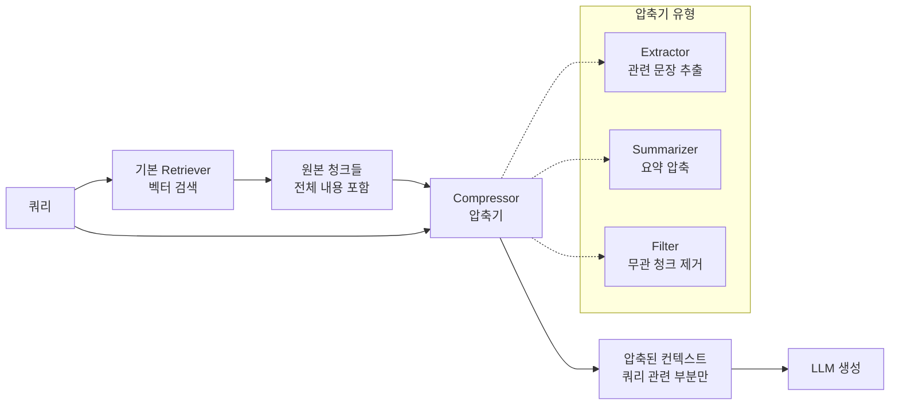

# 컨텍스트 압축 검색 (Contextual Compression Retrieval)

## 개요

컨텍스트 압축 검색(Contextual Compression Retrieval)은 벡터 검색으로 가져온 문서 청크에서 **쿼리와 관련된 부분만 추출·압축하여 LLM에 전달**하는 기법이다. 청크 전체를 그대로 넘기는 대신, 쿼리 맥락에 맞게 내용을 필터링하거나 요약함으로써 컨텍스트 윈도우를 효율적으로 사용한다.

LangChain의 `ContextualCompressionRetriever`가 이 개념을 대중화했지만, 패턴 자체는 특정 프레임워크에 종속되지 않는 범용 [[rag-pipeline]] 최적화 기법이다.

## 왜 필요한가

표준 RAG에서 검색된 청크는 쿼리와 관련 있지만 **쿼리와 무관한 노이즈 텍스트를 다량 포함**하는 경우가 많다. 예를 들어 "파이썬에서 비동기 함수를 어떻게 정의하나요?"라는 쿼리에 대해 검색된 청크가 파이썬 공식 문서의 한 섹션이라면, 그 섹션 전체에는 동기 함수 설명, 예외 처리 패턴, 무관한 표준 라이브러리 설명 등이 섞여 있을 수 있다.

이 노이즈는 두 가지 문제를 일으킨다:
1. **토큰 낭비**: LLM 컨텍스트에서 유용한 공간을 차지
2. **집중력 분산**: LLM이 핵심 정보보다 주변 텍스트에 주의를 낭비 ("lost in the middle" 현상)

컨텍스트 압축은 이 문제를 검색과 생성 사이의 후처리 단계에서 해결한다.

## 아키텍처

기본 Retriever와 Compressor가 분리된 두 단계로 구성되며, 이 분리 덕분에 각 단계를 독립적으로 교체·조합할 수 있다.

## 압축기(Compressor) 유형

### 1. LLM 기반 압축기 (LLMChainExtractor)
LLM에게 "이 문서에서 쿼리와 관련된 부분만 추출하라"는 프롬프트를 보내 관련 문장을 선택하게 한다.
- 장점: 의미론적 이해 수준의 정밀한 추출
- 단점: 추가 LLM 호출 비용, 지연 증가

### 2. 임베딩 필터 (EmbeddingsFilter)
각 문장을 임베딩하여 쿼리 임베딩과의 코사인 유사도가 임계값 이상인 문장만 보존한다.
- 장점: 빠르고 저렴 (LLM 호출 없음)
- 단점: 의미 누락 위험 (임계값 민감도)

### 3. 파이프라인 조합
EmbeddingsFilter로 빠르게 1차 필터링한 후 LLMChainExtractor로 2차 정밀 추출하는 방식이 비용-품질 균형이 좋다.

## [[context-engineering]]과의 관계

컨텍스트 압축은 [[context-engineering]]의 핵심 전술 중 하나다. [[context-engineering]]이 "LLM에게 전달하는 컨텍스트의 내용, 형식, 순서를 설계하는 기술"이라면, 컨텍스트 압축 검색은 그 중 **검색 단계에서의 컨텍스트 품질 향상**을 담당한다.

두 개념이 교차하는 지점:
- 토큰 예산 관리: 압축으로 확보한 공간을 다른 컨텍스트(시스템 프롬프트, 대화 이력)에 배분
- 신호 대 노이즈 비율: 관련 정보 밀도를 높여 LLM 응답 품질 향상
- Lost-in-the-middle 완화: 짧고 밀도 높은 컨텍스트에서 문서 위치 편향이 줄어듦

## 구현 시 고려사항

### 압축 손실 위험
압축기가 지나치게 공격적으로 필터링하면 쿼리에 간접적으로 필요한 배경 지식이 제거될 수 있다. 특히 **다단계 추론(multi-hop reasoning)**이 필요한 쿼리에서 중간 사실을 잘라낼 위험이 있다.

### 청크 크기 전략과의 연계
압축 검색을 쓰면 초기 청킹 시 더 큰 청크를 사용해도 된다. 큰 청크는 리콜에 유리하고, 압축이 정밀도를 보완한다. [[chunking-strategies]]에서 "Large Chunk + Compression" 패턴이 이에 해당한다.

### 지연(Latency) 트레이드오프
LLM 기반 압축기는 기본 검색 대비 1-2회 추가 LLM 호출이 발생한다. 실시간 응답이 중요한 경우 임베딩 필터를 우선하거나, 압축을 비동기로 처리하는 [[streaming-rag]] 패턴을 고려한다.

## 평가 방법

압축 품질은 아래 두 가지 상충 지표로 측정한다:

| 지표 | 의미 | 목표 |
|------|------|------|
| 압축률 (Compression Ratio) | 원본 대비 출력 토큰 비율 | 낮을수록 좋음 |
| 정보 보존률 (Recall@압축) | 정답 도출에 필요한 정보가 압축 후에도 남아있는 비율 | 높을수록 좋음 |

두 지표가 반비례 관계이므로, 태스크 특성(비용 민감 vs. 정확도 민감)에 따라 압축 강도를 조절해야 한다.

## 관련 문서

- [[rag-pipeline]] - 압축 검색이 위치하는 전체 RAG 파이프라인 구조
- [[context-engineering]] - 컨텍스트 압축이 기여하는 상위 개념
- [[chunking-strategies]] - 초기 청크 크기 전략과 압축의 상호작용
- [[reranker-cross-encoder]] - 압축 전 단계로 활용 가능한 리랭킹
- [[multi-hop-retrieval]] - 압축 손실 위험이 높은 복잡 쿼리 패턴
