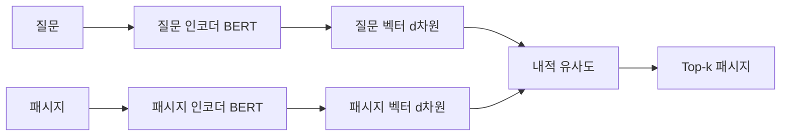

# 고밀도 패시지 검색 (DPR)

Karpukhin et al. (2020)이 제안한 질문-패시지 **이중 인코더(bi-encoder)** 기반 검색 시스템. 질문과 패시지를 각각 독립된 BERT 인코더로 임베딩한 후, 벡터 유사도로 관련 패시지를 검색한다. BM25 키워드 검색을 의미 검색으로 대체한 전환점 논문.

## 아키텍처

- 두 인코더는 **파라미터를 공유하지 않음** (독립 학습)
- [CLS] 토큰의 출력을 d차원 벡터로 사용
- 유사도: $\text{sim}(q, p) = E_Q(q)^T E_P(p)$

## 대조 학습

In-batch negatives로 효율적 학습:

- 미니배치 내 다른 질문의 정답 패시지를 하드 네거티브로 활용
- BM25 상위 결과 중 정답이 아닌 패시지를 추가 하드 네거티브로 사용
- 손실: $L = -\log \frac{e^{\text{sim}(q_i, p_i^+)}}{e^{\text{sim}(q_i, p_i^+)} + \sum_j e^{\text{sim}(q_i, p_j^-)}}$

## BM25 대비 장점과 한계

| 측면 | BM25 | DPR |
|------|------|-----|
| 매칭 | 어휘 중복 | 의미적 유사성 |
| 동의어 처리 | 불가 | 자연스럽게 처리 |
| 인덱스 크기 | 작음 (역색인) | 큼 (벡터 저장) |
| 도메인 적응 | 불필요 | 파인튜닝 필요 |
| 추론 비용 | 낮음 | 높음 (벡터 검색) |

실전에서는 [[dense-sparse-hybrid-retrieval|하이브리드 검색]]이 최적이다.

## 관련 문서

- [[dense-retrieval]] -- Dense Retrieval 개요
- [[bi-encoder-cross-encoder]] -- Bi-Encoder vs Cross-Encoder
- [[embedding-layers]] -- 임베딩 레이어
- [[rag-pipeline]] -- RAG 파이프라인
