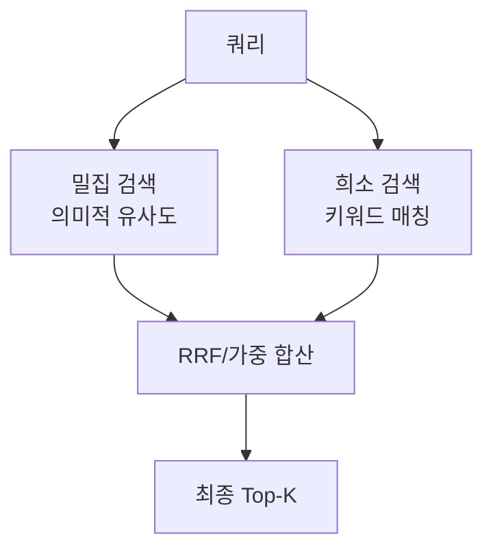

# 밀집-희소 하이브리드 검색

[[dense-retrieval|밀집 벡터 검색]](의미 유사도)과 [[sparse-retrieval-bm25|희소 키워드 검색]](BM25)을 결합하여 **리콜과 정밀도를 동시에 높이는** 검색 전략. 프로덕션 RAG의 사실상 표준.

## 왜 하이브리드인가

| 방식 | 강점 | 약점 |
|------|------|------|
| Dense만 | 동의어, 패러프레이즈 처리 | 정확한 명칭/숫자 놓침 |
| Sparse만 | 정확한 키워드 매칭 | 의미적 유사 문서 놓침 |
| **하이브리드** | **양쪽 장점 결합** | 약간의 복잡성 증가 |

## RRF (Reciprocal Rank Fusion)

$$\text{RRF}(d) = \sum_{r \in R} \frac{1}{k + r(d)}$$

각 검색기의 순위를 역수로 변환해 합산. $k=60$이 일반적. 스코어 정규화 없이 이기종 검색기를 결합할 수 있다.

## 벡터 DB 지원 현황

| DB | 하이브리드 지원 |
|----|--------------|
| [[weaviate\|Weaviate]] | 네이티브 BM25+벡터 |
| [[qdrant\|Qdrant]] | 네이티브 sparse+dense |
| [[pinecone\|Pinecone]] | 네이티브 sparse vector |
| [[milvus\|Milvus]] | 네이티브 하이브리드 |

## 관련 문서

- [[dense-retrieval]] -- 밀집 검색
- [[sparse-retrieval-bm25]] -- BM25
- [[rag-pipeline]] -- RAG 파이프라인
- [[rag-fusion]] -- RAG 퓨전 (다중 쿼리)
- [[bi-encoder-cross-encoder]] -- Bi-Encoder/Cross-Encoder
