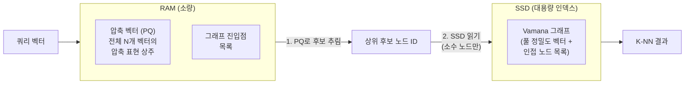
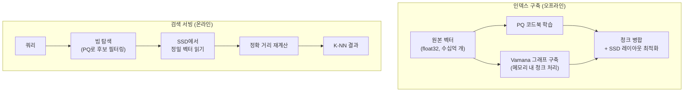

# DiskANN - 디스크 기반 십억 규모 ANN

DiskANN은 Microsoft Research가 개발한 디스크 기반 [[approximate-nearest-neighbor]] 검색 시스템이다. 2019년 NeurIPS 논문 "DiskANN: Fast Accurate Billion-point Nearest Neighbor Search on a Single Node"에서 발표되었다. 수십억 규모의 벡터 인덱스를 단일 서버의 SSD에 저장하면서 밀리초 단위 레이턴시를 달성하는 핵심 혁신을 제공한다. 기존 메모리 기반 ANN 시스템 대비 메모리 사용량을 1/100 수준으로 줄일 수 있다.

## 핵심 혁신: SSD 기반 그래프 탐색

기존 [[hnsw-graph-index|HNSW]] 등 그래프 기반 ANN은 전체 인덱스가 RAM에 있어야 했다. DiskANN은 그래프를 SSD에 저장하고 검색 시 필요한 노드만 SSD I/O로 읽는 방식을 채택한다.



**핵심 트릭**: RAM에 압축 버전(PQ 코드)을 올려두고, SSD에서 읽어야 할 노드를 미리 걸러낸다. 이로써 SSD I/O를 최소화하면서도 정확한 검색이 가능하다.

## Vamana 그래프 알고리즘

DiskANN의 인덱스 구조는 **Vamana**라는 독자적인 그래프 알고리즘을 기반으로 한다. HNSW의 계층 구조 대신 단일 계층 그래프에 집중하되, 더 공격적인 장거리 연결로 탐색 효율을 높인다.

**Vamana vs. HNSW 차이점:**

| 항목 | Vamana (DiskANN) | HNSW |
|------|-----------------|------|
| 계층 구조 | 단일 계층 | 다중 계층 |
| 장거리 연결 | 명시적으로 추가 | 상위 계층에서 암묵적으로 |
| SSD 친화성 | 단일 계층이라 랜덤 I/O 패턴 단순 | 다중 계층 포인터로 더 복잡 |
| 그래프 품질 | 높음 (pruning 정책 개선) | 높음 |

Vamana 구축 시 먼저 무작위 그래프를 구성한 뒤 반복적으로 간선을 개선(robust pruning)하여 탐색 경로의 다양성을 유지한다.

## 시스템 아키텍처



## 성능 스펙

| 데이터셋 | 규모 | 메모리 | 재현율 | QPS |
|----------|------|--------|--------|-----|
| SIFT-1B | 10억 128차원 | ~64GB RAM (vs 수TB) | 95%+ | 수천 QPS/서버 |
| Microsoft SPACEV-1B | 10억 100차원 | SSD 주 사용 | 95% | 실용적 |

DiskANN 팀의 논문 기준으로, 단일 서버(128GB RAM + NVMe SSD)에서 10억 개 벡터를 재현율 95%+, 5ms 미만 레이턴시로 처리한다.

## FreshDiskANN: 실시간 업데이트

초기 DiskANN은 인덱스 구축 후 업데이트가 어려웠다. Microsoft는 이후 **FreshDiskANN**을 발표하여 실시간 삽입/삭제를 지원하는 확장을 제공했다.

- 삽입: 소프트 삽입 후 주기적 인덱스 재구성
- 삭제: 논리적 삭제 마킹 후 압축 단계에서 물리 삭제
- 메모리 버퍼: 최근 삽입 벡터를 RAM 버퍼에 유지하여 즉각 검색 가능

## 스트리밍 DiskANN

Microsoft Research는 이후 "Streaming Similarity Search over One Billion Tweets using Graph and Inverted Indexes"에서 스트리밍 환경의 DiskANN 변형을 발표했다. 트위터 규모의 실시간 데이터에서 ANN 검색을 지원하는 방향으로 발전했다.

## DiskANN 오픈소스

DiskANN은 GitHub(microsoft/DiskANN)에 오픈소스로 공개되어 있으며, C++로 구현되었다. Python 바인딩도 제공된다.

```bash
# 설치
pip install diskannpy

# Python 사용 예시
import diskannpy
import numpy as np

# 인덱스 구축
diskannpy.build_disk_index(
    data=vectors,              # float32 벡터
    distance_metric="l2",
    index_directory="./my_index",
    complexity=64,             # 구축 시 빔 너비
    graph_degree=32,           # 최대 연결 수 (R)
    search_memory_maximum=16.0 # 검색 시 RAM 제한 (GB)
)

# 검색
index = diskannpy.DiskIndex(
    distance_metric="l2",
    vector_dtype=np.float32,
    index_directory="./my_index",
    num_threads=8,
    num_nodes_to_cache=100_000  # 핫 노드 RAM 캐시
)
results, distances = index.search(query, k=10, complexity=50)
```

## 핵심 파라미터

| 파라미터 | 의미 | 영향 |
|----------|------|------|
| `R` (graph_degree) | 최대 연결 수 | 클수록 품질 증가, 인덱스 크기 증가 |
| `L` (complexity) | 구축/검색 빔 너비 | 클수록 품질/재현율 증가, 시간 증가 |
| `B` | 검색 시 메모리 예산(GB) | 클수록 SSD I/O 감소 |
| `T` | PQ 압축 비율 | 클수록 메모리 절약, 정확도 감소 |

## 벡터 DB 통합

DiskANN 알고리즘은 여러 벡터 데이터베이스에 통합되었다:

- **Azure AI Search**: Microsoft의 관리형 검색 서비스에 DiskANN 기반 벡터 검색 내장
- **Weaviate**: DiskANN 백엔드 옵션 추가
- **커뮤니티**: 다양한 오픈소스 통합 진행 중

## 메모리 효율 비교

| 시스템 | 10억 128차원 float32 벡터 필요 RAM |
|--------|----------------------------------|
| HNSW (in-memory) | ~600GB+ |
| IVF-PQ (in-memory) | ~10-50GB |
| DiskANN | ~10-64GB (나머지는 SSD) |

## 관련 문서

- [[approximate-nearest-neighbor]] - ANN 검색 전반 개요
- [[hnsw-graph-index]] - 메모리 기반 그래프 ANN 비교
- [[ivf-pq-vector-index]] - 메모리 효율 인덱스
- [[scann-google-search]] - Google의 정량화 ANN
- [[annoy-spotify]] - 트리 기반 ANN
- [[vector-db-comparison]] - 벡터 DB 시스템 비교
- [[embedding-quantization]] - 임베딩 양자화 기법
