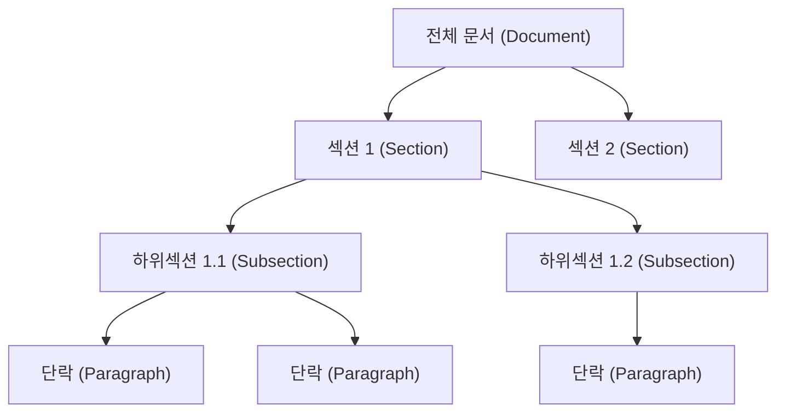
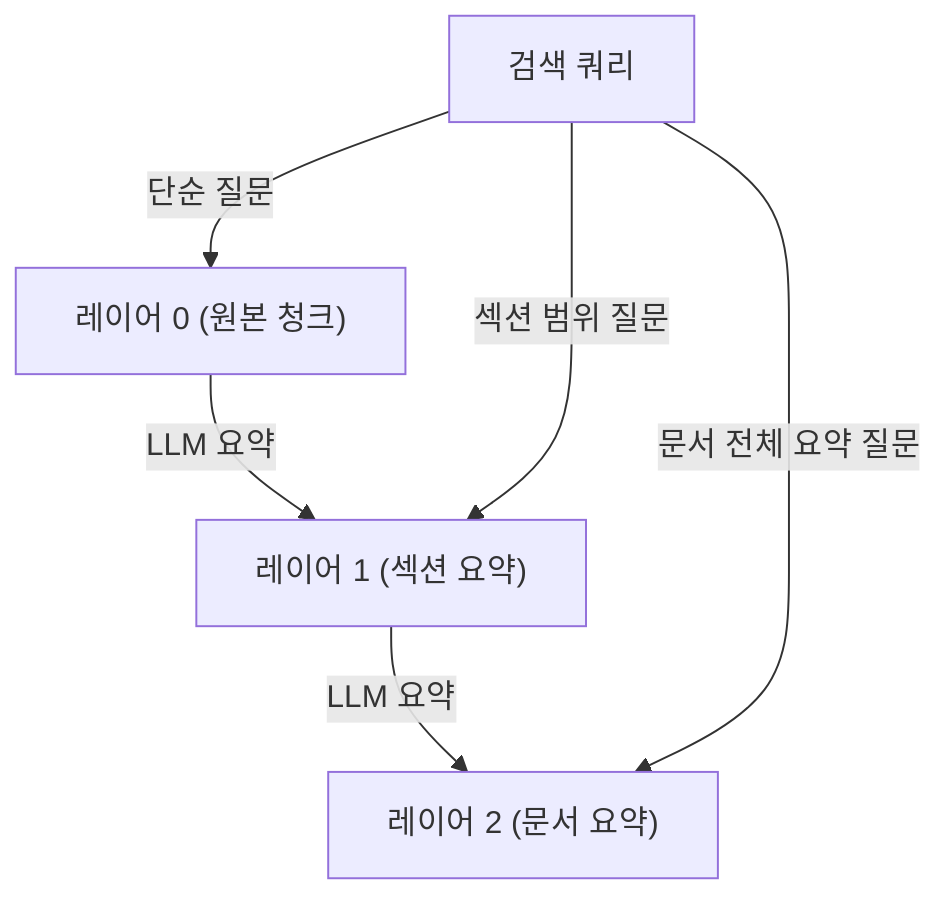

# 문서 계층 청킹

## 개요

문서 계층 청킹(Document Hierarchy Chunking)은 문서의 논리적 구조(섹션, 하위 섹션, 단락)를 보존하면서 청킹하는 기법이다. 단순히 고정 크기로 텍스트를 자르는 방식과 달리, 문서 저자가 의도한 의미 단위를 경계로 삼아 청크를 생성한다. 이를 통해 검색 시 맥락 손실을 최소화하고, 계층적 검색 전략을 구사할 수 있게 된다.

## 왜 계층 청킹이 필요한가

일반 텍스트 기반 RAG(Retrieval-Augmented Generation) 파이프라인에서 고정 크기 청킹은 두 가지 핵심 문제를 일으킨다.

**맥락 단절 문제**: 중요한 문장이 두 청크의 경계에서 잘리면, 의미론적 완결성이 파괴된다. 특히 긴 논문이나 법률 문서처럼 앞 섹션의 정의를 뒤 섹션에서 전제로 사용하는 구조에서 심각하다.

**계층 정보 소실 문제**: "3장 2절"이 "1장"의 하위 내용임을 청크가 담지 못하면, 쿼리의 범위를 계층적으로 제어하기 어렵다. 예를 들어 "이 논문의 실험 설정 전체"를 묻는 쿼리는 "4. 실험" 섹션 전체를 반환해야 하지만, 고정 청킹은 이 범위를 흩어놓는다.

## 계층 구조 표현 방식



위 트리는 문서의 논리적 계층을 나타낸다. 계층 청킹은 이 트리 구조를 청크 메타데이터와 부모-자식 관계로 인코딩하여 저장한다.

### 청크 메타데이터 설계

각 청크에 최소한 다음 메타데이터를 부착해야 계층 검색이 가능하다.

```python
{
    "chunk_id": "doc_a_sec2_sub1_para3",
    "parent_id": "doc_a_sec2_sub1",        # 상위 청크 ID
    "document_id": "doc_a",
    "level": "paragraph",                   # document | section | subsection | paragraph
    "section_path": ["섹션 2", "하위섹션 1"],  # 계층 경로
    "text": "실제 청크 본문...",
    "token_count": 128
}
```

## 주요 계층 청킹 전략

### 1. 상위-하위 분리 청킹 (Parent-Document Retrieval)

검색 시에는 작은 청크(자식)로 의미 매칭 정밀도를 높이고, 실제 컨텍스트 삽입 시에는 부모 청크 전체를 LLM에 제공한다.

- 자식 청크: 128-256 토큰, 임베딩 및 벡터 검색 대상
- 부모 청크: 512-1024 토큰, LLM에 전달되는 실제 컨텍스트

LangChain의 `ParentDocumentRetriever`가 대표적인 구현체다.

### 2. 섹션 헤더 기반 청킹 (Header-Based Chunking)

마크다운 H1/H2/H3, HTML `<h>` 태그, PDF 헤더 폰트 크기 차이를 감지해 섹션 경계로 삼는다.

```python
from langchain.text_splitter import MarkdownHeaderTextSplitter

headers_to_split_on = [
    ("#", "h1"),
    ("##", "h2"),
    ("###", "h3"),
]
splitter = MarkdownHeaderTextSplitter(headers_to_split_on=headers_to_split_on)
docs = splitter.split_text(markdown_text)
# 각 doc.metadata에 {"h1": "소개", "h2": "배경"} 식으로 계층 경로가 첨부됨
```

### 3. RAPTOR 트리 기반 계층 청킹

[[raptor-tree-retrieval]]은 계층 청킹을 한 단계 더 발전시킨다. 리프 노드(원본 청크)들을 LLM으로 요약해 상위 노드를 생성하고, 이 과정을 재귀적으로 반복해 요약의 트리를 구성한다. 검색 시 쿼리 복잡도에 따라 적절한 계층 노드에서 검색한다.



RAPTOR는 "이 보고서의 핵심 결론은?" 같은 문서 수준 쿼리와 "3절에서 사용한 데이터셋은?" 같은 세부 쿼리를 동일 인덱스에서 처리할 수 있게 해준다.

### 4. 의미 단위 병합 청킹 (Semantic Grouping)

고정 경계 대신, 문장 임베딩 유사도가 급격히 떨어지는 지점을 경계로 삼는다. 연속된 문장들의 코사인 유사도 평균이 임계값 이하로 떨어지면 새 청크를 시작한다.

장점: 화제 전환을 자연스럽게 포착한다.
단점: 계산 비용이 높고, 문서 고유 구조 정보가 반영되지 않는다.

## 청킹 수준 선택 기준

| 쿼리 유형 | 최적 청킹 수준 | 이유 |
|-----------|---------------|------|
| 사실 확인 ("X는 무엇인가") | 단락/문장 | 정밀 매칭 필요 |
| 비교 분석 ("A와 B의 차이") | 하위섹션 | 여러 관련 단락 필요 |
| 절차 안내 ("어떻게 하는가") | 섹션 | 단계 전체 흐름 필요 |
| 전체 요약 ("이 문서의 핵심") | 문서/챕터 | 광역 컨텍스트 필요 |

## 실무 구현 패턴

### 계층 메타데이터 필터링

벡터 검색 결과에서 `section_path` 필터를 추가하면 특정 섹션 범위만 검색할 수 있다.

```python
results = vectorstore.similarity_search(
    query="실험 설정",
    filter={"section_path": {"$contains": "4. 실험"}},
    k=5
)
```

### 부모 청크 확장 (Context Expansion)

상위 k개 청크를 검색한 후, 각 청크의 부모 청크 ID를 조회해 더 넓은 컨텍스트를 LLM에 제공한다.

```python
def expand_to_parent(chunk_id: str, chunk_store: dict) -> str:
    chunk = chunk_store[chunk_id]
    parent_id = chunk.get("parent_id")
    if parent_id and parent_id in chunk_store:
        return chunk_store[parent_id]["text"]
    return chunk["text"]
```

## 도구별 지원 현황

| 도구/라이브러리 | 지원 방식 |
|----------------|-----------|
| LangChain | `MarkdownHeaderTextSplitter`, `ParentDocumentRetriever` |
| LlamaIndex | `HierarchicalNodeParser`, `AutoMergingRetriever` |
| Chroma | 메타데이터 필터링으로 계층 구현 |
| Weaviate | 객체 간 참조(cross-reference)로 부모-자식 관계 표현 |
| RAPTOR | 재귀 요약으로 계층 자동 구성 |

## 한계와 주의사항

- **PDF 계층 추출 어려움**: 스캔 PDF나 이미지 기반 PDF는 헤더 감지가 부정확해 계층이 잘못 구성될 수 있다. OCR + 레이아웃 분석(예: Unstructured.io)이 선행되어야 한다.
- **비구조적 문서 처리 한계**: 소설, 이메일, 대화록처럼 헤더가 없는 문서는 의미 단위 병합 청킹으로 대체해야 한다.
- **계층 깊이 트레이드오프**: 너무 세밀한 계층(단락 수준)은 검색 정밀도를 높이나 부모 조회 오버헤드가 증가한다.
- **LLM 컨텍스트 한계**: 부모 청크로 확장 시 토큰 예산 초과 가능성을 항상 점검해야 한다.

## 관련 문서

- [[chunking-strategies]] - 청킹 전략 전반
- [[raptor-tree-retrieval]] - 재귀 요약 기반 계층 트리
- [[parent-document-retrieval]] - 부모 문서 검색 패턴
