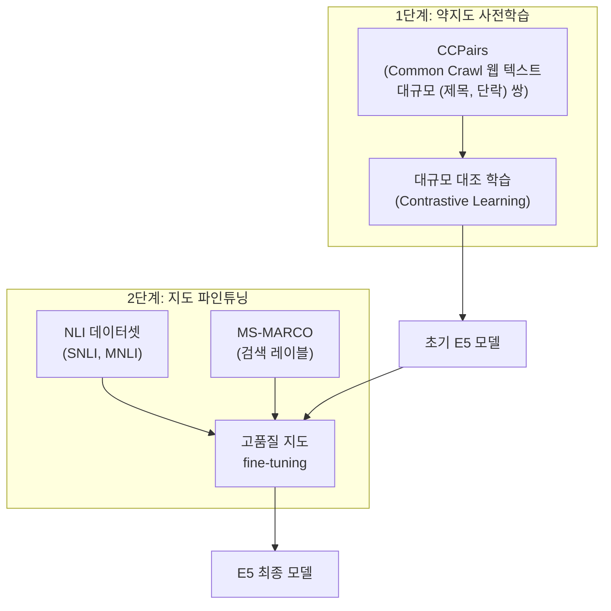

# E5 - Microsoft 텍스트 임베딩

## 개요

**E5(EmbEddings from bidirEctional Encoder rEpresentations)**는 Microsoft Research가 개발한 텍스트 임베딩 모델 시리즈다. 핵심 기여는 **대규모 약지도 학습(weakly-supervised pre-training) + 지도 파인튜닝** 2단계 파이프라인으로, 제한된 레이블 데이터로도 강력한 임베딩을 학습하는 방법을 제시했다. **mE5**는 다국어 확장 버전으로 산업 표준 다국어 임베딩으로 자리잡았다.



2단계 학습 파이프라인이 E5 성능의 핵심이다. 대규모 약지도 데이터로 기반을 쌓고 고품질 레이블로 마무리한다.

---

## 핵심 사양

| 모델 | 파라미터 | 임베딩 차원 | 최대 토큰 | 언어 |
|------|---------|-----------|---------|------|
| e5-small-v2 | 33M | 384 | 512 | 영어 |
| e5-base-v2 | 110M | 768 | 512 | 영어 |
| e5-large-v2 | 335M | 1,024 | 512 | 영어 |
| e5-mistral-7b-instruct | 7.1B | 4,096 | 32,768 | 다국어 |
| multilingual-e5-small | 117M | 384 | 512 | 100개 언어 |
| multilingual-e5-base | 278M | 768 | 512 | 100개 언어 |
| multilingual-e5-large | 560M | 1,024 | 512 | 100개 언어 |

---

## 핵심 특징

### 1. 약지도 + 지도 2단계 학습 (E5의 핵심 기여)

기존 임베딩 모델 학습의 병목은 **고품질 레이블 데이터의 희소성**이었다. E5는 이를 해결하는 우아한 방법을 제시했다:

**1단계 - CCPairs 약지도 학습**:
웹 크롤링 데이터에서 자동으로 (제목, 관련 단락) 쌍을 구성한다. 품질은 낮지만 규모가 크다. 이를 대조 학습으로 초기 모델을 학습한다.

**2단계 - 소규모 고품질 지도 학습**:
NLI, MS-MARCO 같은 고품질 레이블 데이터로 파인튜닝한다. 1단계 덕분에 적은 데이터로도 높은 성능이 나온다.

이 방식은 이후 [[gte-text-embeddings]], [[bge-m3-embedding]] 등 많은 모델에 채택되었다.

### 2. 접두사 기반 태스크 구분

E5는 [[instructor-embedding-model]]의 지시 튜닝과 달리 간단한 **접두사(prefix)**로 쿼리와 패시지를 구분한다:

```python
from sentence_transformers import SentenceTransformer

model = SentenceTransformer("intfloat/e5-large-v2")

# 반드시 접두사 사용
query = "query: 텍스트 임베딩이란 무엇인가?"
passage = "passage: 텍스트 임베딩은 텍스트를 밀집 벡터로 변환하는 기술이다"

query_embedding = model.encode(query, normalize_embeddings=True)
passage_embedding = model.encode(passage, normalize_embeddings=True)
```

**중요**: E5를 사용할 때 `"query: "` 와 `"passage: "` 접두사를 누락하면 성능이 크게 저하된다. 이 접두사가 모델에게 임베딩의 목적을 알려주는 역할을 한다.

### 3. e5-mistral-7b - LLM 기반 임베딩

최신 E5 시리즈는 Mistral-7B를 기반으로 한 거대 임베딩 모델을 포함한다:
- **32,768 토큰** 초장문 컨텍스트 지원
- 4,096차원 고차원 임베딩
- 지시 튜닝 방식 (자연어 지시문 지원)
- MTEB에서 최상위권 성능

```python
# e5-mistral 사용 (지시문 방식)
task_definition = "Retrieve semantically similar text."
query_text = "딥러닝 임베딩 모델"

input_text = f"Instruct: {task_definition}\nQuery: {query_text}"
embedding = model.encode(input_text)
```

### 4. multilingual-e5 (mE5) - 다국어 표준

**mE5**는 E5의 다국어 버전으로, 100개 이상의 언어를 지원한다. XLM-RoBERTa를 기반으로 약지도 + 지도학습 파이프라인을 다국어로 확장했다:

```python
from sentence_transformers import SentenceTransformer

model = SentenceTransformer("intfloat/multilingual-e5-large")

# 한국어 + 영어 교차 언어 검색
korean_query = "query: 기계학습 임베딩 모델의 원리"
english_passage = "passage: Machine learning embedding models convert text into dense vectors"

query_emb = model.encode(korean_query, normalize_embeddings=True)
passage_emb = model.encode(english_passage, normalize_embeddings=True)

# 교차 언어 검색 가능 (한국어 쿼리 → 영어 문서)
similarity = query_emb @ passage_emb
```

---

## MTEB 성능

| 모델 | MTEB 영어 평균 | 비고 |
|------|--------------|------|
| e5-base-v2 | ~63점대 | 기본 기준선 |
| e5-large-v2 | ~65점대 | 대형 범용 모델 |
| e5-mistral-7b-instruct | ~67점대 | LLM 기반 최상위 |
| multilingual-e5-large | 다국어 MTEB 경쟁력 | 한국어 포함 100개 언어 |

---

## 주의사항 및 실무 팁

### 접두사 필수 적용

```python
# 잘못된 사용 - 접두사 없음
bad_query = "임베딩 모델의 원리"

# 올바른 사용
good_query = "query: 임베딩 모델의 원리"
good_passage = "passage: 임베딩 모델은 텍스트를 벡터로 변환한다"
```

### L2 정규화 권장

E5는 코사인 유사도 기반이므로 `normalize_embeddings=True` 또는 사용 전 L2 정규화를 권장한다.

### 배치 처리 최적화

```python
from sentence_transformers import SentenceTransformer
import numpy as np

model = SentenceTransformer("intfloat/multilingual-e5-base")

docs = ["passage: " + doc for doc in document_list]
embeddings = model.encode(
    docs,
    batch_size=32,
    normalize_embeddings=True,
    show_progress_bar=True
)
```

---

## 왜 중요한가

E5는 **약지도 학습을 대규모 임베딩 학습에 체계화**한 선구적 연구다. CCPairs를 활용한 1단계 학습은 이후 많은 임베딩 모델에 영향을 미쳤고, multilingual-e5는 비영어권 RAG 시스템의 표준 선택지 중 하나가 되었다. Microsoft의 Azure AI Search 등 상용 서비스에도 통합되어 산업 표준으로 자리잡았다.

---

## 관련 문서

- [[embedding-models-for-rag]] - 임베딩 모델 전체 비교
- [[mteb]] - 임베딩 벤치마크 기준
- [[gte-text-embeddings]] - 유사한 다단계 학습 방식 (Alibaba)
- [[bge-m3-embedding]] - 또 다른 다기능 임베딩 (BAAI)
- [[instructor-embedding-model]] - 지시 튜닝 접근법 비교
- [[dense-passage-retrieval]] - E5가 개선한 DPR 방식
- [[dense-retrieval]] - 밀집 검색 기반 RAG
- [[mean-vs-cls-pooling]] - E5의 풀링 전략 (Mean Pooling)
- [[token-pooling-strategies]] - 풀링 전략 전체 비교
- [[embedding-finetuning]] - 도메인 특화 파인튜닝
