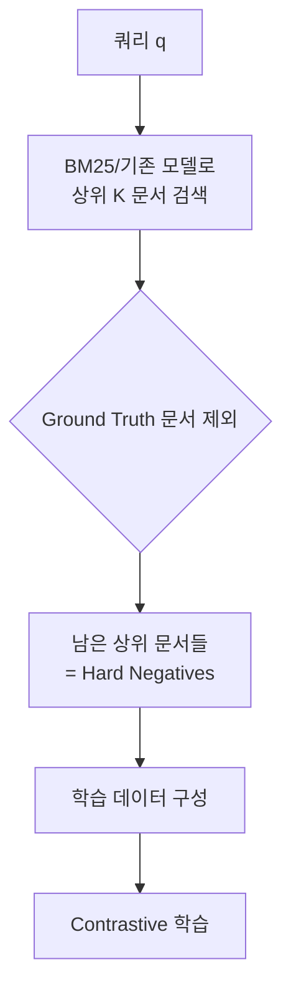
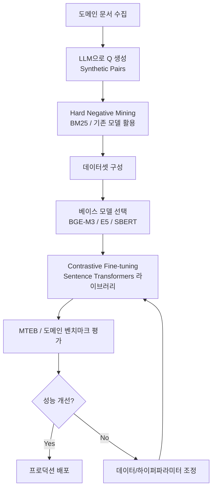

# 임베딩 파인튜닝 (Embedding Fine-tuning)

## 개요

범용 임베딩 모델은 일반 텍스트에 최적화되어 있어 특수 도메인(의료, 법률, 금융, 코드 등)에서 성능이 저하될 수 있다. 임베딩 파인튜닝(Embedding Fine-tuning)은 도메인 특화 데이터로 임베딩 모델을 추가 학습시켜 검색 품질을 향상시키는 기법이다.

## 학습 방식: Contrastive Fine-tuning

임베딩 파인튜닝의 핵심은 대조 학습(Contrastive Learning)이다. 유사한 쌍은 벡터 공간에서 가깝게, 관련 없는 쌍은 멀게 배치하도록 학습.

$$\mathcal{L} = -\log \frac{\exp(\text{sim}(q, d^+) / \tau)}{\exp(\text{sim}(q, d^+) / \tau) + \sum_{d^- \in N} \exp(\text{sim}(q, d^-) / \tau)}$$

- $q$: 쿼리, $d^+$: 관련 문서(positive), $d^-$: 관련 없는 문서(negative)
- $\tau$: 온도(temperature) 파라미터
- 배치 내 다른 쌍을 negative로 활용 (in-batch negatives)

## Hard Negative Mining (어려운 부정 예제)

단순한 random negative는 학습 효율이 낮다. "어렵지만 관련 없는" 예제가 모델을 더 잘 학습시킨다.



Hard Negative가 중요한 이유: 모델이 진짜 관련 문서와 겉만 비슷한 문서를 구별하도록 강제.

## Synthetic Pair Generation (합성 데이터 생성)

도메인 특화 레이블 데이터가 부족할 때 LLM을 이용해 학습 쌍을 자동 생성.

```
과정:
1. 도메인 문서 수집
2. LLM으로 각 문서에 대한 질문 생성:
   "다음 문서에서 물어볼 수 있는 자연스러운 질문을 3개 생성하라"
3. <질문, 문서> 쌍으로 positive 데이터 구성
4. Hard negative mining으로 음성 예제 추가
5. 생성된 데이터로 파인튜닝
```

연구 결과: 합성 데이터로 파인튜닝한 모델이 범용 모델 대비 도메인 검색에서 20-40% 향상.

## Matryoshka Representation Learning (MRL)

Kusupati et al. (2022). 하나의 임베딩 안에 다양한 차원 수준을 내포시키는 학습 기법.

```
학습: 1024차원 임베딩의 처음 256, 512, 768, 1024 차원 각각으로 손실 계산

추론 시:
- 256차원: 빠른 검색, 낮은 정확도 (1차 필터링)
- 512차원: 중간
- 1024차원: 최고 정확도 (최종 선택)
```

2단계 검색: 256차원으로 빠르게 후보 1000개 → 1024차원으로 정밀 상위 10개 선택.

## 파인튜닝 파이프라인



## 도구 및 라이브러리

### Sentence Transformers

가장 널리 사용되는 임베딩 파인튜닝 프레임워크.

```python
from sentence_transformers import SentenceTransformer, InputExample, losses
from torch.utils.data import DataLoader

model = SentenceTransformer("BAAI/bge-m3")
train_examples = [
    InputExample(texts=["쿼리", "관련 문서", "관련 없는 문서"]),
    ...
]
train_loss = losses.TripletLoss(model)
model.fit(train_objectives=[(dataloader, train_loss)], epochs=3)
```

### LlamaIndex Fine-tuning API

문서에서 자동으로 Q-A 쌍을 생성하고 파인튜닝까지 지원하는 파이프라인.

## 도메인별 적용 사례

| 도메인 | 효과 | 주요 도전 |
|--------|------|----------|
| 의료/임상 | 의학 용어/약어 정확 매칭 | 레이블 데이터 희소, HIPAA 규정 |
| 법률 | 조항 번호, 판례 매칭 | 매우 긴 문서, 전문 용어 |
| 코드 | API 이름, 함수 시그니처 매칭 | 언어별 특성, 버전 차이 |
| 금융 | 기업 코드, 용어 정밀 매칭 | 시간적 변화 (신규 상품명) |

## 파인튜닝 vs 더 좋은 범용 모델

파인튜닝이 유리한 경우:
- 도메인 전용 용어/표기가 많음
- 범용 MTEB 1위 모델도 도메인 검색 실패 사례 빈번
- 충분한 도메인 데이터 수집 가능

범용 모델로 충분한 경우:
- 일반적인 FAQ, 제품 매뉴얼
- E5-Mistral, Voyage-3 등 고성능 모델로 이미 충분한 성능

## 관련 문서

- [[embedding-models-for-rag]] - 베이스 임베딩 모델 선택
- [[chunking-strategies]] - 파인튜닝 전 데이터 준비
- [[rag-evaluation-metrics]] - 파인튜닝 효과 측정
- [[hybrid-search-rrf]] - 파인튜닝된 임베딩과 BM25 결합
