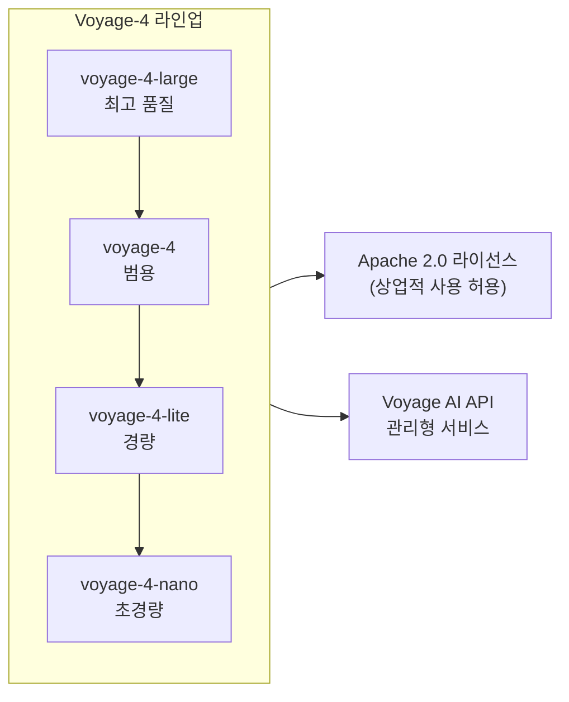

# Qwen3 / Voyage-4 Embedding Leaderboard Shakeup

2026년 초 MTEB(Massive Text Embedding Benchmark) 리더보드(leaderboard)를 뒤흔든 임베딩(embedding) 모델 세대 교체. Qwen3-Embedding 오픈웨이트(open-weight)와 Voyage-4 상용(commercial) 시리즈가 동시에 등장하며 기준선(baseline)이 급격히 상향됐다.

## 왜 중요한가

Qwen3-Embedding-8B가 MTEB Multilingual 1위(70.58점)를 차지하며 오픈웨이트 모델이 Gemini Embedding 등 상용 모델과의 격차를 급속히 좁혔다. Voyage는 voyage-4/4-large/4-lite/4-nano를 Apache 2.0 라이선스로 투입하며 상용·오픈 양쪽의 기준선을 끌어올렸다. RAG 파이프라인의 검색 품질이 임베딩 모델 선택에 크게 좌우되므로, 이 순위 변동은 실무 시스템 업그레이드 여부를 가르는 신호다.

## 2026년 4월 기준 MTEB 순위 변화

| 모델 | MTEB 평균 | 다국어 | 오픈웨이트 | 비고 |
|------|-----------|--------|-----------|------|
| Qwen3-Embedding-8B | 70.58 (다국어 1위) | 70.58 | O | Apache 2.0 |
| voyage-4-large | 최상위권 (영어) | 제한적 | X | 상용 API |
| voyage-4 | 상위권 (범용) | 제한적 | X | 상용 API |
| voyage-4-lite | 중상위권 | 제한적 | X | 경량·저비용 |
| Gemini Embedding | 상위권 | 강세 | X | Google Cloud |
| text-embedding-3-large | 중상위권 | 중간 | X | OpenAI |

## Qwen3-Embedding 시리즈의 부상

```mermaid
flowchart TD
    Base[Qwen3 기반 언어 모델\n(Foundation Model)] --> Embed[임베딩 특화 파인튜닝\nContrastive Learning]
    Embed --> Sizes[모델 크기 시리즈\n0.6B / 4B / 8B]
    Sizes --> MTEB[MTEB Multilingual\n1위 달성: 70.58점]
    Sizes --> Tasks[지원 태스크\n검색 / 분류 / 클러스터링\n의미 유사도 / 재랭킹]
    MTEB --> Impact[오픈웨이트 vs 상용\n격차 5pt 이내로 좁혀짐]
```

Qwen3-Embedding은 Qwen3 기반 언어 모델을 임베딩 태스크에 맞게 대조 학습(contrastive learning)으로 파인튜닝(fine-tuning)한 시리즈다.

### 주요 특징
- **크기 다양성**: 0.6B(경량·엣지), 4B(균형), 8B(고성능) 3종
- **명령어 지원(instruction following)**: 쿼리 유형에 맞는 태스크 설명을 prefix로 추가해 성능 향상
- **다국어 강세**: 100개 이상 언어 지원, 특히 아시아권 언어에서 압도적
- **라이선스**: Apache 2.0 - 상업적 사용, 자체 호스팅 모두 자유

## Voyage-4 시리즈 포지셔닝



Voyage AI는 동일 품질 기준에서 OpenAI text-embedding-3-large 대비 낮은 비용을 강점으로 내세운다. Apache 2.0 라이선스 공개는 기업 도입 장벽을 낮추기 위한 전략적 결정이다.

## 리더보드 순위 변동이 실무에 미치는 영향

### 임베딩 모델 교체 결정 기준

1. **벤치마크 격차**: 현재 사용 모델과 1위 모델의 MTEB 차이가 3pt 이상이면 교체 검토
2. **도메인 특화성**: 일반 MTEB가 아닌 도메인별 벤치마크(법률, 의료, 코드 등)를 우선 확인
3. **비용/성능 트레이드오프**: voyage-4-lite가 voyage-4-large의 90% 성능을 절반 비용으로 달성하는지 확인
4. **다국어 요건**: 한국어·일본어 등 아시아권이면 Qwen3-Embedding이 압도적으로 유리

### 교체 시 고려사항
- 기존 벡터 인덱스(vector index) 전체 재구축(re-indexing) 필요 - 다운타임 계획 수립
- 임베딩 차원(dimension)이 다르면 벡터 DB 스키마 변경 필요
- A/B 테스트로 실제 검색 품질(MRR, nDCG) 향상 검증 후 전환

## 대표 레퍼런스

- [Qwen3 Embedding: Advancing Text Embedding and Reranking Through Foundation Models (arXiv 2506.05176)](https://arxiv.org/abs/2506.05176)
- [Qwen3 Embedding Blog Announcement](https://qwenlm.github.io/blog/qwen3-embedding/)
- [Qwen3-Embedding-8B on Hugging Face](https://huggingface.co/Qwen/Qwen3-Embedding-8B)
- [voyage-3-large: the new state-of-the-art general-purpose embedding model (Voyage AI Blog)](https://blog.voyageai.com/2025/01/07/voyage-3-large/)
- [Voyage AI Text Embeddings Documentation](https://docs.voyageai.com/docs/embeddings)

## 관련 문서

- [[ai-hot-topics-2026-04|2026년 4월 AI 개발 핫토픽 100선]]
- [[temporal-knowledge-graph-memory|Zep / Graphiti Temporal Knowledge Graph Memory]]
- [[adaptive-context-compression|Adaptive Context Compression for Long-Running Agents]]
- [[serverless-vector-dbs|Serverless Object-Storage Vector DBs]]
