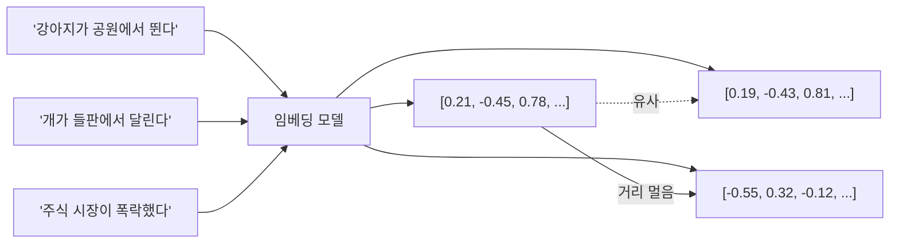
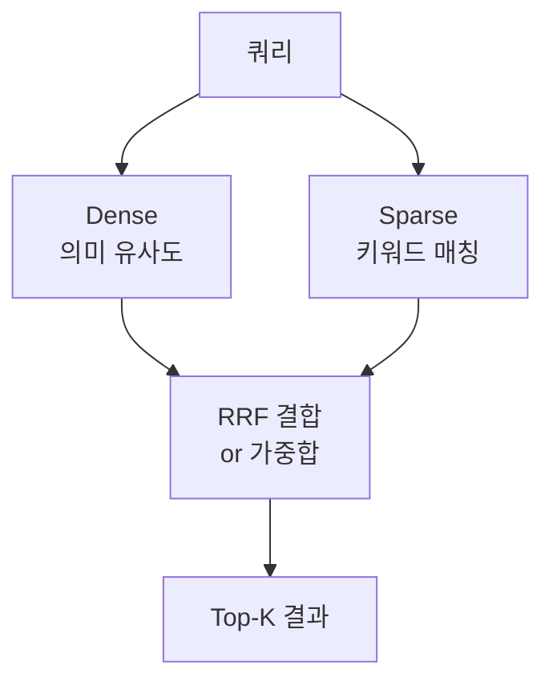
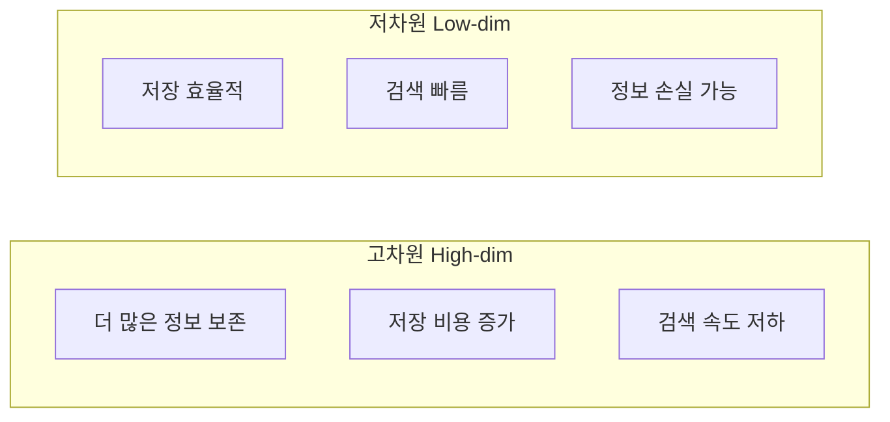

# 임베딩 모델 (Embedding Models)

임베딩 모델은 텍스트(또는 이미지, 코드 등)를 고정 크기의 실수 벡터로 변환하는 모델이다. 변환된 벡터는 의미적으로 유사한 입력일수록 벡터 공간에서 가깝게 위치한다. [[vector-database|벡터 데이터베이스]]에 저장하여 의미 기반 검색(semantic search)을 가능하게 하며, [[rag|RAG(Retrieval-Augmented Generation)]] 시스템의 핵심 구성 요소다.

## 임베딩 모델의 역할



위 예시처럼 의미적으로 유사한 문장은 벡터 공간에서 가깝고, 의미가 다른 문장은 멀리 위치한다.

## Dense vs Sparse 임베딩

### Dense 임베딩 (밀집 임베딩)

신경망 기반으로 입력 전체의 의미를 고정 크기 벡터로 압축한다. 차원 수는 보통 256~4096이며, **모든 차원이 비영(non-zero)** 값을 갖는다.

- 의미적 유사도(semantic similarity) 포착에 강함
- "강아지" = "개" 같은 동의어, 의역 처리 우수
- 키워드 정확 매칭(exact match)에 약함

### Sparse 임베딩 (희소 임베딩)

BM25, TF-IDF 기반 전통 방식 또는 학습된 스파스 방식(SPLADE 등). 어휘 크기(수만~수십만) 차원이지만 **대부분이 영(zero)**.

- 키워드 정확 매칭, 고유명사, 희귀어 검색에 강함
- 의미 변형, 동의어 처리에 약함
- 효율적 저장 (희소 벡터 압축)

### Hybrid: [[bge-m3-embedding|BGE-M3]]의 접근

BGE-M3는 하나의 모델로 Dense + Sparse + ColBERT(Multi-vector) 세 가지를 동시에 제공하는 복합 임베딩 모델이다. 실무에서는 두 점수를 결합하는 하이브리드 검색이 단일 방식보다 일관되게 우수한 성능을 보인다.



## MTEB: 임베딩 평가 기준

**MTEB (Massive Text Embedding Benchmark)**는 임베딩 모델을 다양한 태스크에서 종합 평가하는 공개 벤치마크다. Hugging Face에서 리더보드를 관리한다.

### MTEB 태스크 분류

| 태스크 유형 | 설명 | 예시 |
|-------------|------|------|
| **Retrieval** | 쿼리-문서 관련도 | BEIR 벤치마크 |
| **Clustering** | 문서 군집화 | 클러스터 순도(NMI) |
| **STS** | 문장 쌍 유사도 | STSBenchmark |
| **Reranking** | 후보 재정렬 | AskUbuntu |
| **Classification** | 문서 분류 | Banking77 |
| **Pair Classification** | 쌍 분류 (중복 여부 등) | MRPC |
| **Summarization** | 요약 품질 평가 | SummEval |

### MTEB 리더보드 상위 모델 (2024 기준 개요)

| 모델 | 출시 | 차원 | MTEB 평균 | 특징 |
|------|------|------|-----------|------|
| **text-embedding-3-large** | OpenAI 2024 | 3072 (조정 가능) | ~64.6 | MRL 지원, API |
| **text-embedding-3-small** | OpenAI 2024 | 1536 | ~62.3 | 비용 효율 |
| **gte-Qwen2-7B-instruct** | Alibaba | 3584 | ~72+ | 오픈소스 SOTA |
| **BGE-M3** | BAAI | 1024 | ~67 | 다국어, 복합 임베딩 |
| **E5-large-v2** | Microsoft | 1024 | ~62 | 쿼리/패시지 접두사 |
| **multilingual-e5-large** | Microsoft | 1024 | - | 100개 언어 |

> [교차검증 필요]: MTEB 점수는 버전과 평가 시점에 따라 변동. 최신 수치는 https://huggingface.co/spaces/mteb/leaderboard 에서 확인 권장.

## 주요 임베딩 모델 계열

### OpenAI text-embedding-3

2024년 초 출시. `text-embedding-3-small`(1536차원)과 `text-embedding-3-large`(3072차원).

**Matryoshka Representation Learning (MRL) 지원:**
- 차원을 256, 512, 1536 등으로 잘라도 성능 유지
- 저장 비용과 검색 속도 최적화 가능

```python
from openai import OpenAI

client = OpenAI()

# 일반 임베딩
response = client.embeddings.create(
    input="임베딩할 텍스트",
    model="text-embedding-3-small"
)
vector = response.data[0].embedding  # 길이 1536

# 차원 축소 (MRL 활용)
response = client.embeddings.create(
    input="임베딩할 텍스트",
    model="text-embedding-3-small",
    dimensions=512  # 1536 -> 512로 축소
)
```

### BGE (BAAI General Embedding) 계열 - [[bge-m3-embedding]]

BAAI(Beijing Academy of AI)에서 개발. BGE-M3는 다국어(100+ 언어), Dense/Sparse/Multi-vector 복합 지원.

```python
from FlagEmbedding import BGEM3FlagModel

model = BGEM3FlagModel("BAAI/bge-m3", use_fp16=True)

# Dense + Sparse 동시 추출
output = model.encode(
    ["한국어 문서", "English document"],
    return_dense=True,
    return_sparse=True,
)
dense_vecs = output["dense_vecs"]
sparse_weights = output["lexical_weights"]
```

### E5 계열 - [[e5-text-embeddings]]

Microsoft의 E5(Embeddings from bidirectional Encoder representations). 쿼리에는 `"query: "` 접두사, 문서에는 `"passage: "` 접두사를 붙이는 방식이 특징.

```python
from sentence_transformers import SentenceTransformer

model = SentenceTransformer("intfloat/e5-large-v2")

# 접두사 필수!
query_embedding = model.encode("query: 검색 쿼리")
doc_embedding = model.encode("passage: 문서 내용")
```

### GTE 계열 - [[gte-text-embeddings]]

Alibaba의 GTE(General Text Embeddings). `gte-Qwen2-7B-instruct`는 70억 파라미터 기반으로 MTEB 상위권 성능.

### Sentence-BERT / all-MiniLM

가볍고 빠른 오픈소스 임베딩. `all-MiniLM-L6-v2`(384차원)는 속도 우선 환경에 적합.

## 차원 vs 품질 트레이드오프

차원이 클수록 정보 표현력이 높아지지만, 저장 비용과 검색 레이턴시가 증가한다.



| 차원 | 메모리 (1M 벡터) | float32 기준 | 활용 |
|------|-----------------|-------------|------|
| 256 | 1 GB | 빠른 프로토타입 | - |
| 512 | 2 GB | 균형 | all-MiniLM |
| 768 | 3 GB | 일반 | BERT-base 계열 |
| 1024 | 4 GB | 고성능 | BGE-M3, E5-large |
| 1536 | 6 GB | OpenAI 표준 | text-embedding-3-small |
| 3072 | 12 GB | 최고 품질 | text-embedding-3-large |

**[[matryoshka-embeddings|MRL(Matryoshka Representation Learning)]]**은 하나의 모델 훈련으로 다양한 차원을 지원하여 이 트레이드오프를 유연하게 해결한다.

## 다국어 임베딩

한국어 등 비영어권 텍스트를 처리할 때는 다국어 전용 모델이 필요하다.

| 모델 | 지원 언어 | 특징 |
|------|-----------|------|
| BGE-M3 | 100+ | Dense+Sparse 복합, 8192 토큰 |
| multilingual-e5-large | 100 | MTEB 다국어 강세 |
| paraphrase-multilingual-mpnet | 50 | sentence-transformers 호환 |
| LaBSE | 109 | 언어 무관 문장 임베딩 |

**한국어 특화 고려사항:**
- 형태소 분석 기반 토크나이저와의 궁합
- 한자-한글 혼용 처리
- 문어체 vs 구어체 도메인 차이

## 도메인 특화 임베딩

범용 임베딩이 특정 도메인에서 성능 부족할 경우, 도메인별 파인튜닝이 필요하다.

**파인튜닝 방법:**
1. **대조 학습(Contrastive Learning)**: 긍정 쌍(관련 문서)은 가깝게, 부정 쌍은 멀게
2. **MultipleNegativesRankingLoss**: 배치 내 다른 샘플을 자동으로 부정 샘플로 활용
3. **TripletLoss**: (앵커, 긍정, 부정) 삼중 쌍으로 학습

```python
from sentence_transformers import SentenceTransformer, losses, InputExample
from torch.utils.data import DataLoader

model = SentenceTransformer("BAAI/bge-m3")

# 학습 데이터: 쿼리-문서 쌍
train_examples = [
    InputExample(texts=["머신러닝이란?", "머신러닝은 데이터로부터 패턴을 학습하는 AI 기법"]),
    # ...
]

train_dataloader = DataLoader(train_examples, shuffle=True, batch_size=16)
train_loss = losses.MultipleNegativesRankingLoss(model)
model.fit([(train_dataloader, train_loss)], epochs=3)
```

## 쿼리-문서 비대칭성

검색 시스템에서 쿼리와 문서는 성격이 다르다:
- 쿼리: 짧고, 질문형, 불완전한 문장
- 문서: 길고, 서술형, 완성된 정보

이 비대칭성을 처리하는 방식:

| 방식 | 설명 | 예 |
|------|------|---|
| 접두사 방식 | 쿼리/패시지 접두사로 구분 | E5: `"query: "`, `"passage: "` |
| 별도 인코더 | 쿼리/문서 인코더를 분리 | 양방향 인코더(bi-encoder) |
| 인스트럭션 방식 | 태스크 설명 프롬프트 포함 | E5-instruct, gte-Qwen2-instruct |

## 임베딩 캐싱

동일 텍스트의 반복 임베딩은 비효율적이다. 프로덕션에서는 캐싱이 필수:

```python
import hashlib
import json
import redis

class CachedEmbedder:
    def __init__(self, model, cache_client: redis.Redis):
        self.model = model
        self.cache = cache_client

    def embed(self, text: str) -> list[float]:
        key = f"emb:{hashlib.md5(text.encode()).hexdigest()}"
        cached = self.cache.get(key)
        if cached:
            return json.loads(cached)
        vector = self.model.encode(text).tolist()
        self.cache.setex(key, 86400, json.dumps(vector))  # TTL 1일
        return vector
```

## 평가 시 주의사항

1. **도메인 일치**: MTEB 점수가 높아도 실제 서비스 도메인에서 성능이 다를 수 있음. 도메인별 평가 세트 구축 권장
2. **토큰 길이 한계**: 대부분 512토큰. 초과 시 청킹 필요. BGE-M3는 8192토큰 지원
3. **언어 균형**: 다국어 모델은 영어 편향 있음. 한국어 비중 확인
4. **버전 고정**: 같은 모델명도 버전 업데이트 시 벡터 공간이 달라질 수 있음. 인덱스 재구축 필요

## 관련 문서

- [[bge-m3-embedding]] - BGE-M3 복합 임베딩 모델
- [[gte-text-embeddings]] - GTE 계열 임베딩
- [[e5-text-embeddings]] - E5 접두사 방식 임베딩
- [[matryoshka-embeddings]] - MRL 가변 차원 임베딩
- [[vector-database]] - 임베딩 저장 및 검색 인프라
- [[rag]] - RAG 파이프라인에서의 임베딩 역할
