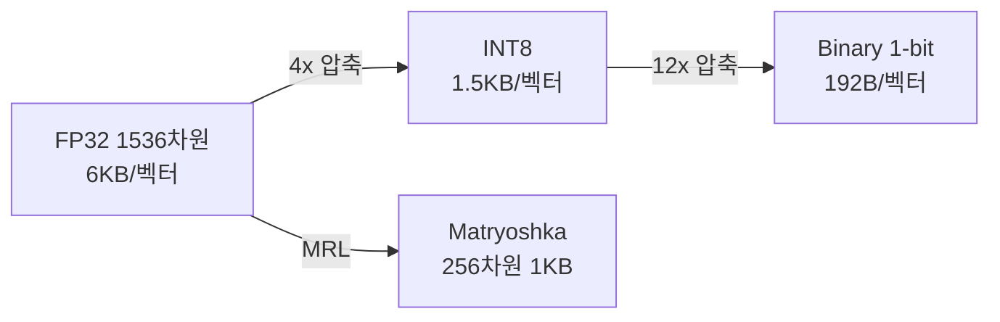

# 임베딩 양자화

벡터 임베딩을 FP32에서 INT8/Binary로 압축하여 메모리 사용량과 검색 속도를 개선하는 인덱스 최적화 기법. 대규모 RAG 시스템에서 수백만-수억 벡터를 다룰 때 필수.

## 양자화 수준

| 수준 | 크기 | 리콜 손실 | 속도 향상 |
|------|------|----------|----------|
| FP32 (기준) | 100% | 0% | 1x |
| INT8 | 25% | 1-2% | 2-3x |
| Binary | 3% | 5-10% | 25-45x |
| MRL 256d | 17% | 2-5% | 4-6x |

## Matryoshka Representation Learning (MRL)

임베딩의 앞쪽 차원이 더 중요하도록 학습하여, 추론 시 차원을 잘라도 품질이 유지되는 기법. 양자화와 직교적으로 결합 가능: MRL 256d + INT8 = **96% 압축, 3% 미만 리콜 손실**.

## 2단계 검색 패턴

Binary 양자화의 높은 리콜 손실을 보완하는 실전 패턴:
1. **1단계**: Binary 벡터로 Top-100 후보 빠르게 검색
2. **2단계**: FP32 원본으로 Top-100을 재순위

## 관련 문서

- [[embedding-layers]] -- 임베딩 레이어
- [[quantization-model-compression]] -- 양자화 일반
- [[bi-encoder-cross-encoder]] -- Bi-Encoder/Cross-Encoder
- [[rag-pipeline]] -- RAG 파이프라인
