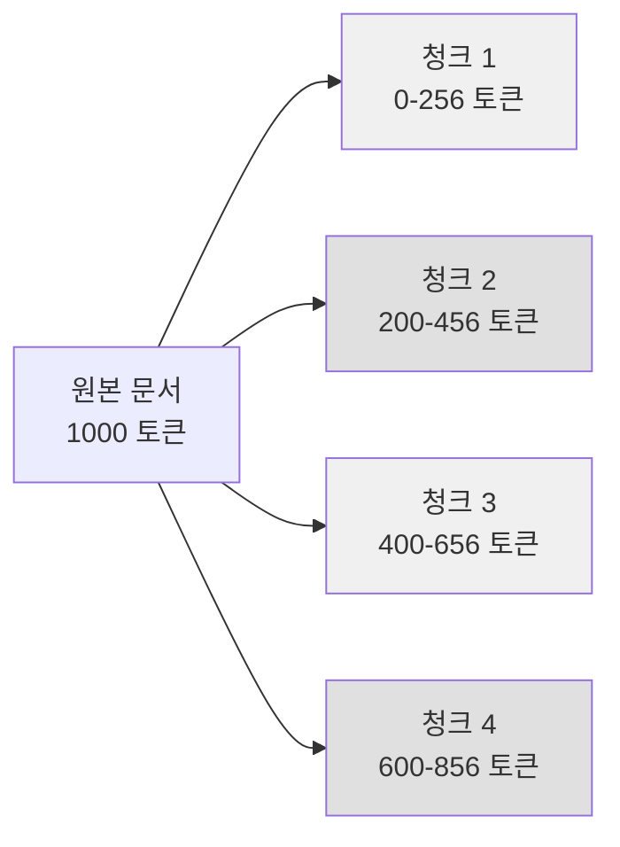

# 고정 길이 청킹 전략

## 정의

고정 길이 청킹(fixed-length chunking)은 텍스트를 **일정한 크기(토큰 수 또는 문자 수)로 균일하게 분할**하는 가장 단순한 청킹 전략이다. 문서 구조나 의미를 고려하지 않고 기계적으로 자르며, RAG (Retrieval-Augmented Generation) 파이프라인의 베이스라인으로 널리 사용된다.



위 다이어그램은 256 토큰 크기, 56 토큰 오버랩으로 분할되는 고정 길이 청킹을 나타낸다 (음영이 겹치는 오버랩 구간).

---

## 핵심 파라미터

### chunk_size (청크 크기)

청크 하나의 최대 토큰(또는 문자) 수. 임베딩 모델의 최대 입력 길이와 검색 품질 간의 트레이드오프를 결정한다:

| chunk_size | 특성 | 적합한 경우 |
|-----------|------|-------------|
| 128 이하 | 매우 세밀, 노이즈 많음 | 정밀 검색, 단문 도메인 |
| 256-512 | 균형점, 가장 일반적 | 범용 RAG |
| 512-1024 | 맥락 풍부, 재현율 높음 | 긴 컨텍스트 이해 필요 시 |
| 1024 이상 | 맥락 최대화, 정밀도 낮음 | 문서 수준 검색 |

### chunk_overlap (오버랩)

인접 청크 간 겹치는 토큰 수. 청크 경계에서 정보가 잘리는 문제를 완화한다:

```
오버랩 없음:  [청크A][청크B][청크C]
오버랩 있음:  [---청크A---][---청크B---][---청크C---]
                        ^^^^^^^^^^
                       오버랩 구간
```

일반적으로 chunk_size의 10-20%를 오버랩으로 설정한다.

---

## 구현

### 문자 기반 고정 길이 청킹

```python
from typing import Iterator

def fixed_length_char_chunker(
    text: str,
    chunk_size: int = 1000,
    chunk_overlap: int = 200,
) -> Iterator[str]:
    """문자 수 기준 고정 길이 청킹."""
    if chunk_overlap >= chunk_size:
        raise ValueError("chunk_overlap은 chunk_size보다 작아야 합니다")

    start = 0
    text_len = len(text)

    while start < text_len:
        end = min(start + chunk_size, text_len)
        yield text[start:end]
        start += chunk_size - chunk_overlap


# 사용 예시
chunks = list(fixed_length_char_chunker(document, chunk_size=1000, chunk_overlap=200))
```

### 토큰 기반 고정 길이 청킹

```python
import tiktoken

def fixed_length_token_chunker(
    text: str,
    chunk_size: int = 512,
    chunk_overlap: int = 64,
    encoding_name: str = "cl100k_base",
) -> list[str]:
    """토큰 수 기준 고정 길이 청킹 (tiktoken 사용)."""
    encoding = tiktoken.get_encoding(encoding_name)
    tokens = encoding.encode(text)
    chunks = []

    start = 0
    while start < len(tokens):
        end = min(start + chunk_size, len(tokens))
        chunk_tokens = tokens[start:end]
        chunk_text = encoding.decode(chunk_tokens)
        chunks.append(chunk_text)
        start += chunk_size - chunk_overlap

    return chunks
```

### LangChain 활용

```python
from langchain.text_splitter import CharacterTextSplitter, TokenTextSplitter

# 문자 기반
char_splitter = CharacterTextSplitter(
    chunk_size=1000,
    chunk_overlap=200,
    separator="",  # 분리자 없음 = 완전한 고정 길이
)

# 토큰 기반
token_splitter = TokenTextSplitter(
    chunk_size=512,
    chunk_overlap=64,
    encoding_name="cl100k_base",
)

char_chunks = char_splitter.split_text(document)
token_chunks = token_splitter.split_text(document)
```

---

## 고정 길이 청킹의 한계

### 의미 절단 문제

```
원본: "파이썬은 인터프리터 언어로, 코드를 실행하기 위해 인터프리터가 필요하다.
       C언어와 달리 컴파일 과정이 없어서..."

청크1: "파이썬은 인터프리터 언어로, 코드를 실행하기 위해 인터프리터가 필요하다.
        C언어와 달리 컴파일 과정이"  <- 문장 중간에서 잘림

청크2: "없어서..."                    <- 맥락 없이 시작
```

오버랩으로 일부 완화할 수 있으나 근본적 해결이 아니다.

### 단락/섹션 무시

문서 구조(제목, 단락, 리스트)를 고려하지 않아 논리적으로 연결된 내용이 분리되거나, 무관한 내용이 한 청크에 묶일 수 있다.

---

## 오버랩 전략 상세

### 오버랩의 효과와 비용

| 오버랩 비율 | 검색 품질 향상 | 인덱스 크기 증가 | 추천 |
|------------|--------------|----------------|------|
| 0% | 베이스라인 | +0% | 빠른 실험용 |
| 10% | 소폭 향상 | +10% | 효율적 선택 |
| 20% | 눈에 띄는 향상 | +25% | 일반 권장 |
| 50% | 상당한 향상 | +100% | 고품질 RAG |

오버랩이 클수록 청크 수가 늘어나 인덱스 크기와 검색 비용이 증가한다.

### 위치 인식 오버랩

단순 오버랩 대신 문장 경계를 탐지해 오버랩 구간을 자연스럽게 만드는 방법:

```python
import re

def sentence_aware_overlap(
    text: str, chunk_size: int = 512, overlap_ratio: float = 0.2
) -> list[str]:
    """오버랩 구간을 문장 경계에 맞추는 고정 길이 청킹."""
    sentences = re.split(r"(?<=[.!?])\s+", text)
    chunks = []
    current_chunk = []
    current_len = 0
    overlap_sentences = []

    for sent in sentences:
        sent_len = len(sent)
        if current_len + sent_len > chunk_size and current_chunk:
            chunks.append(" ".join(current_chunk))
            # 오버랩: 마지막 몇 문장을 다음 청크의 시작으로
            overlap_len = int(chunk_size * overlap_ratio)
            overlap_sentences = []
            cumulative = 0
            for s in reversed(current_chunk):
                if cumulative + len(s) > overlap_len:
                    break
                overlap_sentences.insert(0, s)
                cumulative += len(s)
            current_chunk = overlap_sentences + [sent]
            current_len = sum(len(s) for s in current_chunk)
        else:
            current_chunk.append(sent)
            current_len += sent_len

    if current_chunk:
        chunks.append(" ".join(current_chunk))

    return chunks
```

---

## 실무 권장 파라미터

### 도메인별 권장 설정

| 도메인 | chunk_size | chunk_overlap | 이유 |
|--------|-----------|--------------|------|
| 기술 문서 (코드 포함) | 512 토큰 | 50 토큰 | 코드 블록 보존 우선 |
| 법률/계약 문서 | 256-512 토큰 | 64 토큰 | 조항 단위 검색 |
| 뉴스 기사 | 256 토큰 | 32 토큰 | 짧은 단락 구조 |
| 학술 논문 | 512-1024 토큰 | 128 토큰 | 긴 논증 보존 |
| 챗봇 대화 로그 | 128-256 토큰 | 0 토큰 | 발화 단위 자연 분리 |

### 임베딩 모델 최대 길이 고려

```python
# 임베딩 모델의 max_seq_length를 초과하지 않도록 chunk_size 설정
from sentence_transformers import SentenceTransformer

model = SentenceTransformer("BAAI/bge-m3")
max_len = model.max_seq_length  # 보통 512 또는 8192
recommended_chunk_size = int(max_len * 0.8)  # 20% 여유 확보
```

---

## 다른 청킹 전략과의 비교

| 전략 | 복잡도 | 품질 | 비용 | 사용 시점 |
|------|--------|------|------|----------|
| 고정 길이 (이 문서) | 매우 낮음 | 낮음-중간 | 최저 | 빠른 프로토타입, 베이스라인 |
| [[recursive-character-splitting]] | 낮음 | 중간 | 낮음 | 일반 구조적 문서 |
| [[semantic-chunking-strategies]] | 중간 | 높음 | 중간 | 품질 중요 RAG |
| [[propositional-chunking]] | 높음 | 매우 높음 | 높음 | 고정밀 검색 |
| [[agentic-chunking]] | 매우 높음 | 최고 | 매우 높음 | 최고급 RAG |

---

## 관련 문서

- [[chunking-strategies]] - 청킹 전략 전체 개요
- [[recursive-character-splitting]] - 재귀적 문자 분할 (고정 길이의 다음 단계)
- [[semantic-chunking-strategies]] - 의미 기반 청킹
- [[propositional-chunking]] - 명제 단위 청킹
- [[agentic-chunking]] - 에이전트 기반 청킹
- [[rag-indexing-pipeline]] - 청킹을 포함한 전체 인덱싱 파이프라인
- [[late-chunking]] - 청킹 후 풀링 대신 전체 임베딩 후 청킹하는 대안적 접근
