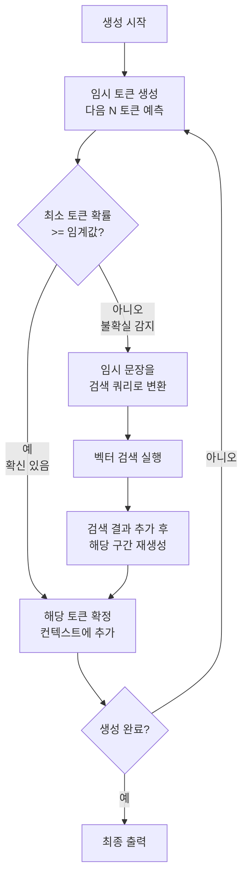

# FLARE 반복 검색

FLARE(Forward-Looking Active REtrieval)는 LLM이 텍스트를 생성하다가 **불확실한 토큰을 만나는 시점에 동적으로 검색을 트리거**하는 능동형 검색 기법이다. 2023년 Chen et al.이 제안했으며, 미리 정해진 시점에 검색하는 [[adaptive-rag]]나 [[self-rag]]와 달리, 생성 중 실시간으로 불확실성을 감지하고 그 시점에 필요한 정보만 가져온다.

## 핵심 직관

사람이 에세이를 쓸 때를 생각해보자. 잘 아는 내용은 그냥 쓰고, 확실하지 않은 부분에 이르면 자료를 찾아보는 행동과 동일하다. FLARE는 이 패턴을 LLM 생성에 구현한다.

기존 RAG: "검색 → 컨텍스트 주입 → 전체 생성"

FLARE: "생성 시작 → 불확실 구간 감지 → 해당 구간에 대해 검색 → 검색 결과로 재생성 → 계속 생성"

## 작동 메커니즘

FLARE의 핵심 루프는 두 단계로 구성된다.

**1단계: 임시 생성과 불확실성 감지**
LLM이 다음 토큰들을 가상으로 예측한다. 각 토큰의 로그 확률(log probability)을 측정하여 신뢰도가 낮은 구간(임계값 $\theta$ 이하)을 식별한다.

**2단계: 임시 생성을 검색 쿼리로 변환**
불확실 구간을 포함한 임시 문장을 검색 쿼리로 변환한다. 검색 결과를 컨텍스트에 추가하고 해당 구간을 재생성한다.

## 두 가지 변형

**FLARE Direct**
임시 생성 문장을 그대로 검색 쿼리로 사용한다. 단순하지만 임시 문장 자체가 부정확하면 검색 품질이 저하될 수 있다.

**FLARE Instruct**
LLM에 명시적으로 "지금 생성하기 위해 필요한 검색 쿼리를 작성하라"고 지시한다. 임시 생성 대신 의도적으로 쿼리를 구성하므로 검색 품질이 더 안정적이다.

| 항목 | FLARE Direct | FLARE Instruct |
|------|-------------|---------------|
| 구현 복잡도 | 낮음 | 중간 |
| 쿼리 품질 | 임시 생성 의존 | LLM이 명시적 생성 |
| 추가 LLM 호출 | 없음 | 쿼리 생성 1회 추가 |
| 검색 정밀도 | 보통 | 더 높음 |

## [[self-rag]]와 비교

[[self-rag]]도 동적 검색을 수행하지만, 특수 리플렉션 토큰으로 검색 여부를 이진 판단한다. FLARE는 토큰 확률이라는 연속값으로 불확실성을 측정하고, 임시 생성 문장을 직접 쿼리에 활용한다는 점에서 구분된다.

| 항목 | Self-RAG | FLARE |
|------|---------|-------|
| 검색 트리거 | 리플렉션 토큰 | 토큰 확률 임계값 |
| 모델 수정 필요 | 파인튜닝 필수 | 기존 LLM 사용 가능 |
| 검색 쿼리 생성 | 현재 컨텍스트 기반 | 임시(Forward-Looking) 문장 기반 |
| 구현 진입장벽 | 높음 | 중간 |

## 실무 적용 시 주의점

**토큰 확률 접근**
FLARE Direct는 로그 확률 값이 필요하므로, 이를 제공하지 않는 API(예: 일부 상용 모델 API)에서는 사용이 어렵다. FLARE Instruct는 이 제약을 우회한다.

**임계값 튜닝**
$\theta$ 값이 너무 낮으면 검색이 거의 발생하지 않고, 너무 높으면 과도한 검색으로 레이턴시가 폭증한다. 데이터셋과 모델에 따라 0.3-0.7 범위에서 실험적으로 결정한다.

**검색 오버헤드**
한 응답에서 여러 번 검색이 발생할 수 있어, 토큰당 레이턴시가 표준 RAG보다 높다. 스트리밍 응답 환경에서는 UX 설계에 주의가 필요하다.

## 관련 문서

- [[self-rag]] - 리플렉션 토큰 기반의 유사한 동적 검색 프레임워크
- [[adaptive-rag]] - 쿼리 복잡도로 검색 전략을 사전에 결정하는 대조적 접근
- [[multi-hop-retrieval]] - 여러 번의 검색을 체인으로 연결하는 관련 기법
- [[rag-pipeline]] - FLARE가 확장하는 기본 검색 파이프라인
