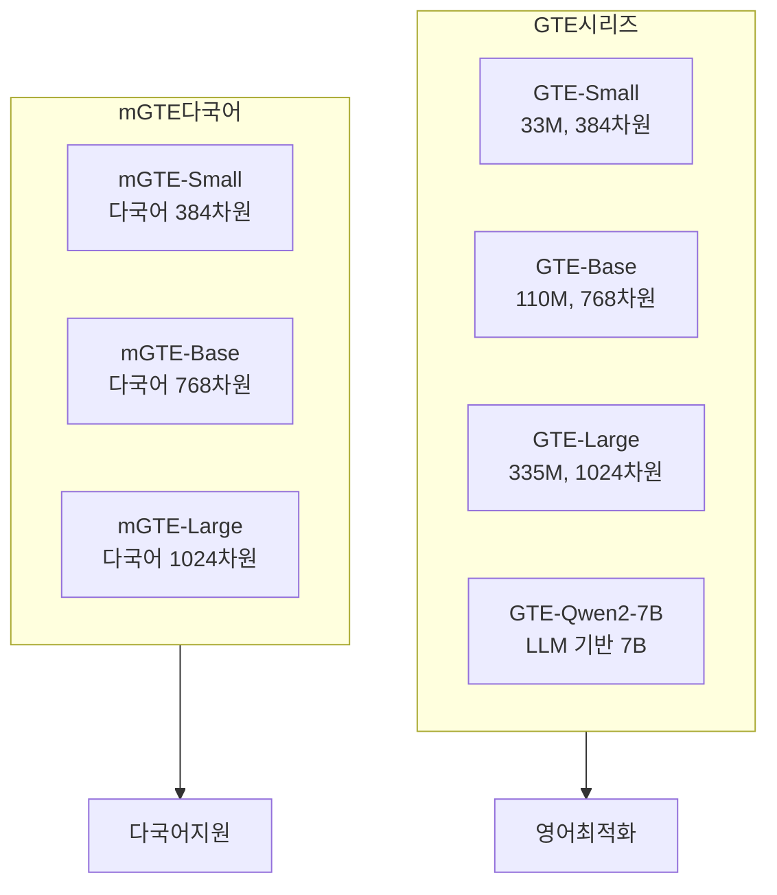

# GTE - 일반 텍스트 임베딩 (Alibaba)

## 개요

**GTE(General Text Embeddings)**는 Alibaba DAMO Academy와 Tongyi Lab에서 개발한 텍스트 임베딩 모델 시리즈다. "일반(General)"이라는 이름처럼 특정 도메인이나 언어에 특화되지 않고 **다양한 태스크, 다양한 모델 크기, 다국어 지원**을 목표로 설계되었다. BERT 계열(small/base/large)부터 최근 LLM 기반 대형 모델까지 다양한 크기로 제공된다.



GTE 시리즈는 크기별로 다양한 선택지를 제공하며, mGTE는 다국어 변형이다.

---

## 핵심 사양

| 모델 | 파라미터 | 임베딩 차원 | 최대 토큰 | 언어 |
|------|---------|-----------|---------|------|
| GTE-Small | 33M | 384 | 512 | 영어 |
| GTE-Base | 110M | 768 | 512 | 영어 |
| GTE-Large | 335M | 1,024 | 512 | 영어 |
| mGTE-Large-v1.5 | 305M | 1,024 | 8,192 | 다국어 |
| GTE-Qwen2-7B-instruct | 7.6B | 3,584 | 32,768 | 다국어 |

---

## 핵심 특징

### 1. 다중 크기 지원 (Multi-Scale)

GTE의 가장 실용적인 특징은 **동일한 학습 방식으로 다양한 크기의 모델을 제공**한다는 점이다. 실무에서 리소스 제약에 따라 적합한 크기를 선택할 수 있다:

- **Small (33M)**: 엣지 디바이스, 저지연 서비스, 비용 제약 환경
- **Base (110M)**: 범용 RAG 파이프라인의 균형점
- **Large (335M)**: 품질 우선 프로덕션 환경
- **LLM 기반 (7B)**: 최고 품질, 복잡한 의미 이해가 필요한 경우

### 2. mGTE - 다국어 변형

**mGTE(Multilingual GTE)**는 영어 중심의 기본 GTE를 확장해 한국어, 중국어, 일본어 등 100개 이상의 언어를 지원한다. mGTE-Large-v1.5는 특히:
- **8,192 토큰** 장문 컨텍스트 지원
- 다국어 MTEB에서 경쟁력 있는 성능
- [[dense-retrieval]] 및 다중 벡터 검색 모두 지원

```python
from sentence_transformers import SentenceTransformer

# mGTE 다국어 모델 사용
model = SentenceTransformer("Alibaba-NLP/gte-multilingual-base")

# 한국어 문장 임베딩
korean_texts = [
    "자연어 처리를 위한 임베딩 모델",
    "텍스트 검색과 의미 유사도 계산"
]
embeddings = model.encode(korean_texts)
print(f"임베딩 차원: {embeddings.shape}")
```

### 3. 학습 방식 - 다단계 약지도 + 지도학습

GTE는 [[e5-text-embeddings]]과 유사한 **다단계 학습 파이프라인**을 사용한다:


이 2단계 학습이 데이터 효율과 최종 성능을 모두 높이는 핵심이다.

### 4. GTE-Qwen2 - LLM 기반 임베딩

최신 GTE 시리즈는 Qwen2 LLM을 기반으로 한 **대형 임베딩 모델**을 포함한다. 디코더 기반 LLM을 임베딩에 활용할 때는 [[token-pooling-strategies]]에서 마지막 토큰(last token) 풀링을 사용한다.

```python
# GTE-Qwen2 사용 예시
from transformers import AutoTokenizer, AutoModel
import torch

model_name = "Alibaba-NLP/gte-Qwen2-7B-instruct"
tokenizer = AutoTokenizer.from_pretrained(model_name)
model = AutoModel.from_pretrained(model_name, trust_remote_code=True)

def get_embedding(text: str) -> list[float]:
    inputs = tokenizer(text, return_tensors="pt", truncation=True, max_length=8192)
    with torch.no_grad():
        outputs = model(**inputs)
    # 마지막 토큰 풀링 (디코더 모델 표준)
    embedding = outputs.last_hidden_state[:, -1, :]
    return embedding.squeeze().tolist()
```

---

## MTEB 성능

GTE 시리즈의 MTEB 성능은 크기별로 다양하다:

| 모델 | MTEB 평균 (영어) | 비고 |
|------|----------------|------|
| GTE-Small | ~60점대 | 소형 모델 중 경쟁력 |
| GTE-Base | ~64점대 | 표준 기준 |
| GTE-Large | ~63~66점대 | Large 티어에서 경쟁력 |
| mGTE-Large-v1.5 | 다국어 MTEB 상위 | 다국어에서 특히 강점 |

---

## 실무 활용 가이드

### RAG 파이프라인에서 크기 선택 기준

```
지연 시간 < 50ms 필요    → GTE-Small (33M)
균형 잡힌 품질/속도      → GTE-Base (110M)
최고 품질 (영어)         → GTE-Large (335M)
한국어/다국어 포함       → mGTE-Large-v1.5
복잡한 의미 이해 필요    → GTE-Qwen2-7B (비용 고려)
```

### LangChain/LlamaIndex 통합

```python
from langchain_huggingface import HuggingFaceEmbeddings

# mGTE로 한국어 RAG 구축
embeddings = HuggingFaceEmbeddings(
    model_name="Alibaba-NLP/gte-multilingual-base",
    model_kwargs={"device": "cpu"},
    encode_kwargs={"normalize_embeddings": True}
)

# 문서 벡터화
texts = ["RAG 파이프라인 구축 예시", "벡터 검색 시스템"]
vectors = embeddings.embed_documents(texts)
```

---

## 왜 중요한가

GTE 시리즈는 **스펙트럼 전체를 커버하는 단일 모델 패밀리**를 제공한다는 점에서 독특하다. 프로덕션 환경에서 작은 모델로 시작해 점진적으로 업그레이드할 때 동일한 패밀리 내에서 이동할 수 있어 마이그레이션 비용이 낮다. mGTE의 한국어 지원은 국내 RAG 시스템에서 특히 가치 있다.

---

## 관련 문서

- [[embedding-models-for-rag]] - 임베딩 모델 전체 비교
- [[mteb]] - 임베딩 벤치마크 기준
- [[e5-text-embeddings]] - Microsoft의 유사한 다단계 학습 임베딩
- [[bge-m3-embedding]] - BAAI의 다기능 다국어 임베딩
- [[token-pooling-strategies]] - 크기별 풀링 전략 차이
- [[mean-vs-cls-pooling]] - 인코더 vs 디코더 풀링
- [[dense-retrieval]] - 밀집 검색 기반 RAG
- [[embedding-finetuning]] - 도메인 특화 파인튜닝
