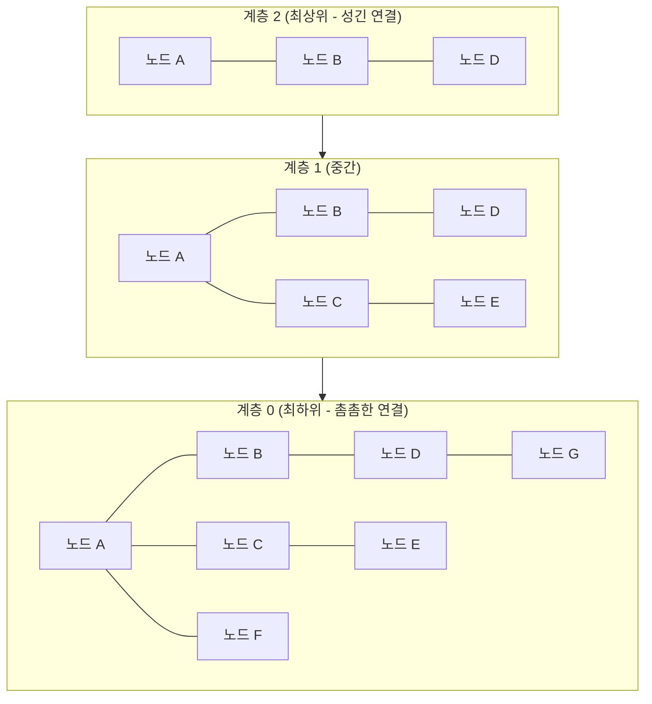
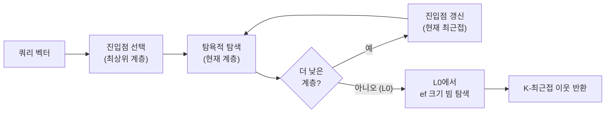

# HNSW - 계층적 탐색 가능 작은 세계 그래프

HNSW(Hierarchical Navigable Small World)는 [[approximate-nearest-neighbor]] 검색을 위한 그래프 기반 인덱스 알고리즘이다. 2016년 Yu. A. Malkov와 D. A. Yashunin이 제안했으며, 오늘날 [[vector-db-comparison|대부분의 벡터 데이터베이스]]에서 기본 인덱스로 채택하고 있다. $O(\log n)$ 복잡도의 검색과 높은 재현율을 동시에 달성하는 실용적인 알고리즘이다.

## 핵심 아이디어

HNSW는 두 가지 아이디어를 결합한다:

1. **작은 세계 그래프(Small World Graph)**: 임의의 두 노드 사이를 몇 번의 홉(hop)만으로 이동할 수 있는 그래프. 소셜 네트워크의 "6단계 법칙"과 같은 구조.
2. **계층화(Hierarchical)**: NSW 그래프를 여러 층으로 쌓아, 상위 계층은 장거리 이동용 "고속도로", 하위 계층은 정밀 탐색용 "골목길" 역할을 담당.

이 구조 덕분에 검색 시 상위 층에서 빠르게 근사 위치를 파악한 후 하위 층에서 정밀하게 좁혀가는 전략이 가능하다.

## 계층 구조



각 계층은 동일한 데이터 포인트를 포함하지만 연결 수가 다르다. 노드가 특정 계층에 포함될 확률은 지수적으로 감소하므로($P = e^{-l/m_L}$), 상위 계층일수록 노드 수가 적다.

## 검색 알고리즘



1. 최상위 계층에서 임의 진입점으로 시작
2. 각 계층에서 현재 쿼리에 가장 가까운 노드로 이동 (탐욕 탐색)
3. 하위 계층으로 내려가며 반복
4. 최하위 계층(L0)에서 `ef`(탐색 후보 크기) 만큼의 빔 탐색으로 K개 최근접 이웃 수집

## 핵심 하이퍼파라미터

| 파라미터 | 의미 | 권장값 | 영향 |
|----------|------|--------|------|
| `M` | 각 노드의 최대 연결 수 | 16-64 | 클수록 재현율 증가, 메모리/구축 시간 증가 |
| `ef_construction` | 인덱스 구축 시 탐색 후보 크기 | 100-400 | 클수록 인덱스 품질 증가, 구축 시간 증가 |
| `ef` (ef_search) | 검색 시 탐색 후보 크기 | 50-200 | 클수록 재현율 증가, 레이턴시 증가 |
| `max_M0` | L0 계층 최대 연결 수 | `2*M` | 하위 계층 정밀도 조정 |

`M`과 `ef_construction`은 인덱스 구축 시 고정되고, `ef`는 검색 시 런타임에 조정 가능하다. `ef`를 높이면 재현율이 올라가지만 레이턴시도 증가하므로 서비스 요구사항에 맞게 튜닝해야 한다.

## 인덱스 구축

노드를 삽입할 때 다음 절차를 따른다:

1. 삽입할 노드의 최대 계층 `l`을 확률적으로 결정: $l = \lfloor -\ln(\text{uniform}(0,1)) \cdot m_L \rfloor$
2. 최상위 계층부터 `l`까지 탐욕 탐색으로 진입점 갱신
3. `l`부터 L0까지 각 계층에서 `ef_construction` 크기 빔 탐색
4. 각 계층에서 발견된 최근접 이웃들과 양방향 간선 연결
5. 연결이 `M`을 초과하면 가장 멀리 있는 연결 제거(pruning)

## 성능 특성

| 지표 | 특성 |
|------|------|
| 검색 복잡도 | $O(\log n)$ |
| 메모리 사용 | $O(M \cdot n)$ - 벡터 차원 d에 비례 |
| 구축 시간 | $O(n \cdot \log n)$ |
| 재현율(Recall) | M, ef 조정으로 0.9+ 달성 가능 |
| 단점 | 삭제 연산 비효율, 메모리 상주 필요 |

브루트 포스 대비 수십~수백 배 빠른 검색이 가능하며, [[ivf-pq-vector-index|IVF-PQ]]보다 재현율이 일반적으로 높다. 다만 인덱스 전체를 메모리에 올려야 한다는 제약이 있으며, [[diskann-microsoft|DiskANN]]은 이 한계를 디스크 기반으로 해결한 대안이다.

## 필터링 연동 문제

벡터 검색에 메타데이터 필터를 적용할 때 두 가지 전략이 있다:

- **사전 필터(Pre-filtering)**: 필터 조건을 만족하는 하위 집합에서만 HNSW 탐색. 재현율 저하 가능성.
- **사후 필터(Post-filtering)**: HNSW로 K개 후보를 뽑은 뒤 필터 적용. 필터 선택도가 높으면(조건이 까다로우면) 결과 수 부족 문제.
- **ACORN/필터링 인식 탐색**: 최근 연구 방향으로, 탐색 중 필터 조건을 반영하는 hybrid 방식.

## 벡터 DB별 HNSW 구현

| 시스템 | 기본 인덱스 | 특이사항 |
|--------|-----------|----------|
| [[vector-db-comparison|Qdrant]] | HNSW | Rust 구현, 필터 인식 HNSW |
| [[vector-db-comparison|Weaviate]] | HNSW | 사전 필터 옵션 |
| [[vector-db-comparison|Milvus]] | IVF_FLAT, HNSW 등 선택 | HNSW + 스칼라 양자화 조합 |
| FAISS | HNSW 지원 | `faiss.IndexHNSWFlat` |
| [[vector-db-comparison|Pinecone]] | 자체 구현 (HNSW 기반) | 서버리스 최적화 |

## 실무 활용 가이드

**소규모~중규모 데이터셋(~수천만 벡터)**에서는 HNSW가 최선의 선택이다. 재현율 99% 이상이 필요하면 `ef`를 높이고, 레이턴시를 줄이려면 `ef`를 낮추는 방식으로 런타임 튜닝이 가능하다.

```python
# FAISS HNSW 사용 예시
import faiss
import numpy as np

d = 768       # 차원 (예: BERT 임베딩)
M = 32        # 연결 수
ef_construction = 200

index = faiss.IndexHNSWFlat(d, M)
index.hnsw.efConstruction = ef_construction

# 벡터 추가
vectors = np.random.rand(100_000, d).astype('float32')
index.add(vectors)

# 검색 시 ef 설정
index.hnsw.efSearch = 100
distances, indices = index.search(query_vec, k=10)
```

## 관련 문서

- [[approximate-nearest-neighbor]] - ANN 검색 전반 개요
- [[ivf-pq-vector-index]] - 메모리 효율 중심 대안 인덱스
- [[diskann-microsoft]] - 디스크 기반 십억 규모 ANN
- [[annoy-spotify]] - 트리 기반 ANN 라이브러리
- [[scann-google-search]] - Google의 정량화 ANN
- [[vector-db-comparison]] - 벡터 DB 시스템 비교
- [[embedding-quantization]] - 임베딩 양자화로 메모리 절감
