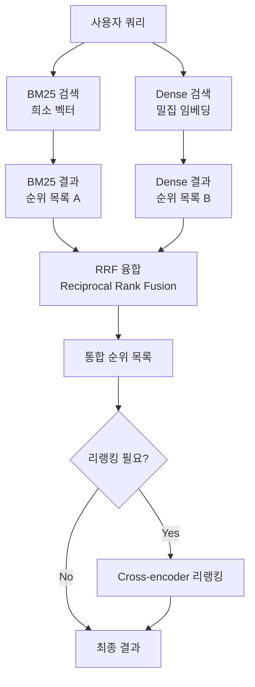

# 하이브리드 검색과 RRF (Hybrid Search & Reciprocal Rank Fusion)

## 개요

하이브리드 검색(Hybrid Search)은 키워드 기반 희소 검색(BM25)과 의미 기반 밀집 검색(Dense Retrieval)을 결합하여 각각의 약점을 보완하는 검색 전략이다. RRF(Reciprocal Rank Fusion)는 두 결과 목록을 효과적으로 합산하는 알고리즘이다.

## BM25의 여전한 강점

임베딩 기반 검색이 발전했음에도 BM25는 특정 상황에서 우위를 유지한다.

- **정확한 키워드 매칭**: 제품 코드, 고유명사, 약어(CUDA, API 이름 등)
- **도메인 외 용어**: 임베딩 모델이 학습하지 않은 신조어/전문용어
- **짧은 쿼리**: 한두 단어 쿼리에서 TF-IDF 계열이 강함
- **빠른 속도**: 역 인덱스 기반, 추가 연산 불필요

Dense Retrieval의 강점:
- 동의어, 패러프레이즈 처리
- 개념적 유사성 (질문 표현 방식이 달라도 매칭)

## 하이브리드 검색 파이프라인



## RRF (Reciprocal Rank Fusion) 알고리즘

Cormack et al. (2009). 여러 순위 목록을 파라미터 없이 효과적으로 합산.

$$\text{RRF}(d) = \sum_{r \in R} \frac{1}{k + \text{rank}_r(d)}$$

- $R$: 검색 결과 목록들 (BM25 결과, Dense 결과 등)
- $\text{rank}_r(d)$: 목록 $r$에서 문서 $d$의 순위
- $k$: 상수 (기본값: **60**), 상위 순위의 영향력 완화

### k=60의 의미

k가 크면 순위 1과 순위 2의 점수 차이가 작아져 결과가 더 균등하게 분배된다. k=60은 경험적으로 안정적인 값.

```python
def rrf(results_list, k=60):
    scores = {}
    for results in results_list:
        for rank, doc_id in enumerate(results, start=1):
            if doc_id not in scores:
                scores[doc_id] = 0
            scores[doc_id] += 1 / (k + rank)
    return sorted(scores.items(), key=lambda x: x[1], reverse=True)
```

## 가중 결합 (Weighted Combination)

단순 RRF 대신 두 점수에 가중치를 부여하는 방식.

$$\text{score}(d) = \alpha \cdot \text{score}_{\text{dense}}(d) + (1-\alpha) \cdot \text{score}_{\text{BM25}}(d)$$

- `alpha = 0.7`: Dense 70% + BM25 30%
- 도메인에 따라 alpha 조율 필요
- 두 점수 분포가 다르므로 정규화 필수

실제로는 RRF가 가중 결합보다 튜닝 불필요하고 안정적이어서 더 많이 사용.

## 주요 벡터 DB의 하이브리드 검색 구현

| DB | 구현 방식 | 특이사항 |
|----|-----------|---------|
| **Weaviate** | BM25 + Vector, RRF 기본 제공 | `alpha` 파라미터로 가중치 조절 |
| **Qdrant** | Sparse + Dense 혼합 인덱스 | SPLADE 등 학습된 희소 벡터 지원 |
| **Vespa** | BM25 + ANN, 복잡한 랭킹 표현식 | 대규모 기업 검색에 강함 |
| **Elasticsearch** | BM25 내장 + KNN, RRF 지원 | 기존 ES 인프라 활용 가능 |
| **pgvector** | pg_trgm(텍스트)+ pgvector | PostgreSQL 쿼리로 통합 |

## 언제 하이브리드 검색이 필요한가

하이브리드가 유리한 상황:
- 쿼리에 고유명사/약어/코드가 많음
- 도메인 전문 용어가 임베딩 학습 데이터에 적음
- 키워드 검색과 의미 검색을 모두 커버해야 함

Dense만으로 충분한 상황:
- 자연어 질의, 의미 기반 검색
- 임베딩 모델이 해당 도메인에 충분히 학습된 경우

## 실무 권장

대부분의 RAG 파이프라인에서 하이브리드 검색 + RRF를 기본값으로 사용하는 것이 안전한 선택이다. BM25를 추가하는 비용이 낮고 엣지 케이스 커버리지가 크게 향상된다.

## 관련 문서

- [[sparse-retrieval-bm25]] - BM25 알고리즘 상세
- [[dense-retrieval]] - Dense retrieval 기본 개념
- [[embedding-models-for-rag]] - Dense 검색에 사용하는 임베딩 모델
- [[colbert-late-interaction]] - 토큰 수준 세밀 검색
- [[vector-db-comparison]] - 벡터 DB 구현 선택
