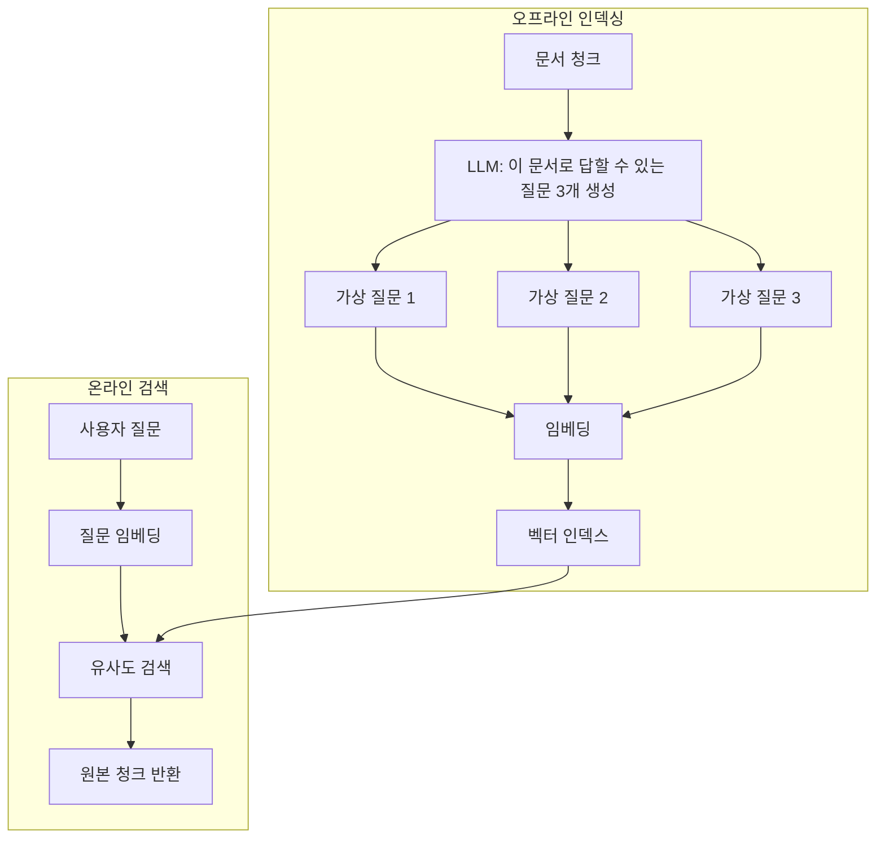

# 가상 질문 인덱싱

각 문서 청크에 대해 LLM이 **예상 질문들을 오프라인으로 생성**하고, 이 질문들을 임베딩하여 인덱싱하는 RAG 전처리 기법. [[hyde-rag|HyDE]]가 쿼리 시점에 가상 답변을 생성하는 것과 반대로, 인덱싱 시점에 가상 질문을 생성한다.

## 동작 원리

## HyDE와의 비교

| 측면 | HyDE | 가상 질문 인덱싱 |
|------|------|----------------|
| LLM 호출 시점 | 쿼리 시 (온라인) | 인덱싱 시 (오프라인) |
| 지연시간 영향 | 있음 (쿼리마다 LLM 호출) | 없음 (사전 생성) |
| 비용 | 쿼리 비례 | 문서 비례 (1회) |
| 매칭 공간 | 답변-문서 | **질문-질문** |

질문-질문 매칭이 질문-문서 매칭보다 의미적으로 가까워 검색 정밀도가 높다.

## [[proposition-indexing|명제 인덱싱]]과 결합

문서를 원자적 명제로 분해하고, 각 명제에 대해 가상 질문을 생성하면 이중 정밀화 효과.

## 관련 문서

- [[hyde-rag]] -- HyDE (가상 문서 임베딩)
- [[proposition-indexing]] -- 명제 기반 인덱싱
- [[rag-pipeline]] -- RAG 파이프라인
- [[chunking-strategies]] -- 청킹 전략
