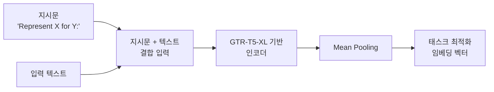

# Instructor - 지시 튜닝 임베딩 모델

## 개요

**Instructor**는 홍콩대학교와 워싱턴대학교 연구팀이 개발한 **지시 튜닝(instruction-tuned) 임베딩 모델**이다. 핵심 아이디어는 단순하지만 강력하다: 임베딩 생성 시 **자연어 지시문(instruction)**을 함께 제공해 동일한 모델이 다양한 태스크에 맞게 임베딩을 최적화하도록 한다. "하나의 임베딩 모델이 모든 태스크를 커버할 수 있다"는 비전을 실현한 초기 모델 중 하나다.

> "Represent the scientific paper for retrieval: "

위와 같은 지시문 하나만으로 논문 검색에 특화된 임베딩이 생성된다. 이것이 Instructor의 핵심이다.



지시문이 임베딩의 방향을 결정한다. 동일한 텍스트도 지시문에 따라 다른 임베딩이 생성된다.

---

## 핵심 사양

| 항목 | 값 |
|------|-----|
| 모델 기반 | GTR-T5-XL (T5 계열) |
| 파라미터 | ~335M (XL 버전) |
| 임베딩 차원 | 768 |
| 최대 시퀀스 길이 | 512 토큰 |
| 라이선스 | Apache 2.0 |
| 학습 데이터 | MEDI 데이터셋 (330개 이상 태스크) |

---

## 지시 튜닝의 핵심 메커니즘

### 지시문 구조

Instructor의 지시문은 다음 형식을 따른다:

```
Represent the {domain} {text_type} for {task_objective}:
```

예시:
- `"Represent the scientific paper for retrieval: "` - 논문 검색
- `"Represent the news article for classification: "` - 뉴스 분류
- `"Represent the product description for clustering: "` - 상품 군집화
- `"Represent the question for retrieval: "` - 질문 검색 (쿼리용)
- `"Represent the document for retrieval: "` - 문서 검색 (코퍼스용)

### 왜 작동하는가

기존 임베딩 모델은 단일 벡터 공간에서 모든 태스크를 처리하려 한다. 이는 본질적으로 충돌한다 - "의미가 비슷한 텍스트를 같은 방향으로" 배치해야 하는 의미 유사도 태스크와, "다른 클래스의 텍스트를 멀리" 배치해야 하는 분류 태스크는 상반된 요구를 갖는다.

Instructor는 **지시문을 통해 같은 텍스트도 태스크에 따라 다른 공간에 투영**함으로써 이 문제를 해결한다.

---

## MEDI 데이터셋

Instructor 학습에 사용된 **MEDI(Meta Embeddings Dataset for Instructions)**는 330개 이상의 다양한 태스크를 포함한다:

| 태스크 유형 | 예시 |
|-----------|------|
| 정보 검색 | MS-MARCO, Natural Questions |
| 의미 유사도 | STS 벤치마크 |
| 분류 | AG News, DBPedia |
| 군집화 | ArXiv, Wikipedia |
| 재순위화 | TREC, MedMCQA |
| 요약 | SummEval |

---

## 실무 활용

### InstructorEmbedding 라이브러리 사용

```python
from InstructorEmbedding import INSTRUCTOR

model = INSTRUCTOR("hkunlp/instructor-xl")

# 쿼리 임베딩 (검색용)
query_instruction = "Represent the question for retrieving relevant documents:"
query = "딥러닝 임베딩 모델의 작동 원리는 무엇인가?"
query_embedding = model.encode([[query_instruction, query]])

# 문서 임베딩 (코퍼스용)
doc_instruction = "Represent the document for retrieval:"
docs = [
    "임베딩 모델은 텍스트를 고차원 벡터로 변환한다",
    "딥러닝은 다층 신경망을 사용한 머신러닝 기법이다"
]
doc_embeddings = model.encode([[doc_instruction, doc] for doc in docs])
```

### 태스크별 지시문 예시

```python
# 분류 태스크용
classification_examples = [
    ["Represent the Amazon review for classification:", "배송이 너무 느렸어요"],
    ["Represent the Amazon review for classification:", "상품 품질이 훌륭합니다"]
]
class_embeddings = model.encode(classification_examples)

# 군집화 태스크용
clustering_examples = [
    ["Represent the news article for clustering:", "오늘 주식 시장이 급등했다"],
    ["Represent the news article for clustering:", "반도체 산업 투자 현황"]
]
cluster_embeddings = model.encode(clustering_examples)
```

### LangChain 통합

```python
from langchain_community.embeddings import HuggingFaceInstructEmbeddings

embeddings = HuggingFaceInstructEmbeddings(
    model_name="hkunlp/instructor-xl",
    query_instruction="Represent the question for retrieving documents:",
    embed_instruction="Represent the document for retrieval:"
)

query_vec = embeddings.embed_query("Instructor 임베딩의 장점은?")
doc_vecs = embeddings.embed_documents(["Instructor는 지시 튜닝을 활용한다"])
```

---

## 버전 비교

| 버전 | 특징 |
|------|------|
| instructor-base | 110M, 빠른 추론 |
| instructor-large | 335M, 균형 |
| instructor-xl | 1.5B, 최고 품질 (T5-XL 기반) |

---

## Instructor의 한계와 후계자

### 주요 한계
- **512 토큰 제한**: 긴 문서에 부적합 (vs. Nomic, mGTE의 8K)
- **지시문 설계 의존성**: 적절한 지시문을 작성해야 성능이 나옴
- **T5 기반**: BERT 계열 대비 추론 속도가 다소 느릴 수 있음
- **영어 중심**: 한국어 등 비영어권 언어 지원 제한적

### 후계자들

Instructor의 아이디어는 이후 많은 모델에 영향을 미쳤다:
- [[nomic-embed-text]]: 간결한 task prefix 방식 (`search_query:`, `search_document:`)
- [[e5-text-embeddings]]: `"query: "`, `"passage: "` 접두사 방식
- [[bge-m3-embedding]]: 지시 없이도 다기능 지원

---

## 왜 중요한가

Instructor는 **"하나의 임베딩 모델 + 자연어 지시문 = 다목적 임베딩"** 패러다임을 제시한 선구자다. 이전에는 검색용 모델, 분류용 모델을 따로 학습해야 했다면, Instructor는 동일한 모델로 지시문만 바꿔 다양한 태스크를 처리할 수 있음을 보였다. 이 아이디어는 이후 대부분의 임베딩 모델 설계에 영향을 미쳤다.

---

## 관련 문서

- [[embedding-models-for-rag]] - 임베딩 모델 전체 비교
- [[mteb]] - 임베딩 벤치마크 기준
- [[e5-text-embeddings]] - 접두사 기반 유사 접근법
- [[nomic-embed-text]] - task prefix 방식 후계자
- [[bge-m3-embedding]] - 지시 없는 다기능 임베딩
- [[mean-vs-cls-pooling]] - Mean Pooling 사용 (Instructor)
- [[token-pooling-strategies]] - 다양한 풀링 전략 비교
- [[embedding-finetuning]] - 도메인 특화 파인튜닝
- [[dense-retrieval]] - 밀집 검색 기반 RAG
