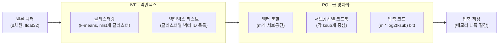
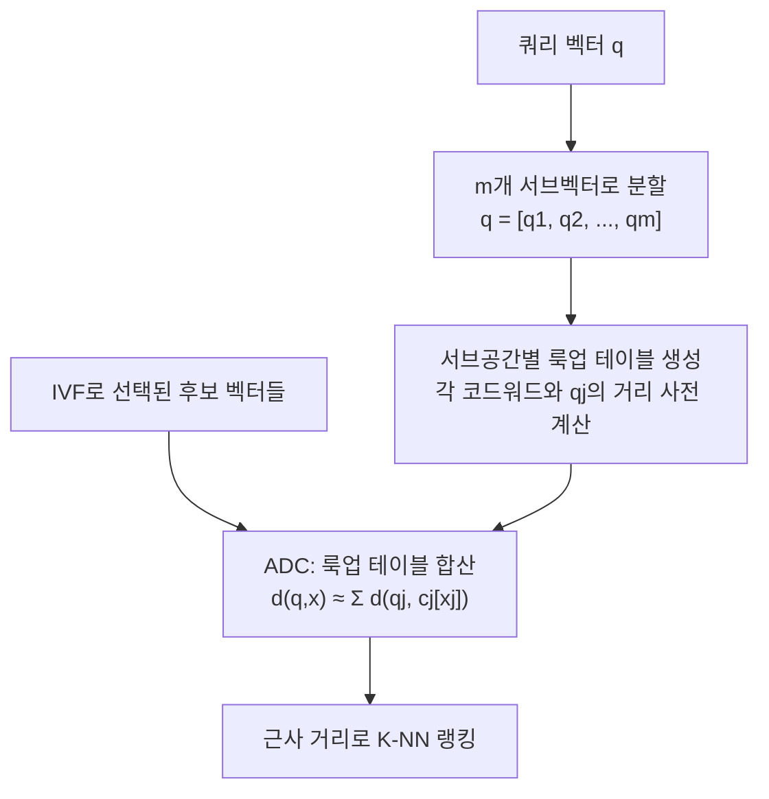

# IVF-PQ 벡터 인덱스

IVF-PQ(Inverted File Index with Product Quantization)는 역인덱스(Inverted File Index)와 곱 양자화(Product Quantization)를 결합한 [[approximate-nearest-neighbor]] 벡터 인덱스 방식이다. FAISS(Facebook AI Similarity Search) 라이브러리의 핵심 인덱스 타입으로, 수억~수십억 규모의 벡터를 메모리 효율적으로 처리하는 산업 표준 기술이다.

## 두 핵심 기법

IVF-PQ는 독립적인 두 기법을 파이프라인으로 결합한다:



## IVF: 역인덱스 (검색 공간 축소)

k-means 클러스터링으로 전체 벡터 공간을 `nlist`개 보로노이(Voronoi) 셀로 분할한다.

**인덱스 구축:**
1. `nlist`개 클러스터 중심(코드워드) 학습 (k-means, 훈련 데이터 필요)
2. 각 벡터를 가장 가까운 클러스터에 할당
3. 클러스터 ID -> 벡터 ID 목록의 역인덱스 생성

**검색 시:**
1. 쿼리 벡터에서 가장 가까운 `nprobe`개 클러스터 선택
2. 선택된 클러스터의 벡터들만 검색 후보로 사용
3. 전체의 `nprobe/nlist` 비율만 탐색하므로 속도 대폭 향상

`nprobe`는 재현율-속도 트레이드오프를 조정하는 핵심 파라미터다. 높을수록 정확하지만 느리다.

## PQ: 곱 양자화 (메모리 압축)

원본 $d$차원 벡터를 $m$개 서브벡터로 분할하고 각 서브벡터를 $k_{sub}$개 중심 중 하나로 근사 표현한다.

**압축 원리:**
- 원본: $d$차원 float32 = $d \times 4$ bytes
- PQ 후: $m$개 인덱스 각 $\lceil \log_2 k_{sub} \rceil$ bits
- $m=8, k_{sub}=256$ 이면 단 8 bytes로 표현 (32배 이상 압축)

**근사 거리 계산 (ADC, Asymmetric Distance Computation):**
- 쿼리 벡터와 각 서브공간 코드워드 간의 거리를 미리 계산하여 룩업 테이블 구성
- 압축된 코드에서 룩업 테이블 합산으로 빠른 근사 거리 계산



## 핵심 파라미터

| 파라미터 | 의미 | 권장값 | 영향 |
|----------|------|--------|------|
| `nlist` | 클러스터 수 | $\sqrt{n}$ ~ $4\sqrt{n}$ | 클수록 각 리스트 작아짐, 훈련 시간 증가 |
| `nprobe` | 검색 시 탐색 클러스터 수 | 8-128 | 클수록 재현율 증가, 속도 감소 |
| `m` | PQ 서브공간 수 | d의 약수 (4-64) | 클수록 압축률 감소, 정밀도 증가 |
| `nbits` | 서브공간당 비트 수 | 8 (= 256 코드워드) | 일반적으로 고정 |

## IVF-PQ 변형

| 인덱스 타입 | 설명 | 용도 |
|------------|------|------|
| `IndexIVFFlat` | IVF만 사용, PQ 없이 원본 벡터 저장 | 정확도 우선, 메모리 여유 시 |
| `IndexIVFPQ` | IVF + PQ 조합 | 메모리 제약 환경의 기본 선택 |
| `IndexIVFPQR` | IVF-PQ + 잔차 재랭킹 | 정밀도 향상 |
| `IndexIVFScalarQuantizer` | IVF + 스칼라 양자화 | PQ보다 빠른 인코딩/디코딩 |
| `IndexHNSW` | 그래프 기반 (PQ 없음) | 재현율 우선, 메모리 충분 시 |

## HNSW와 비교

| 항목 | IVF-PQ | HNSW |
|------|--------|------|
| 메모리 | 매우 낮음 (압축) | 높음 (그래프 + 원본) |
| 재현율 | 중간 (nprobe 조정) | 높음 (ef 조정) |
| 검색 속도 | 빠름 | 중간 |
| 구축 속도 | 빠름 | 느림 |
| 디스크 오프로드 | 쉬움 | 어려움 |
| 삭제 지원 | 제한적 | 제한적 |

수억 벡터 이상에서는 IVF-PQ가 메모리 한계를 돌파하는 유일한 실용적 선택이 되는 경우가 많다.

## FAISS 코드 예시

```python
import faiss
import numpy as np

d = 768      # 벡터 차원
nlist = 1000 # 클러스터 수 (sqrt(n) 근사)
m = 16       # PQ 서브공간 수 (d의 약수)
nbits = 8    # 서브공간당 비트 수

# 인덱스 생성
quantizer = faiss.IndexFlatL2(d)
index = faiss.IndexIVFPQ(quantizer, d, nlist, m, nbits)

# 훈련 (k-means 및 PQ 코드북 학습)
train_data = np.random.rand(50_000, d).astype('float32')
index.train(train_data)

# 벡터 추가
vectors = np.random.rand(1_000_000, d).astype('float32')
index.add(vectors)

# 검색 (nprobe로 정확도-속도 조정)
index.nprobe = 50
distances, indices = index.search(query_vec, k=10)
```

## GPU 가속

FAISS는 GPU 버전(`faiss-gpu`)을 제공하며, IVF-PQ 계산을 GPU로 오프로드하면 CPU 대비 10-100배 처리량 향상이 가능하다.

```python
# GPU 인덱스로 변환
res = faiss.StandardGpuResources()
gpu_index = faiss.index_cpu_to_gpu(res, 0, index)
```

## 실무 활용 지침

- **데이터셋 크기 < 1M**: [[hnsw-graph-index|HNSW]]가 더 단순하고 재현율 높음
- **데이터셋 크기 1M-1B**: IVF-PQ가 메모리 효율 면에서 유리
- **데이터셋 크기 > 1B**: [[diskann-microsoft|DiskANN]] 또는 분산 IVF-PQ 고려
- **정확도가 최우선**: `nprobe`를 높이거나 `IndexIVFFlat` 사용
- **훈련 데이터**: nlist * 39개 이상의 훈련 샘플 필요 (권고: nlist * 100개)

## 관련 문서

- [[approximate-nearest-neighbor]] - ANN 검색 전반 개요
- [[hnsw-graph-index]] - 그래프 기반 ANN 비교
- [[diskann-microsoft]] - 디스크 기반 십억 규모 ANN
- [[scann-google-search]] - Google의 정량화 ANN 대안
- [[vector-db-comparison]] - 벡터 DB 시스템 비교
- [[embedding-quantization]] - 임베딩 양자화 기법
