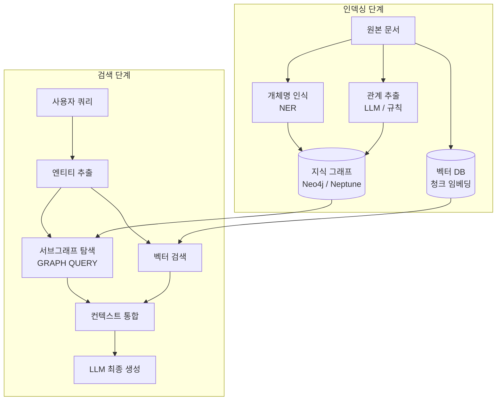
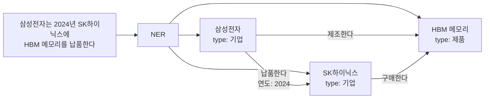

# 지식 그래프 RAG (Knowledge Graph RAG)

지식 그래프 RAG(Knowledge Graph RAG)는 텍스트 코퍼스에서 추출한 **엔티티(entity)와 관계(relation)로 구성된 그래프 구조**를 벡터 DB와 함께 활용해 검색하는 RAG 기법이다. [[rag-pipeline]]의 순수 벡터 검색이 포착하기 어려운 **엔티티 간 다단계 관계 추론**을 명시적 그래프 구조로 지원한다.

## 왜 지식 그래프인가

벡터 기반 RAG는 의미적 유사도 검색에 강하지만, "A가 B를 인수한 C 회사의 CEO는 누구인가"처럼 **엔티티 간 관계 체인**이 필요한 질의에서는 단순 유사도 매칭이 한계를 드러낸다. [[knowledge-graph]]는 이런 관계를 직접 표현하고 탐색할 수 있는 자료구조다.

## 아키텍처 개요



## 핵심 컴포넌트

### 그래프 구축



그래프 구축 시 LLM 기반 정보 추출을 사용하는 것이 일반적이다:

```python
extraction_prompt = """
텍스트에서 엔티티와 관계를 JSON으로 추출하라.
형식: {"entities": [{"name": ..., "type": ...}], "relations": [{"subject": ..., "predicate": ..., "object": ...}]}
텍스트: {text}
"""
```

### 서브그래프 검색

쿼리에서 엔티티를 식별한 뒤, 해당 엔티티를 시드로 **BFS/DFS 또는 최단 경로** 알고리즘으로 연관 서브그래프를 탐색한다.

```cypher
-- Neo4j Cypher: 특정 엔티티와 2홉 이내 관계 탐색
MATCH path = (e:Entity {name: $entity_name})-[*1..2]-(related)
RETURN path
LIMIT 50
```

### 벡터+그래프 하이브리드

| 검색 유형 | 강점 | 활용 |
|---------|------|------|
| 벡터 검색 | 의미적 유사도 | 개념 질의, 설명 요청 |
| 그래프 탐색 | 관계 추론, 경로 탐색 | 엔티티 관계 질의, 멀티홉 추론 |
| 결합 | 양쪽 장점 통합 | 대부분의 실무 질의 |

두 결과를 통합할 때 가중 RRF 또는 리랭커를 사용한다.

## Microsoft GraphRAG

2024년 Microsoft Research가 발표한 GraphRAG는 지식 그래프 RAG의 대표 구현체로, 다음 두 검색 모드를 제공한다:

- **Local Search**: 특정 엔티티 주변 서브그래프를 탐색. 구체적인 팩트 질의에 적합.
- **Global Search**: 전체 그래프의 클러스터 요약(RAPTOR 유사)을 활용. "이 코퍼스의 주요 주제는?"처럼 포괄적 질의에 적합.

GraphRAG는 [[rag-pipeline]]의 커뮤니티 요약 레이어를 추가함으로써 대규모 코퍼스의 글로벌 구조를 파악하는 데 특히 강점을 보인다.

## 구현 스택

| 컴포넌트 | 옵션 |
|---------|------|
| 그래프 DB | Neo4j, Amazon Neptune, TigerGraph, FalkorDB |
| NER/관계 추출 | spaCy, GLiNER, LLM(GPT-4o) |
| 그래프 쿼리 | Cypher(Neo4j), SPARQL, Gremlin |
| 벡터 DB 연계 | Neo4j Vector Index, Weaviate, Chroma |
| 프레임워크 | LangChain GraphQA, LlamaIndex KnowledgeGraph, Microsoft GraphRAG |

## 한계와 주의사항

- **그래프 구축 비용**: NER·관계 추출에 LLM을 사용하면 대규모 코퍼스에서 비용이 급격히 증가한다. 규칙 기반 추출과 혼용하는 것이 현실적이다.
- **그래프 품질 의존성**: 잘못 추출된 엔티티나 관계가 그래프에 누적되면 검색 품질이 저하된다. 주기적 그래프 검증과 노이즈 제거가 필요하다.
- **도메인 특화성**: 일반 도메인보다 **엔티티가 명확하고 관계가 정형화된** 의학, 법률, 금융 도메인에서 효과가 두드러진다.
- **실시간 갱신 어려움**: 그래프 갱신은 단순 벡터 DB 갱신보다 복잡하다. 이벤트 기반 스트리밍 업데이트 파이프라인이 필요하다.

## 실무 적용 시나리오

- **의료 문헌**: 약물-질병-유전자 관계 추론 ("이 약물과 상호작용하는 모든 유전자 변이")
- **기업 지식 관리**: 조직도·프로젝트·담당자 관계 탐색
- **법률 문서**: 판례·법령·당사자 관계 체인 추적
- **금융 리서치**: 기업 지배구조, 공급망 관계, M&A 이력 분석

## 관련 문서

- [[knowledge-graph]] - 지식 그래프의 구조와 기본 개념
- [[rag-pipeline]] - KG RAG가 강화하는 표준 RAG 파이프라인
- [[raptor-tree-retrieval]] - 유사하게 계층적 컨텍스트를 구성하는 트리 기반 RAG
- [[graphrag-in-production]] - GraphRAG 프로덕션 배포 사례 및 고려사항
