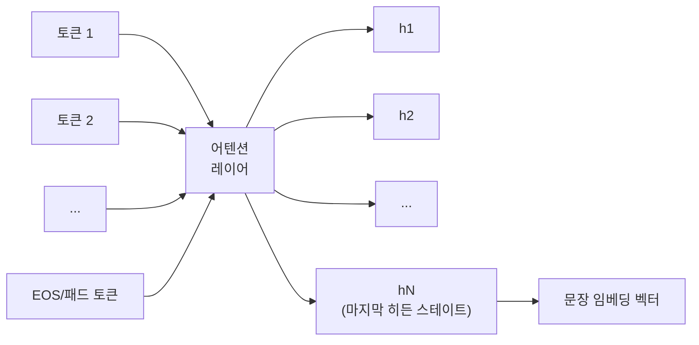

# 마지막 토큰 풀링 (디코더 기반 임베딩)

## 정의

마지막 토큰 풀링(last token pooling)은 디코더 전용(decoder-only) LLM을 임베딩 모델로 활용할 때 사용하는 표준 풀링 방식이다. 입력 시퀀스의 **마지막 위치에 있는 토큰의 히든 스테이트(hidden state)**를 문장 전체의 표현 벡터로 취급한다.

인과적 어텐션(causal attention) 구조상 디코더의 마지막 토큰은 앞선 모든 토큰을 참조할 수 있으므로, 시퀀스 전체 정보를 가장 풍부하게 압축하고 있다. 이 성질을 이용해 마지막 토큰 하나만으로 문장 임베딩을 추출한다.



위 다이어그램은 인과적 어텐션 하에서 마지막 토큰의 히든 스테이트만 임베딩으로 추출하는 흐름을 나타낸다.

---

## 왜 디코더에서는 마지막 토큰을 쓰는가

### 인과적 어텐션의 구조적 특성

인코더(BERT 계열)는 양방향 어텐션을 사용하므로 어떤 위치의 토큰이든 전체 시퀀스를 참조한다. 따라서 CLS 토큰이나 평균 풀링이 자연스럽다.

반면 GPT 계열 디코더는 **단방향(왼쪽-오른쪽) 인과적 어텐션**을 사용한다:

- 토큰 $i$는 토큰 $1, 2, ..., i$만 볼 수 있다
- 첫 번째 토큰은 자기 자신만 본다 - 정보량이 가장 적다
- **마지막 토큰은 앞선 모든 토큰을 참조** - 정보량이 가장 많다

이 비대칭 구조 때문에 디코더에서는 마지막 위치의 히든 스테이트가 시퀀스 전체의 표현으로 가장 적합하다.

### EOS 토큰의 역할

많은 구현에서 입력 끝에 EOS(End-of-Sequence) 토큰을 명시적으로 추가한다:

```python
# EOS 토큰 활용 예시
input_ids = tokenizer.encode(text) + [tokenizer.eos_token_id]
```

EOS 토큰은 시퀀스 종료 신호로 사전학습되었으므로, 전체 시퀀스를 "요약"하는 임베딩 추출에 의미론적으로 적합하다.

---

## 알고리즘

### 기본 추출 절차

```python
import torch
from transformers import AutoTokenizer, AutoModel

def last_token_pooling(model_name: str, texts: list[str]) -> torch.Tensor:
    tokenizer = AutoTokenizer.from_pretrained(model_name)
    model = AutoModel.from_pretrained(model_name)

    # 패딩 방향 중요: 디코더는 right-padding이 표준
    # (마지막 토큰을 일정하게 추출하려면 left-padding 필요 - 모델마다 다름)
    encoded = tokenizer(
        texts,
        padding=True,
        truncation=True,
        return_tensors="pt"
    )

    with torch.no_grad():
        outputs = model(**encoded)

    hidden_states = outputs.last_hidden_state  # (batch, seq_len, hidden_dim)

    # attention_mask로 실제 마지막 토큰 위치 계산
    attention_mask = encoded["attention_mask"]
    # 각 시퀀스에서 마지막 비패딩 토큰 위치
    last_token_idx = attention_mask.sum(dim=1) - 1  # (batch,)

    # 인덱싱으로 마지막 토큰 히든 스테이트 추출
    batch_size = hidden_states.size(0)
    embeddings = hidden_states[
        torch.arange(batch_size), last_token_idx, :
    ]  # (batch, hidden_dim)

    return embeddings
```

### 패딩 방향 주의사항

디코더 모델의 패딩 방향은 모델마다 다르며 결과에 큰 영향을 미친다:

| 패딩 방향 | 동작 | 권장 여부 |
|-----------|------|-----------|
| Right-padding (우측) | 각 시퀀스마다 마지막 실제 토큰 위치를 별도 계산해야 함 | 모델 기본값이면 유지 |
| Left-padding (좌측) | 마지막 위치 = 항상 실제 마지막 토큰, 구현이 단순함 | LLM 임베딩에 선호 |

```python
# Left-padding 설정 (일부 모델에서 권장)
tokenizer.padding_side = "left"
```

---

## 주요 활용 모델

### E5-Mistral / E5-LLaMA 계열

Microsoft의 E5-Mistral-7B는 LLaMA/Mistral 기반 디코더를 임베딩에 적용한 대표 사례다. 마지막 토큰 풀링 + 지시문(instruction) 접두어 방식을 결합해 MTEB 벤치마크에서 높은 성능을 달성했다.

```python
# E5-Mistral 스타일 지시문 기반 임베딩
def get_detailed_instruct(task_description: str, query: str) -> str:
    return f"Instruct: {task_description}\nQuery: {query}"

query = get_detailed_instruct(
    "Retrieve semantically similar documents",
    "파이썬으로 머신러닝 모델을 훈련하는 방법"
)
```

### LLM2Vec 접근법

LLM2Vec은 인과적 어텐션 LLM을 양방향으로 변환하는 방법론이지만, 변환 전 베이스라인으로 마지막 토큰 풀링을 사용한다.

### GTE-Qwen / Qwen3-Embedding

Alibaba의 Qwen 기반 임베딩 모델들도 마지막 토큰 풀링(EOS 기반)을 채택했으며, 8K 이상의 긴 컨텍스트에서도 안정적인 임베딩을 생성한다.

---

## 장단점 분석

### 장점

- **디코더 LLM의 강력한 사전학습 지식 활용**: GPT-4 규모 지식을 임베딩에 활용 가능
- **긴 컨텍스트 지원**: 최신 LLM은 128K+ 컨텍스트를 지원하므로 긴 문서도 단일 임베딩 가능
- **지시 튜닝(instruction tuning) 활용**: 태스크 설명을 프롬프트로 제공해 임베딩 방향을 조정할 수 있음
- **구현 단순성**: 마지막 히든 스테이트 추출 = 단 몇 줄의 코드

### 단점

- **추론 비용**: 인코더보다 파라미터가 훨씬 많아 임베딩 생성 비용이 높음
- **인과적 어텐션의 구조적 한계**: 앞 토큰이 뒤 토큰을 볼 수 없어 역방향 맥락 손실
- **패딩 민감성**: 패딩 방향 설정 오류 시 임베딩 품질 급락
- **배포 메모리**: 7B 모델은 FP16 기준 14GB+ VRAM 필요

### 인코더 계열 CLS/Mean 풀링과 비교

| 기준 | 마지막 토큰 풀링 (디코더) | CLS/Mean 풀링 (인코더) |
|------|--------------------------|------------------------|
| 어텐션 방향 | 단방향 (좌->우) | 양방향 |
| 모델 크기 | 7B~70B (대형) | 110M~560M (소형) |
| 추론 속도 | 느림 | 빠름 |
| 지시 튜닝 | 자연스럽게 활용 | 별도 학습 필요 |
| MTEB 성능 | 최상위 | 경쟁력 있음 |

---

## 실무 권장 사항

### 언제 선택하는가

- 임베딩 품질이 최우선이고 비용/지연 허용 범위가 클 때
- 태스크별로 임베딩 방향을 동적으로 조정해야 할 때 (지시 튜닝)
- 8K 이상의 긴 문서를 단일 임베딩으로 처리해야 할 때

### 언제 선택하지 않는가

- 실시간 검색 레이턴시가 100ms 이하로 요구될 때
- 서버 메모리가 제한적일 때
- 배치 임베딩 처리량이 중요할 때

---

## 관련 문서

- [[token-pooling-strategies]] - 풀링 전략 전체 비교 (mean/max/cls/last/weighted)
- [[mean-vs-cls-pooling]] - 인코더 계열 풀링 방식 비교
- [[weighted-attention-pooling]] - 학습 가능 어텐션 가중치 풀링
- [[embedding-models-for-rag]] - RAG용 임베딩 모델 선택 가이드
- [[rag-indexing-pipeline]] - 임베딩을 인덱싱 파이프라인에 통합하는 방법
