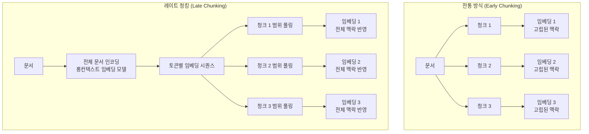

# 레이트 청킹 (Late Chunking)

레이트 청킹(Late Chunking)은 문서를 먼저 청크로 분할한 뒤 각 청크를 독립적으로 임베딩하는 전통 방식과 달리, **전체 문서를 먼저 인코더에 통과시킨 뒤 토큰 임베딩을 청크 단위로 풀링**하는 기법이다. 2024년 Jina AI가 제안했으며, 청크가 문서 전체 문맥을 잃지 않도록 **문맥 보존(contextual embedding)**을 실현한다.

## 전통 청킹 방식의 문제

[[chunking-strategies]]에서 다루는 전통적 접근은 다음 순서를 따른다:

1. 문서를 고정 크기 또는 의미 단위로 분할
2. 각 청크를 독립적으로 임베딩
3. 청크 임베딩을 벡터 DB에 저장

이 방식의 핵심 결함은 **청크가 고립된 맥락에서 임베딩**된다는 점이다. 예를 들어 "그는 2024년에 회사를 설립했다"라는 청크에서 "그"가 앞 청크에 등장한 특정 인물을 가리키더라도, 현재 청크 임베딩에는 그 맥락이 반영되지 않는다.

## 레이트 청킹의 동작 원리



### 핵심 메커니즘

1. **전체 문서 인코딩**: 트랜스포머 인코더가 전체 문서를 한번에 처리한다. 롱 컨텍스트 임베딩 모델(예: jina-embeddings-v3, NV-Embed-v2)이 필요하다.
2. **토큰 수준 임베딩 추출**: 인코더의 마지막 레이어에서 각 토큰의 컨텍스트화된 임베딩을 추출한다. 이 시점에서 각 토큰은 문서 전체의 어텐션을 반영한 상태다.
3. **청크 범위 풀링**: 미리 정의한 청크 경계에 따라 해당 범위의 토큰 임베딩을 평균 풀링(mean pooling)해 청크 임베딩을 생성한다.

## [[embedding-layers]]와의 연관

레이트 청킹은 [[embedding-layers]]의 구조, 특히 **어텐션 기반 컨텍스트 누적**을 활용한다. 트랜스포머의 셀프 어텐션 덕분에 토큰 임베딩은 주변 전체 문맥을 반영하며, 이 풍부한 표현을 청크 단위로 압축하는 것이 레이트 청킹의 본질이다.

## 전통 방식 vs 레이트 청킹 비교

| 항목 | 전통 청킹 | 레이트 청킹 |
|------|---------|-----------|
| 임베딩 단위 | 독립 청크 | 전체 문서 후 청크 풀링 |
| 대명사/지시어 해석 | 불가 | 가능 |
| 롱컨텍스트 모델 필요 | 아니오 | 예 |
| 인코딩 비용 | 낮음 | 높음 (문서 전체) |
| 검색 단위 | 청크 | 청크 (동일) |
| 저장 포맷 | 동일 | 동일 |

## Contextual Retrieval과의 차이

Anthropic이 2024년 소개한 Contextual Retrieval(문서 내 청크에 LLM으로 맥락 설명을 추가)과 레이트 청킹은 목표가 같지만 접근이 다르다:

- **Contextual Retrieval**: LLM이 각 청크에 "이 청크는 문서의 어떤 맥락에서 등장했는가"를 텍스트로 추가한 뒤 임베딩. LLM 호출 비용이 추가된다.
- **레이트 청킹**: 임베딩 모델이 어텐션으로 자연스럽게 맥락을 흡수. 별도 LLM 호출 없이 맥락 보존.

## 구현 요건

```python
from transformers import AutoTokenizer, AutoModel
import torch

model_name = "jinaai/jina-embeddings-v3"
tokenizer = AutoTokenizer.from_pretrained(model_name, trust_remote_code=True)
model = AutoModel.from_pretrained(model_name, trust_remote_code=True)

def late_chunk_embed(document: str, chunk_spans: list[tuple[int, int]]) -> list[list[float]]:
    """
    chunk_spans: 문자 오프셋 기반 청크 경계 [(start, end), ...]
    """
    inputs = tokenizer(document, return_tensors="pt", return_offsets_mapping=True)
    offset_mapping = inputs.pop("offset_mapping")[0]

    with torch.no_grad():
        outputs = model(**inputs)

    token_embeddings = outputs.last_hidden_state[0]  # (seq_len, hidden_dim)

    chunk_embeddings = []
    for char_start, char_end in chunk_spans:
        # 토큰 인덱스와 문자 오프셋을 매핑해 해당 청크 범위 풀링
        mask = (offset_mapping[:, 0] >= char_start) & (offset_mapping[:, 1] <= char_end)
        chunk_vec = token_embeddings[mask].mean(dim=0)
        chunk_embeddings.append(chunk_vec.tolist())

    return chunk_embeddings
```

## 한계와 주의사항

- **모델 컨텍스트 길이 제한**: 문서 전체를 한번에 인코딩하므로 임베딩 모델의 최대 컨텍스트 길이 이내여야 한다. 매우 긴 문서(수만 토큰)는 청크로 나눠 여러 번 인코딩하거나 슬라이딩 윈도우를 사용해야 한다.
- **인코딩 비용**: 동일 문서에서 여러 청크를 추출할 때도 문서 전체를 한번 인코딩하므로 배치 처리 효율은 오히려 향상된다.
- **롱컨텍스트 모델 필수**: 일반 512토큰 임베딩 모델로는 효과를 볼 수 없다. jina-embeddings-v3(8192 토큰), NV-Embed-v2(32768 토큰) 등이 실용적 선택이다.

## 관련 문서

- [[chunking-strategies]] - 레이트 청킹이 개선하는 전통 청킹 전략 개요
- [[embedding-layers]] - 전체 문서 인코딩을 담당하는 임베딩 모델 구조
- [[rag-pipeline]] - 레이트 청킹이 인덱싱 단계에서 적용되는 전체 파이프라인
- [[contextual-retrieval]] - 유사한 목표의 대안적 맥락 보존 기법
