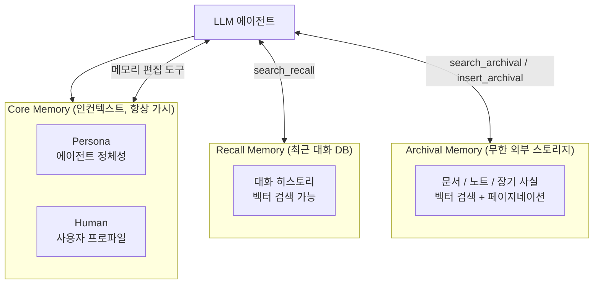
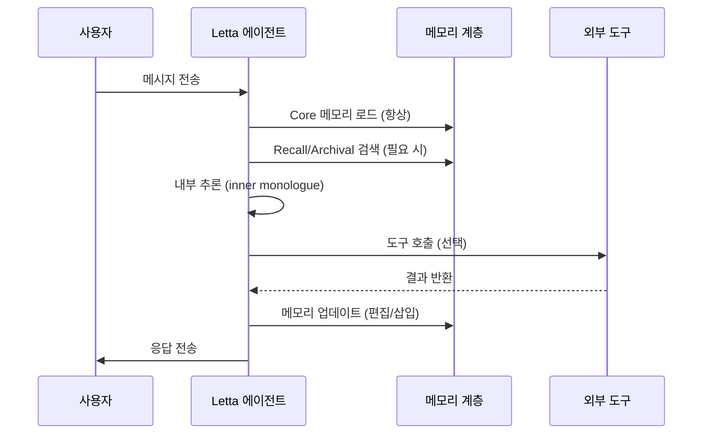

# Letta (MemGPT) Stateful Agent Runtime

LLM-as-OS 모델로 Core/Recall/Archival 3계층(3-tier) 메모리(memory)를 관리하는 에이전트(agent) 플랫폼. 2023년 MemGPT 논문에서 시작해 2024년 Letta로 브랜드를 재정립했으며, 장기 기억(long-term memory)이 필요한 프로덕션(production) 에이전트의 런타임(runtime) 표준을 목표로 한다.

## 왜 지금 중요한가

2025년 12월 Letta Code 출시 이후 Terminal-Bench 1위 OSS 코딩 하네스(harness) 타이틀을 유지 중이며, v0.16.7(2026-03-31)과 Conversations API로 공유 메모리(shared memory) 기반 멀티세션(multi-session) 에이전트 수요가 폭발 중이다. ReAct, MemGPT, Claude Code의 교훈을 통합해 에이전트 루프(agent loop)를 재설계한 것이 현재 아키텍처의 핵심이다.

## 3계층 메모리 아키텍처



이 다이어그램은 LLM이 도구(tool) 호출을 통해 세 계층의 메모리를 자율적으로 읽고 쓰는 구조를 보여준다.

### Core Memory (코어 메모리)
- 항상 컨텍스트 윈도우(context window) 안에 존재하는 소형(small) 메모리
- `Persona` 블록: 에이전트의 정체성, 행동 방침 (에이전트가 직접 수정 가능)
- `Human` 블록: 사용자 이름, 선호도, 장기 사실 (상호작용을 통해 점진적으로 업데이트)

### Recall Memory (리콜 메모리)
- 과거 대화 전체를 저장하는 관계형 DB(relational DB) + 벡터 인덱스(vector index)
- `search_recall(query)` 도구로 LLM이 자율 검색
- 세션 경계를 넘어 이전 대화 내용 참조 가능

### Archival Memory (아카이벌 메모리)
- 용량 제한 없는 외부 문서 저장소
- `insert_archival(text)`, `search_archival(query)` 도구로 읽고 씀
- 사용자가 외부 문서를 Archival에 직접 삽입 가능 (RAG 대체 또는 보완)

## 에이전트 루프 설계



Letta의 에이전트 루프는 ReAct(Reasoning + Acting) 패턴을 확장해 "내부 독백(inner monologue)" 단계를 추가했다. 이 단계에서 에이전트는 메모리 업데이트 여부, 도구 호출 여부를 결정한다.

## Letta Code: 메모리 우선 코딩 에이전트

2025년 12월 출시된 Letta Code는 Letta 런타임 위에 코딩 에이전트(coding agent)를 구현한 사례다.

- **Terminal-Bench 1위**: 장기 터미널 작업(long-horizon terminal task)에서 OSS 최고 성능
- **메모리 우선 설계**: 코드베이스(codebase) 구조, 컨벤션(convention), 진행 상황을 Archival에 저장
- **세션 간 연속성**: 이전 세션에서 작업하던 컨텍스트를 다음 세션에 자동 로드

## 주요 API - Conversations API

v0.16.7부터 제공되는 Conversations API는 여러 에이전트가 공유 메모리 블록(shared memory block)을 통해 협력하는 멀티에이전트(multi-agent) 오케스트레이션(orchestration)을 지원한다.

```python
# 공유 메모리 블록 생성 예시 (공식 문서 기반 패턴)
from letta import create_client

client = create_client()
# 여러 에이전트가 동일 human 블록을 참조
agent_a = client.create_agent(memory_blocks=[shared_human_block])
agent_b = client.create_agent(memory_blocks=[shared_human_block])
```

## 운영 고려사항

| 항목 | 내용 |
|------|------|
| 자체 호스팅 | Docker 또는 pip 설치, PostgreSQL + 벡터 DB 필요 |
| 관리형 서비스 | Letta Cloud (SaaS) |
| 지원 LLM | OpenAI, Anthropic, 로컬 모델(Ollama 등) |
| 메모리 백엔드 | PostgreSQL + pgvector 또는 Chroma |
| 라이선스 | Apache 2.0 (OSS 코어) |

## 대표 레퍼런스

- [Letta GitHub (letta-ai/letta)](https://github.com/letta-ai/letta)
- [Letta Code: A Memory-First Coding Agent](https://www.letta.com/blog/letta-code)
- [Rearchitecting Letta's Agent Loop: Lessons from ReAct, MemGPT, & Claude Code](https://www.letta.com/blog/letta-v1-agent)
- [Intro to Letta (MemGPT docs)](https://docs.letta.com/concepts/memgpt/)
- [Agent Memory: How to Build Agents that Learn and Remember](https://www.letta.com/blog/agent-memory)

## 관련 문서

- [[ai-hot-topics-2026-04|2026년 4월 AI 개발 핫토픽 100선]]
- [[contextual-retrieval|Contextual Retrieval (Anthropic)]]
- [[mem0-universal-memory-layer|Mem0 Universal Memory Layer]]
- [[temporal-knowledge-graph-memory|Zep / Graphiti Temporal Knowledge Graph Memory]]
- [[agent-memory-systems|에이전트 메모리 시스템]]
- [[adaptive-context-compression|Adaptive Context Compression for Long-Running Agents]]
