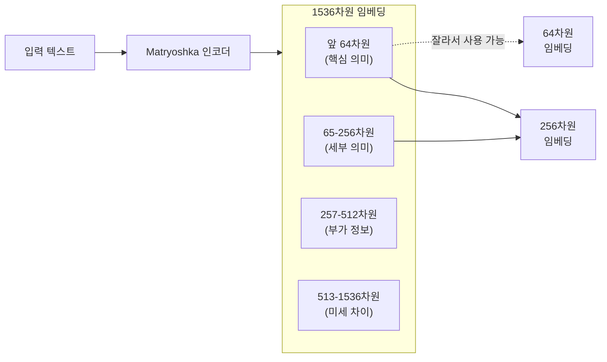
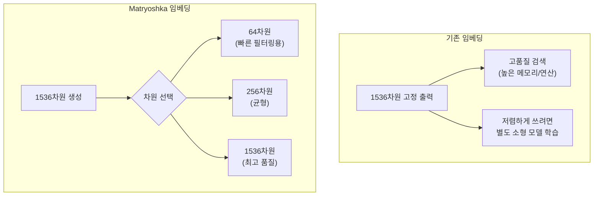

# Matryoshka 임베딩 - 가변 차원

Matryoshka 임베딩(Matryoshka Representation Learning, MRL)은 단일 임베딩 모델로 다양한 차원의 임베딩을 생성할 수 있는 학습 기법이다. 러시아 전통 인형 마트료시카(큰 인형 안에 작은 인형이 겹쳐 있는 구조)에서 이름을 따왔다. 2022년 Kusupati et al. "Matryoshka Representation Learning" 논문에서 제안되었으며, OpenAI의 `text-embedding-3` 시리즈, Nomic의 `nomic-embed-text`가 이 방식을 채택해 대중화되었다.

## 핵심 아이디어

기존 임베딩은 고정 차원(예: 1536차원 float32)을 출력한다. MRL은 임베딩 벡터를 **잘라내도(truncation) 품질이 크게 떨어지지 않도록** 학습한다. 즉, 앞부분 차원들이 가장 중요한 정보를 압축적으로 담고, 뒤로 갈수록 세부 정보를 추가하는 구조다.



## MRL 학습 방법

일반 임베딩 학습(대조 학습)과 달리, MRL은 동일한 임베딩 벡터를 여러 차원으로 잘라낸 버전 각각에 대해 손실을 계산하고 합산한다:

$$\mathcal{L}_{MRL} = \sum_{m \in M} \frac{1}{|M|} \mathcal{L}(F_{:m}(x), F_{:m}(x^+), F_{:m}(x^-))$$

여기서 $M = \{8, 16, 32, 64, 128, 256, 512, 1536\}$은 학습할 차원 집합이고, $F_{:m}(x)$는 임베딩의 앞 $m$차원이다. 각 차원 잘라내기마다 긍정/부정 예시와의 대조 손실이 계산되므로, 작은 차원도 의미 있는 임베딩을 강제 학습한다.

## 기존 임베딩 vs. MRL 비교



## 실용적 활용 패턴

### 2단계 검색 (Adaptive Retrieval)

```python
# 1단계: 저차원 임베딩으로 빠른 후보 추림
# 2단계: 고차원 임베딩으로 정밀 재랭킹

from openai import OpenAI
import numpy as np

client = OpenAI()

def embed(text, dimensions=None):
    kwargs = {"model": "text-embedding-3-large", "input": text}
    if dimensions:
        kwargs["dimensions"] = dimensions
    return client.embeddings.create(**kwargs).data[0].embedding

# 1단계: 작은 차원으로 대용량 코퍼스 빠른 검색 (메모리 1/8)
query_small = embed("검색 쿼리", dimensions=256)
# ... 벡터 DB에서 top-100 후보 검색 ...

# 2단계: 큰 차원으로 후보 재랭킹 (정밀도 향상)
query_large = embed("검색 쿼리", dimensions=1536)
# ... 100개 후보 재정렬 ...
```

### 수동 잘라내기 (FAISS/Qdrant)

MRL 임베딩은 numpy 슬라이싱으로도 잘라낼 수 있다:

```python
embedding_1536 = embed("텍스트")  # 1536차원
embedding_256 = np.array(embedding_1536[:256])  # 앞 256차원만 사용

# L2 정규화 후 사용 (코사인 유사도 기반)
embedding_256_normalized = embedding_256 / np.linalg.norm(embedding_256)
```

## OpenAI text-embedding-3 구현

OpenAI의 `text-embedding-3-small`(1536차원)과 `text-embedding-3-large`(3072차원)는 MRL 기반이다. API에서 `dimensions` 파라미터로 원하는 차원을 지정하면 API 수준에서 잘라내기가 적용된다.

| 모델 | 최대 차원 | 지원 축소 차원 |
|------|---------|--------------|
| text-embedding-3-small | 1536 | 512, 256, 64 등 |
| text-embedding-3-large | 3072 | 1536, 512, 256 등 |

`dimensions=256`을 지정하면 1536차원 생성 후 잘라내기가 아니라, 효율적인 방식으로 바로 256차원이 반환된다 (실제로는 API 내부에서 처리).

## Nomic Embed Text

오픈소스 MRL 임베딩의 대표 사례다. `nomic-embed-text-v1`(137M 파라미터)은 8K 토큰 컨텍스트와 MRL 지원을 갖추면서 완전 재현 가능한(fully reproducible) 학습 과정을 제공했다.

```python
# Nomic Embed with MRL (HuggingFace)
from sentence_transformers import SentenceTransformer

model = SentenceTransformer("nomic-ai/nomic-embed-text-v1", trust_remote_code=True)

# 전체 차원 임베딩
embedding_full = model.encode("text", normalize_embeddings=True)  # 768차원

# 잘라내기로 소형 임베딩 생성
embedding_256 = embedding_full[:256]
embedding_256 = embedding_256 / np.linalg.norm(embedding_256)
```

## 성능 트레이드오프

MRL 임베딩을 잘라낼수록 성능이 점진적으로 감소한다. 일반적인 양상:

| 차원 | BEIR 재현율 (대략) | 메모리 (대비 최대) |
|------|-----------------|-----------------|
| 64 | ~85% | 1/24 |
| 256 | ~92% | 1/6 |
| 512 | ~95% | 1/3 |
| 1536 | 100% (기준) | 1 |

*실제 수치는 모델, 데이터셋, 태스크에 따라 다름. 참고용.*

## Cohere Embed v4와의 차이

[[cohere-embed-v4|Cohere Embed v4]]도 가변 차원 임베딩을 지원하지만, 공개된 방식은 MRL과 다를 수 있다. 두 접근 모두 "큰 임베딩을 잘라서 작은 임베딩으로 사용"하는 목표는 같다.

## 왜 중요한가

1. **단일 모델로 비용-품질 트레이드오프 조정**: 데이터셋 크기, 레이턴시 요구에 따라 동적으로 차원 선택
2. **메모리 절감**: 256차원 사용 시 1536차원 대비 메모리 1/6, 검색 속도 향상
3. **2단계 검색의 필수 기반**: 저차원 빠른 필터링 + 고차원 정밀 재랭킹 패턴
4. **벡터 DB 비용 절감**: 저차원 인덱스는 벡터 DB 저장 비용도 절감

## 관련 문서

- [[embedding-models-for-rag]] - RAG용 임베딩 모델 전반
- [[embedding-quantization]] - 임베딩 양자화 (다른 차원 압축 방식)
- [[cohere-embed-v4]] - Cohere의 MRL 지원 임베딩
- [[voyage-ai-embeddings]] - Voyage AI 임베딩 모델군
- [[embedding-finetuning]] - 임베딩 도메인 특화 파인튜닝
- [[dense-retrieval]] - 밀집 벡터 검색
- [[hybrid-search-rrf]] - 하이브리드 검색
- [[embedding-leaderboard-shakeup-2026]] - 최신 임베딩 벤치마크 현황
