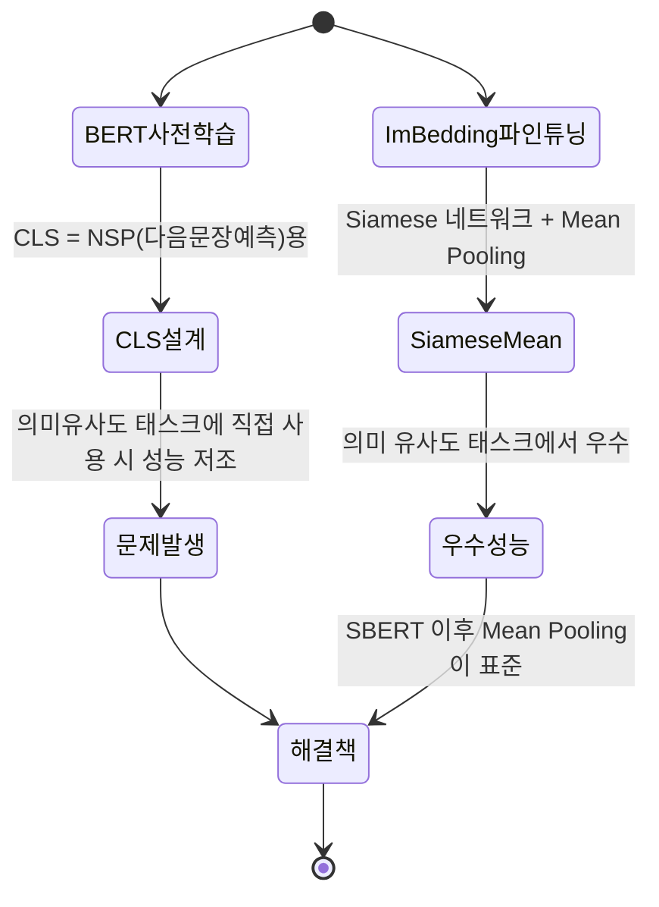
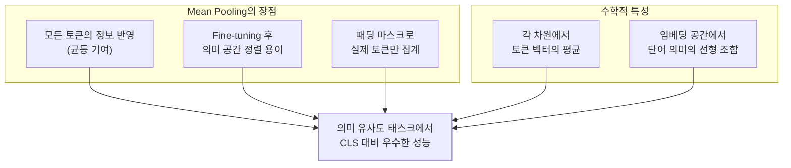
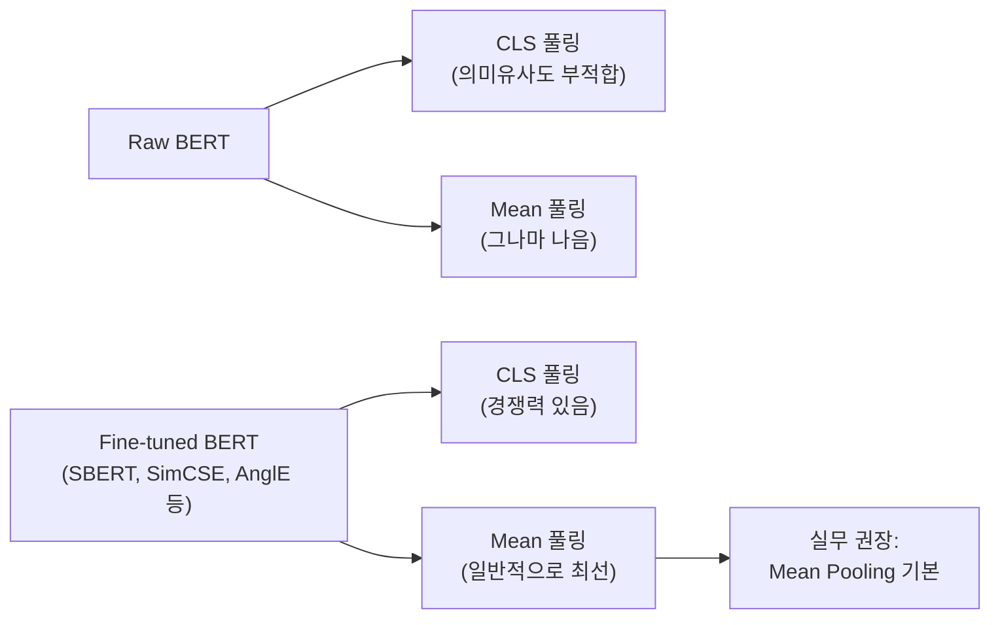

# Mean Pooling vs CLS 토큰 풀링

## 개요

텍스트 임베딩에서 가장 흔하게 마주치는 질문 중 하나가 **"CLS 토큰을 써야 하나, Mean Pooling을 써야 하나?"**다. 이 질문에는 명확한 답이 있다: **임베딩 fine-tuning이 없는 raw BERT에서는 CLS가 좋지 않고, 의미 유사도용으로 fine-tuning된 모델에서는 Mean Pooling이 일반적으로 더 낫다.** 그 이유를 이해하면 임베딩 모델 선택과 활용에 큰 도움이 된다.



BERT 사전학습의 CLS 목적과 임베딩 fine-tuning의 목표가 다르기 때문에 이 차이가 발생한다.

---

## CLS 토큰: 설계 의도와 실제 성능

### CLS 토큰의 기원

BERT([[bert]])는 두 가지 사전학습 목표를 가졌다:
1. **MLM (Masked Language Modeling)**: 마스킹된 토큰 예측
2. **NSP (Next Sentence Prediction)**: 두 문장이 연속되는지 예측

NSP를 위해 BERT는 첫 번째 위치에 `[CLS]` 특수 토큰을 삽입하고, 전체 입력의 요약 표현이 이 위치에 집약되도록 학습했다. 이론적으로는 "전체 시퀀스의 요약"이 CLS에 담겨야 한다.

### CLS가 의미 유사도에 약한 이유


**핵심 문제**: NSP는 "두 문장이 인접한 문서에서 왔는가"를 판단하는 태스크다. 이 목표로 학습된 CLS는 **의미적 유사성**이 아닌 **문서 연속성**에 특화된 표현을 갖는다.

실험으로도 확인된다 - raw BERT의 CLS를 의미 유사도(STS)에 사용하면 GloVe 단어 임베딩의 단순 평균보다도 성능이 낮을 수 있다.

### NSP 제거 이후 (RoBERTa)

RoBERTa는 NSP 목표를 제거하고 더 많은 데이터와 긴 학습으로 MLM만 사용했다. 이후 CLS 토큰의 "전체 요약" 역할은 더욱 약해졌다.

---

## Mean Pooling: SBERT의 기여

### Sentence-BERT (SBERT) 등장

2019년 Reimers와 Gurevych의 **Sentence-BERT** 논문이 Mean Pooling의 우수성을 체계적으로 증명했다:

> "Using BERT output layer (i.e., without fine-tuning) maps sentences to a vector space that is rather poorly suited for semantic textual similarity."

SBERT는 Siamese 네트워크 구조에서 두 문장을 각각 BERT로 인코딩하고, 각 출력에 Mean Pooling을 적용해 코사인 유사도를 계산하는 방식으로 fine-tuning했다.

### Mean Pooling이 나은 이유



직관적 설명: 문장 "고양이가 매트 위에 앉았다"에서 Mean Pooling은 '고양이', '매트', '앉다' 모든 핵심 개념을 균등하게 벡터에 반영한다. CLS는 이 정보들이 NSP 목적의 필터를 통해 압축된 표현을 가지므로 정보 손실이 있다.

---

## 실험 비교

### STS 벤치마크에서의 성능 (Pearson 상관계수)

| 방법 | STS-B | STS-2012 | 평균 |
|------|-------|---------|------|
| BERT-CLS (raw) | 16.50 | 25.32 | ~20 |
| BERT-Mean (raw) | 47.29 | 50.89 | ~49 |
| BERT-CLS (fine-tuned SBERT) | 79.19 | 67.58 | ~73 |
| BERT-Mean (fine-tuned SBERT) | **84.67** | **72.54** | ~79 |

*참조: Reimers & Gurevych (2019) Sentence-BERT*

Raw BERT에서 Mean Pooling이 CLS보다 월등하며, fine-tuning 후에도 Mean Pooling이 더 좋다.

---

## Fine-tuning 후 CLS가 경쟁력을 갖는 경우

Fine-tuning 방식에 따라 CLS도 좋은 성능을 발휘할 수 있다:

### SimCSE

**SimCSE**는 동일 문장을 다른 드롭아웃 마스크로 두 번 인코딩해 긍정 쌍을 구성하는 방법으로 CLS를 대조 학습했다. 이 방법으로 CLS도 좋은 의미 유사도 성능을 보인다.

### AnglE ([[mxbai-embed-large]])

AnglE 기반 fine-tuning 후 CLS를 사용하는 mxbai-embed-large는 MTEB에서 경쟁력 있는 성능을 보인다. 핵심은 **fine-tuning 방식**이지 풀링 자체가 아닐 수 있다.

### 결론: Fine-tuning이 핵심



---

## 실무 가이드

### 풀링 전략 결정 트리

```
1. 사용 중인 모델의 공식 문서/모델 카드를 확인한다
   → 명시된 풀링 방법이 있으면 그것을 따른다

2. Sentence-Transformers 라이브러리를 사용한다면
   → 자동으로 올바른 풀링이 적용됨

3. 직접 구현해야 한다면:
   - 인코더 모델 (BERT, RoBERTa) → Mean Pooling 기본
   - 디코더 모델 (GPT, Mistral) → Last Token Pooling
   - 특수 fine-tuning (mxbai AnglE) → CLS 풀링
```

### Sentence-Transformers로 올바른 풀링 적용

```python
from sentence_transformers import SentenceTransformer

# Sentence-Transformers는 자동으로 올바른 풀링 적용
model = SentenceTransformer("sentence-transformers/all-MiniLM-L6-v2")
embedding = model.encode("임베딩 예시 텍스트")  # 자동 Mean Pooling
```

### 직접 구현할 때 Mean Pooling

```python
import torch
from transformers import AutoTokenizer, AutoModel

def encode_with_mean_pooling(texts: list[str], model_name: str) -> torch.Tensor:
    tokenizer = AutoTokenizer.from_pretrained(model_name)
    model = AutoModel.from_pretrained(model_name)

    encoded = tokenizer(texts, padding=True, truncation=True, return_tensors="pt")

    with torch.no_grad():
        output = model(**encoded)

    # Mean Pooling - 패딩 마스크 적용
    token_embeddings = output.last_hidden_state
    attention_mask = encoded["attention_mask"]
    mask_expanded = attention_mask.unsqueeze(-1).expand(token_embeddings.size()).float()
    mean_pooled = torch.sum(token_embeddings * mask_expanded, 1) / torch.clamp(
        mask_expanded.sum(1), min=1e-9
    )

    # L2 정규화 (코사인 유사도 준비)
    return torch.nn.functional.normalize(mean_pooled, p=2, dim=1)
```

---

## 요약

| 상황 | 권장 풀링 | 이유 |
|------|---------|------|
| Raw BERT (fine-tuning 없음) | Mean Pooling | CLS는 NSP용, 의미 유사도에 부적합 |
| SBERT/E5/Nomic 등 임베딩 fine-tuned | Mean Pooling | 대부분 Mean으로 최적화됨 |
| mxbai-embed, BGE-M3 | CLS Pooling | AnglE/모델별 fine-tuning으로 CLS 최적화 |
| GPT/Mistral/LLM 기반 | Last Token | 인과적 어텐션 구조 특성 |
| 불확실한 경우 | 공식 문서 확인 | 모델마다 다름 |

---

## 관련 문서

- [[token-pooling-strategies]] - 모든 풀링 전략 전체 비교
- [[bert]] - CLS 토큰의 설계 배경 (NSP 목표)
- [[sentence-transformer]] - SBERT와 Mean Pooling 표준화
- [[contextual-embeddings]] - 토큰 레벨 표현
- [[nomic-embed-text]] - Mean Pooling 사용 예시
- [[e5-text-embeddings]] - Mean Pooling 사용 예시
- [[mxbai-embed-large]] - CLS Pooling + AnglE 사용 예시
- [[bge-m3-embedding]] - CLS 기반 Dense 임베딩
- [[embedding-finetuning]] - Fine-tuning이 풀링 선택에 미치는 영향
- [[embedding-models-for-rag]] - 모델별 풀링 전략 정리
