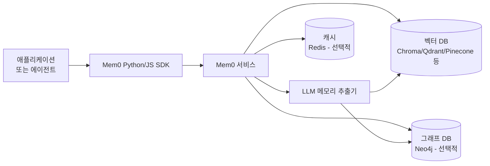

# Mem0 Universal Memory Layer

모든 LLM 앱과 에이전트(agent)에 꽂을 수 있는 자가개선형(self-improving) 메모리 레이어(memory layer). 대화(conversation)에서 자동으로 사실(fact)을 추출하고, 벡터 DB(vector database)에 저장·검색·업데이트하며, 중복·모순된 기억을 자동으로 병합·폐기한다.

## 왜 지금 중요한가

2026년 4월 공개된 "State of AI Agent Memory 2026" 보고서에서 LOCOMO 벤치마크(benchmark) 기준 풀컨텍스트(full-context) 방식 대비 91% 지연(latency) 감소·90% 토큰 절감을 입증했다. v1.0.0 메이저 릴리스(major release)로 21개 프레임워크·19개 벡터스토어를 지원하며 MCP(Model Context Protocol) 생태계의 기본 메모리 백엔드(backend)로 표준화되고 있다.

## 핵심 동작 원리

```mermaid
flowchart TD
    Input[대화 입력\n"나는 채식주의자야"] --> Extract[메모리 추출기\nLLM 기반 사실 추출]
    Extract --> Check{기존 메모리 확인}
    Check -->|없음| Insert[새 메모리 삽입\n벡터 DB + 그래프]
    Check -->|유사 기억 존재| Merge{충돌 판정}
    Merge -->|업데이트| Update[기존 기억 갱신\n"채식주의자로 전환"]
    Merge -->|모순| Delete[구 기억 폐기\n새 기억 삽입]
    Insert & Update --> VectorDB[(벡터 DB\n의미 검색)]
    Insert & Update --> GraphDB[(그래프 DB\n관계 검색)]
    VectorDB & GraphDB --> Retrieve[관련 기억 검색\n쿼리 시]
    Retrieve --> Inject[컨텍스트에 주입\n개인화된 응답]
```

이 다이어그램은 Mem0가 대화에서 사실을 추출하고, 기존 기억과 병합하며, 검색 시 컨텍스트에 주입하는 전체 사이클을 보여준다.

## 메모리 유형

Mem0는 세 가지 메모리 유형을 구분해 저장한다:

| 유형 | 설명 | 예시 |
|------|------|------|
| **Semantic Memory (의미 메모리)** | 사용자에 대한 사실, 선호도 | "채식주의자", "Python 선호" |
| **Episodic Memory (에피소딕 메모리)** | 과거 이벤트, 대화 내용 | "2024년에 파리 여행 다녀옴" |
| **Procedural Memory (절차적 메모리)** | 작업 방식, 규칙 | "코드는 항상 타입 힌트 추가" |

## 아키텍처 구성



### 지원 백엔드 (v1.0.0 기준)
- **벡터 DB**: Chroma, Qdrant, Pinecone, Weaviate, PGVector 등 19개
- **LLM**: OpenAI, Anthropic, Google, Mistral, Ollama 등 21개 프레임워크
- **그래프 DB**: Neo4j (옵션 - 관계 기반 메모리용)

## 핵심 API 패턴

```python
from mem0 import Memory

m = Memory()

# 메모리 추가 (대화에서 자동 추출)
m.add("나는 채식주의자이고 Python을 주로 씁니다.", user_id="brian")

# 메모리 검색
memories = m.search("식단 관련 추천해줘", user_id="brian")
# -> [{"memory": "채식주의자", "score": 0.92}, ...]

# 전체 메모리 조회
all_memories = m.get_all(user_id="brian")
```

## LOCOMO 벤치마크 성능 비교

LOCOMO(Long-term Conversation Memory)는 장기 대화 기억을 평가하는 벤치마크다:

| 방식 | 지연(Latency) | 토큰 사용량 | 정확도 |
|------|--------------|------------|--------|
| Full Context (전체 대화 주입) | 기준(100%) | 기준(100%) | 기준 |
| **Mem0** | **9% (91% 감소)** | **10% (90% 감소)** | 경쟁적 |
| Zep | 상대적으로 높음 | 높음 | LongMemEval 상위 |

Mem0는 비용·속도 측면에서 우위, Zep은 시간적 추론(temporal reasoning)이 필요한 복잡한 쿼리에서 우위.

## MCP 연동

Mem0는 MCP(Model Context Protocol) 서버로도 동작해 Claude, Claude Code 등 MCP를 지원하는 클라이언트에 메모리를 제공한다.

```json
// MCP 서버 설정 예시
{
  "mcpServers": {
    "mem0": {
      "command": "npx",
      "args": ["-y", "@mem0ai/mem0-mcp"],
      "env": { "MEM0_API_KEY": "<your_key>" }
    }
  }
}
```

## 자체 호스팅 vs 관리형

| 항목 | 자체 호스팅 (OSS) | Mem0 Cloud |
|------|-------------------|------------|
| 비용 | 인프라 비용만 | 사용량 기반 API 요금 |
| 설정 | 벡터 DB 직접 구성 | 즉시 사용 |
| 데이터 통제 | 완전 | Mem0 서버 저장 |
| 라이선스 | Apache 2.0 | 상용 |

## 대표 레퍼런스

- [Mem0 GitHub (mem0ai/mem0)](https://github.com/mem0ai/mem0)
- [Mem0 Official Site](https://mem0.ai/)
- [State of AI Agent Memory 2026](https://mem0.ai/blog/state-of-ai-agent-memory-2026)
- [The Definitive Guide to AI Agent Memory with Mem0 (Docs)](https://docs.mem0.ai/components/llms/overview)
- [mem0/LLM.md](https://github.com/mem0ai/mem0/blob/main/LLM.md)

## 관련 문서

- [[ai-hot-topics-2026-04|2026년 4월 AI 개발 핫토픽 100선]]
- [[letta-stateful-agent-runtime|Letta (MemGPT) Stateful Agent Runtime]]
- [[temporal-knowledge-graph-memory|Zep / Graphiti Temporal Knowledge Graph Memory]]
- [[agent-memory-systems|에이전트 메모리 시스템]]
- [[adaptive-context-compression|Adaptive Context Compression for Long-Running Agents]]
