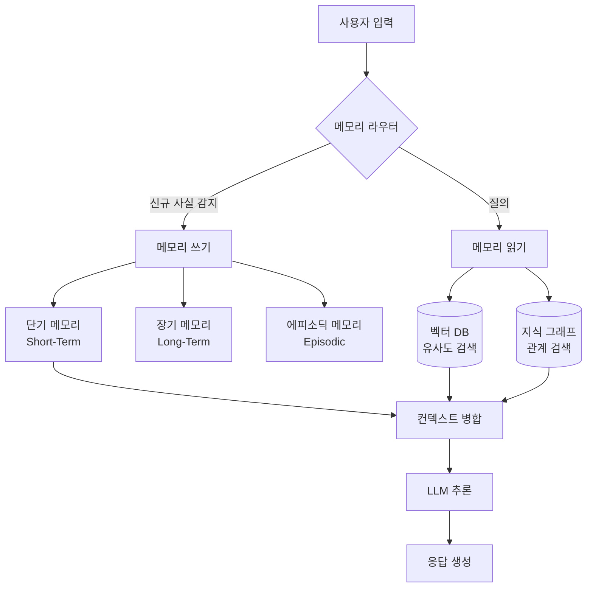

# Memory-Augmented Generation (MAG)

LLM에 명시적 외부 메모리를 통합하여 유한한 컨텍스트 윈도우(context window), 부실한 장기 기억(long-term memory), 업데이트 불가능성 등의 한계를 극복하는 패러다임. [[rag-architecture-evolution-2026|RAG]] 개념을 확장하여 단순 검색을 넘어 영속적인 메모리 계층을 구축한다.

## 왜 중요한가

| 접근 방식 | 한계 |
|-----------|------|
| 순수 LLM | 무상태(stateless). 컨텍스트 윈도우 내에서만 동작 |
| 풀 컨텍스트(full-context) | 비용 폭발, p95 지연 증가, 실용성 저하 |
| **MAG** | 외부 메모리로 선택적 검색. 비용/지연 절감 + 장기 기억 |

2026년 기준 MAG는 풀 컨텍스트 대비 **p95 지연 91% 감소**, **토큰 비용 90%+ 절감**, LLM judge 메트릭 **최대 26% 상대 개선**을 달성했다.

## 핵심 메커니즘

이 다이어그램은 MAG의 전체 흐름을 보여준다. 사용자 입력이 메모리 라우터를 거쳐 쓰기/읽기 경로로 분기되고, 여러 메모리 계층에서 검색된 컨텍스트가 LLM에 주입되어 응답을 생성한다.

## 아키텍처 패턴 4가지

### 1. 검색 기반 메모리(Retrieval-based Memory)

벡터 DB에 과거 상호작용을 저장하고 유사도 검색으로 관련 기억을 회수한다. 가장 단순하고 널리 사용되는 패턴이다.

### 2. 그래프 기반 메모리(Graph-based Memory)

지식 그래프(knowledge graph)로 엔티티와 관계를 구조화한다. 단순 유사도가 아닌 관계적 추론이 필요한 태스크에 강점을 보인다.

### 3. 계층적 메모리(Hierarchical Memory)

인간의 기억 체계를 모방하여 단기(short-term), 장기(long-term), 에피소딕(episodic) 메모리를 계층으로 분리한다. 각 계층의 보존 기간과 검색 전략이 다르다.

### 4. 자기 조직화 메모리(Self-Organizing Memory)

메모리가 자동으로 분류, 정리, 망각(forgetting)을 수행한다. EverMemOS가 대표적이며, 구조화된 장기 추론을 지원한다.

## 주요 시스템 (2025-2026)

| 시스템 | 특징 |
|--------|------|
| [[mem0-universal-memory-layer\|Mem0]] | 범용 메모리 레이어. LLM judge 메트릭 26% 개선. 21개 프레임워크 지원 |
| LightMem | 경량 MAG. 성능-효율 균형 최적화 |
| MAGMA | 멀티그래프 기반 에이전틱 메모리 아키텍처 |
| EverMemOS | 자기조직화 메모리 OS. 구조화된 장기 추론 |
| Memori | 효율적 컨텍스트 인식 LLM 에이전트용 영속 메모리 레이어 |

## 실무 적용

- **개인화 어시스턴트**: 사용자 선호도, 이전 대화 기억을 유지하여 맞춤 응답 생성
- **에이전트 장기 태스크**: [[agent-memory-systems|에이전트 메모리 시스템]]과 결합하여 긴 수명 에이전트의 상태 유지
- **엔터프라이즈 지식 관리**: 조직 내 암묵지를 외부 메모리로 구조화

## 관련 문서

- [[mem0-universal-memory-layer]] -- Mem0 범용 메모리 레이어 상세
- [[agent-memory-systems]] -- 에이전트 메모리 시스템 개념
- [[temporal-knowledge-graph-memory]] -- 시간 지식 그래프 메모리
- [[rag-architecture-evolution-2026]] -- 2026 RAG 아키텍처 진화
- [[adaptive-context-compression]] -- 적응적 컨텍스트 압축
