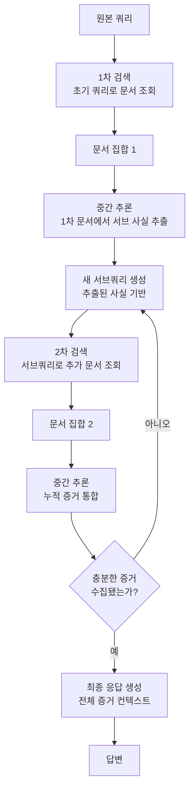

# 멀티홉 검색 (Multi-Hop Retrieval)

멀티홉 검색(Multi-Hop Retrieval)은 **하나의 질문에 답하기 위해 여러 문서를 단계적으로 거쳐 증거를 수집**하는 RAG 기법이다. "A의 CEO가 설립한 회사의 현재 직원 수는?"처럼 단일 검색으로는 해결할 수 없고, 여러 문서 사이를 '홉(hop)'하며 정보를 연결해야 하는 복합 질의에 적합하다.

## 왜 멀티홉이 필요한가

표준 [[rag-pipeline]]은 원본 쿼리로 한 번만 검색하고 그 결과를 LLM에 전달한다. 이 접근은 다음 유형의 질문에 실패한다.

- **브리지 질문**: 중간 엔티티를 통해 두 사실을 연결해야 하는 질문
- **비교 질문**: 서로 다른 소스에서 각각 검색해야 하는 비교 분석
- **집계 질문**: 여러 문서에서 데이터를 종합해야 하는 집계

HotpotQA, 2WikiMultiHopQA 같은 벤치마크는 이런 복합 추론 능력을 측정하기 위해 설계됐다.

## 핵심 메커니즘

멀티홉 검색의 핵심은 **이전 검색 결과를 새 쿼리 생성에 활용**하는 반복 루프다.



각 홉에서 LLM은 (1) 현재까지 수집된 증거, (2) 아직 답하지 못한 부분, (3) 다음 검색에 필요한 서브쿼리를 동시에 추론한다.

## 주요 구현 패턴

**IRCoT (Interleaved Retrieval Chain-of-Thought)**
Chain-of-Thought 추론과 검색을 교차 실행한다. 추론 단계마다 새 사실이 필요하면 즉시 검색을 트리거한다.

```
추론 1: "A의 CEO는 B다."
    → 검색: "B가 설립한 회사"
추론 2: "B가 설립한 회사는 C다."
    → 검색: "C의 직원 수"
추론 3: "C의 직원 수는 5000명이다."
    → 최종 답변
```

**ReAct (Reason + Act)**
LLM이 Thought / Action / Observation 사이클로 검색과 추론을 번갈아 수행한다. [[agentic-rag]]의 기반 패턴이기도 하다.

**Step-Back Prompting**
구체적인 질문에서 한 단계 물러나 추상적 상위 질문을 먼저 검색한 뒤, 그 배경 지식을 바탕으로 원래 질문에 답한다.

## 종료 조건 설계

무한 루프를 방지하기 위한 종료 조건이 필수적이다.

| 조건 | 설명 |
|------|------|
| 최대 홉 수 | 미리 정한 상한(예: 5홉) 도달 시 종료 |
| 충분성 판단 | LLM이 "답변에 필요한 정보가 충분하다"고 판단 시 종료 |
| 신규 정보 없음 | 연속 두 홉에서 새 증거가 없으면 종료 |
| 신뢰도 임계값 | 특정 신뢰도 이상의 답변 후보 생성 시 종료 |

## 성능 고려사항

홉이 늘어날수록 레이턴시가 선형 이상으로 증가한다. 프로덕션 환경에서는 다음을 고려해야 한다.

- **병렬 검색**: 독립적인 서브쿼리는 동시에 실행
- **캐싱**: 동일 서브쿼리가 반복될 경우를 위한 결과 캐시
- **조기 종료**: 충분한 신뢰도 조건을 엄격히 설정

[[agentic-rag]]와의 차이점은, 멀티홉 검색은 검색 경로가 비교적 선형적이고 목표가 명확한 반면, 에이전틱 RAG는 더 열린 탐색과 도구 사용이 포함된다는 점이다.

## 관련 문서
- [[contextual-compression-retrieval]] -- 컨텍스트 압축 검색 (Contextual Compression Retrieval)

- [[agentic-rag]] - 멀티홉을 포함한 더 넓은 에이전틱 검색 패러다임
- [[rag-pipeline]] - 멀티홉이 확장하는 기본 RAG 구조
- [[query-transformation]] - 멀티홉 각 단계에서 서브쿼리를 생성하는 변환 기법
- [[adaptive-rag]] - 쿼리 복잡도에 따라 멀티홉 여부를 동적으로 결정
- [[query-routing]] - 멀티홉 경로로 쿼리를 라우팅하는 상위 조율 기법
