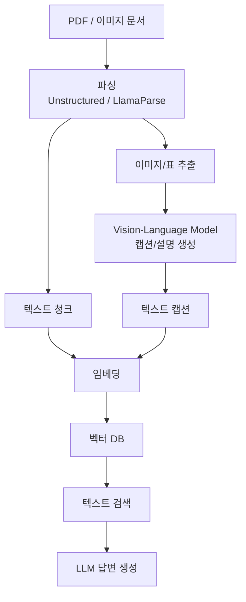
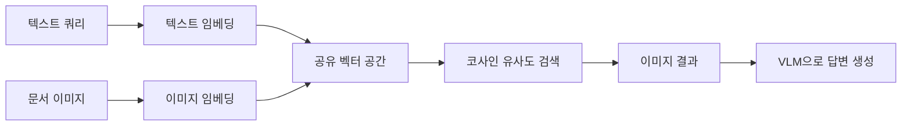
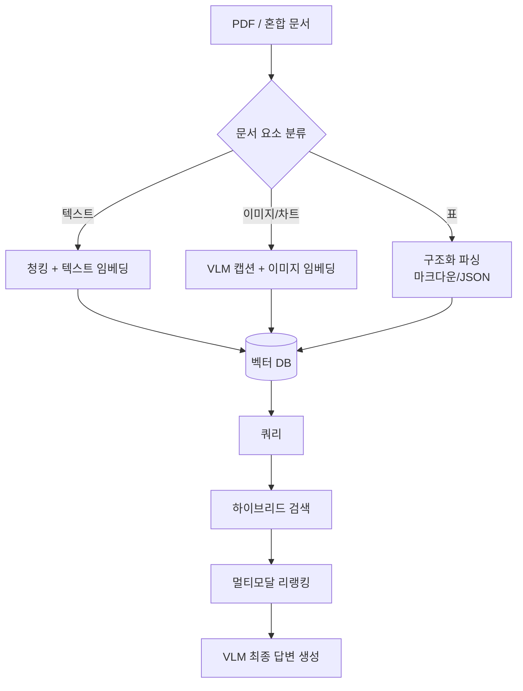

# 멀티모달 RAG (Multimodal RAG)

## 개요

멀티모달 RAG(Multimodal RAG)는 텍스트뿐 아니라 이미지, 표, 차트, PDF 스캔 문서 등 다양한 형식의 정보를 검색하고 활용하는 RAG 시스템이다. 기업 문서의 상당 부분이 비텍스트 요소를 포함하므로 멀티모달 처리는 실용적 필수 요건이 되고 있다.

## 핵심 도전

표준 텍스트 RAG는 이미지/표를 처리할 수 없다:

- PDF 내 차트: 의미 있는 숫자가 이미지로 저장
- 스캔 문서: 텍스트 레이어 없음
- 복잡한 표: 마크다운으로 완벽 변환 어려움
- 다이어그램: 관계 정보가 시각적으로만 존재

## 접근 방식 1: 이미지 캡션 기반

이미지를 텍스트로 변환 후 표준 텍스트 RAG에 편입.



- 장점: 기존 텍스트 파이프라인과 완전 호환
- 단점: 캡션 품질에 의존, 세밀한 시각 정보 손실 가능
- VLM 사용: GPT-4o, Claude 3.5, LLaVA 등

## 접근 방식 2: 네이티브 멀티모달 임베딩

이미지를 텍스트 변환 없이 직접 임베딩. 동일한 벡터 공간에서 이미지와 텍스트 검색.



- CLIP, OpenCLIP: 텍스트-이미지 공유 임베딩
- 이미지 검색 후 VLM이 이미지를 직접 읽어 답변

## 표/차트 처리

### OCR 방식

표를 이미지로 추출 → OCR → 텍스트로 변환 → 임베딩.

- 한계: 복잡한 병합 셀, 레이아웃 정보 손실

### Vision 모델 직접 방식

표 이미지를 VLM에 직접 전달하여 해석.

```
표 이미지 → "이 표에서 2024년 3분기 매출은 얼마인가?"
→ GPT-4o가 이미지를 보고 직접 답변
```

### 구조화 파싱

LlamaParse, Unstructured 등의 전용 파서로 표를 마크다운/JSON으로 변환.

- 품질: 파서 품질에 크게 의존
- `LlamaParse`: PDF 표 파싱에 특화된 유료 API

## ColPali: 비전 리트리버

Faysse et al. (2024). PDF 페이지 전체를 이미지로 처리하여 검색하는 비전 리트리버.

```mermaid
flowchart LR
    PDF_PAGE[PDF 페이지 이미지] --> VENC[Vision Encoder\nPaliGemma]
    VENC --> TOK_EMB[패치(patch)별 임베딩\n1024개 벡터]
    Q[쿼리] --> QENC[텍스트 인코더]
    QENC --> Q_EMB[쿼리 임베딩]
    Q_EMB -->|MaxSim\nColBERT 스타일| TOK_EMB
    TOK_EMB --> SCORE[관련도 점수]
```

- PDF 페이지를 이미지 패치(patch)들의 임베딩으로 표현
- ColBERT의 MaxSim 연산 적용
- OCR/파싱 완전히 우회 가능
- 레이아웃, 색상, 차트 등 시각 정보 자연스럽게 포함

## 멀티모달 리랭킹

1차 검색 후 VLM이 관련도를 재평가.

```
1. 텍스트/이미지 임베딩으로 후보 20개 검색
2. 각 후보 이미지 + 쿼리를 VLM에 입력
3. VLM: "이 이미지가 쿼리에 얼마나 관련있나? 1-5점"
4. 점수 기반 최종 상위 5개 선택
```

## 실전 파이프라인 설계



## 도구 및 라이브러리

| 도구 | 역할 |
|------|------|
| Unstructured | PDF/문서 파싱, 요소 추출 |
| LlamaParse | 고품질 PDF 표/수식 파싱 |
| ColPali | 비전 기반 PDF 검색 |
| GPT-4o / Claude 3.5 | 이미지 캡션, 답변 생성 |
| CLIP / OpenCLIP | 이미지-텍스트 공유 임베딩 |

## 관련 문서

- [[rag-indexing-pipeline]] - 전체 인덱싱 파이프라인에서 멀티모달 통합
- [[colbert-late-interaction]] - ColPali의 기반이 되는 MaxSim 연산
- [[chunking-strategies]] - 멀티모달 문서의 청킹 전략
- [[embedding-models-for-rag]] - 멀티모달 임베딩 모델
