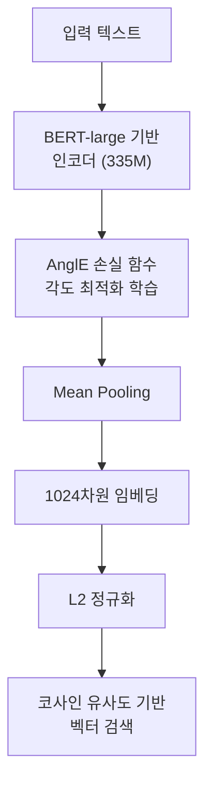

# mxbai-embed-large - mixedbread.ai 임베딩 모델

## 개요

**mxbai-embed-large-v1**은 독일의 AI 스타트업 mixedbread.ai가 개발한 고성능 텍스트 임베딩 모델이다. 출시 시점(2024년 초)에 [[mteb]] 리더보드에서 OpenAI `text-embedding-3-large`를 포함한 여러 상업 모델을 능가하며 주목받았다. **AnglE(Angle-optimized Text Embeddings)** 학습 기법을 사용해 코사인 유사도 최적화 문제를 해결한 점이 핵심 차별점이다.



위 다이어그램은 mxbai-embed-large의 학습 및 추론 파이프라인을 보여준다. AnglE 손실 함수가 임베딩 품질의 핵심이다.

---

## 핵심 사양

| 항목 | 값 |
|------|-----|
| 모델 파라미터 | 335M |
| 임베딩 차원 | 1,024 |
| 최대 시퀀스 길이 | 512 토큰 |
| 라이선스 | Apache 2.0 |
| 기반 아키텍처 | BERT-large 계열 |
| 학습 기법 | AnglE (Angle-optimized Text Embeddings) |
| 지원 언어 | 주로 영어 |

---

## AnglE 학습 기법

### 기존 방식의 문제

대부분의 임베딩 모델은 **코사인 유사도**를 직접 최적화하는 방식으로 학습한다. 그러나 코사인 유사도는 포화 영역(saturation zone) 문제가 있다 - 두 벡터가 매우 유사하거나 매우 다를 때 기울기가 작아져 학습이 느려진다.

### AnglE의 해결책

AnglE는 **각도(angle)** 기반 손실 함수를 사용해 이 문제를 해결한다:

$$\mathcal{L}_{AnglE} = \mathbb{E}\left[\sin^2(\theta_{pos}) + \cos^2(\theta_{neg})\right]$$

여기서:
- $\theta_{pos}$: 긍정 쌍(positive pair) 벡터 간의 각도 (작을수록 좋음)
- $\theta_{neg}$: 부정 쌍(negative pair) 벡터 간의 각도 (클수록 좋음)

각도 공간에서 최적화하면 포화 영역 문제가 줄어들어 더 균등하게 분리된 임베딩 공간이 형성된다.

```python
# AnglE 학습 방식의 개념적 예시
# 실제 구현은 angle-emb 라이브러리 참조
from angle_emb import AnglE

angle = AnglE.from_pretrained(
    "mixedbread-ai/mxbai-embed-large-v1",
    pooling_strategy="cls"  # v1은 CLS 풀링 사용
)

embeddings = angle.encode(["임베딩 예시 텍스트"])
```

---

## 주요 특징

### 1. MTEB 리더보드 성능

mxbai-embed-large-v1은 출시 시점에 MTEB 전체 평균에서 상위권을 기록했다:
- 분류(Classification), 클러스터링(Clustering), 쌍별 분류(Pair Classification) 태스크에서 강점
- OpenAI `text-embedding-3-large` 대비 경쟁력 있는 성능
- 335M 파라미터 대비 비교적 높은 효율성

### 2. 1024차원 고품질 표현

768차원을 사용하는 많은 BERT 계열 모델과 달리 **1024차원**을 사용해 더 풍부한 의미 표현이 가능하다. 단, 저장 공간과 계산 비용이 증가한다.

### 3. CLS 풀링 사용 (v1)

mxbai-embed-large-v1은 [[mean-vs-cls-pooling]]에서 **CLS 토큰 풀링**을 사용한다. 이는 AnglE 학습과 함께 최적화되었으며, 단순히 평균을 내는 것보다 태스크별로 더 집중된 표현을 생성한다.

---

## 실무 활용

### Sentence Transformers로 사용

```python
from sentence_transformers import SentenceTransformer

model = SentenceTransformer("mixedbread-ai/mxbai-embed-large-v1")

# 검색용 쿼리와 문서 인코딩
query = "머신러닝 임베딩 모델 비교"
documents = [
    "mxbai-embed-large는 AnglE 기법을 사용한다",
    "BERT는 사전학습 언어 모델이다"
]

query_embedding = model.encode(query)
doc_embeddings = model.encode(documents)
```

### Ollama 로컬 실행

```bash
ollama pull mxbai-embed-large
```

```python
import ollama

response = ollama.embeddings(
    model="mxbai-embed-large",
    prompt="검색 쿼리 텍스트"
)
```

### 선택 기준

mxbai-embed-large가 적합한 경우:
- 높은 임베딩 품질이 필요한 영어 중심 RAG 파이프라인
- MTEB 벤치마크 상위 성능이 요구되는 프로덕션 환경
- 로컬 실행 가능한 오픈소스 대안이 필요할 때
- 512토큰 이하 문서 처리가 주 use case일 때

주의사항:
- 512토큰 제한 - 긴 문서는 청킹 필요 (vs. Nomic Embed의 8K)
- 1024차원은 768차원 모델 대비 저장 공간 33% 증가
- 주로 영어 최적화 (다국어 지원 제한적)

---

## 모델 버전 비교

| 버전 | 특징 |
|------|------|
| mxbai-embed-large-v1 | 최초 공개, CLS 풀링, MTEB 상위권 |
| mxbai-embed-2d-large-v1 | 2D 임베딩 실험 버전 |

mixedbread.ai는 이후 더 작은 크기의 모델과 다국어 모델도 출시했다.

---

## 왜 중요한가

mxbai-embed-large는 **작은 팀이 상업 거대 기업과 경쟁할 수 있음을 보여준 사례**다. AnglE라는 학술 연구를 제품화해 MTEB 리더보드 상위에 오른 것은 임베딩 연구의 실용성을 잘 보여준다. 특히 오픈소스이면서 상업 모델과 경쟁하는 성능을 가진 선택지로서, [[embedding-models-for-rag]] 선택 시 중요한 후보 중 하나다.

---

## 관련 문서

- [[embedding-models-for-rag]] - 임베딩 모델 전체 비교
- [[mteb]] - 임베딩 벤치마크 기준
- [[mean-vs-cls-pooling]] - CLS vs Mean 풀링 전략
- [[token-pooling-strategies]] - 다양한 풀링 전략 비교
- [[nomic-embed-text]] - 오픈소스 경쟁 모델 (8K 컨텍스트)
- [[bge-m3-embedding]] - BAAI의 다기능 임베딩 모델
- [[dense-retrieval]] - 밀집 검색 기반 RAG
- [[embedding-finetuning]] - 도메인 특화 파인튜닝
