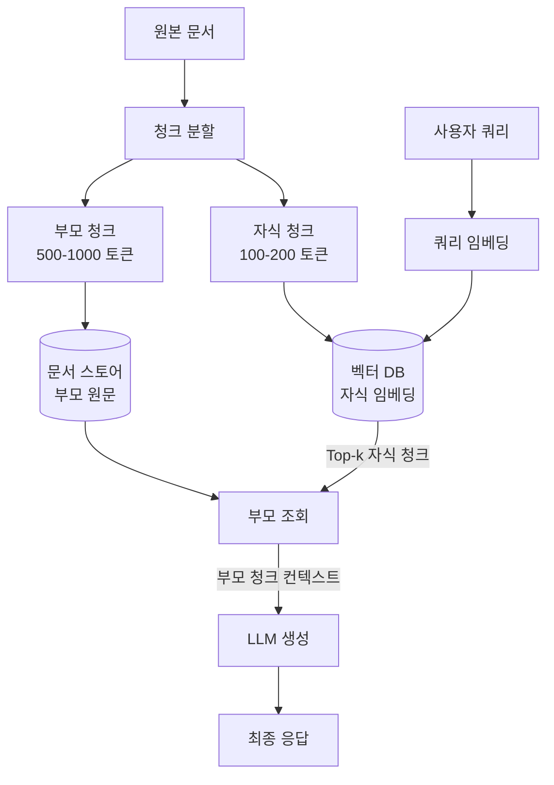

# 부모 문서 검색 (Parent Document Retrieval)

부모 문서 검색(Parent Document Retrieval)은 **검색은 작은 청크(child chunk)로, 응답 생성은 큰 청크(parent chunk)로 분리**하는 RAG 기법이다. 작은 단위로 쪼갠 텍스트는 의미적 유사도 검색 정밀도를 높여주지만, LLM에 너무 좁은 컨텍스트만 전달하면 답변 품질이 떨어지는 트레이드오프를 해소하기 위해 고안됐다.

## 핵심 아이디어

[[chunking-strategies]]는 청크를 크게 쪼갤수록 검색 노이즈가 증가하고, 작게 쪼갤수록 컨텍스트가 빈약해지는 딜레마를 내포한다. 부모 문서 검색은 이 두 목표를 **인덱싱과 검색 단계를 분리**함으로써 동시에 달성한다.

- **인덱싱**: 원본 문서를 작은 자식 청크(예: 100-200 토큰)로 분할하고 벡터 DB에 임베딩
- **검색**: 쿼리와 유사도가 높은 자식 청크를 상위 k개 선별
- **확장**: 선별된 자식 청크의 부모(전체 단락 또는 원본 문서)를 스토어에서 조회
- **생성**: LLM에는 부모 청크를 컨텍스트로 전달

이 접근 방식을 "Small-to-Big Retrieval"이라고도 부른다.

## 파이프라인 구조

자식 청크와 부모 청크 사이의 연결은 일반적으로 청크 ID 또는 문서 ID를 메타데이터로 관리한다.

## 계층 변형: 멀티레벨 부모

단순 2단계(자식-부모)에서 나아가, **3단계 계층** 구조도 가능하다.

| 레벨 | 크기 (예시) | 용도 |
|------|------------|------|
| 문장 청크 | 50-100 토큰 | 벡터 검색 (정밀도 최대화) |
| 단락 청크 | 300-500 토큰 | 1차 부모 - 중간 컨텍스트 |
| 섹션 청크 | 1000-2000 토큰 | 2차 부모 - 폭넓은 배경 |

검색 히트된 문장 청크를 기반으로 먼저 단락을 가져오고, 필요 시 섹션 전체까지 확장하는 방식이다. 이 설계는 [[rag-pipeline]] 내에서 컨텍스트 윈도우를 효율적으로 활용하게 해준다.

## 구현 시 고려사항

**부모-자식 매핑 유지**
자식 청크 메타데이터에 `parent_id` 또는 `doc_id`를 저장해 조회 경로를 명확히 해야 한다. LangChain의 `ParentDocumentRetriever`가 대표 구현체다.

**중복 부모 제거**
동일 문서에서 여러 자식 청크가 검색되면 같은 부모가 여러 번 추가될 수 있다. 중복을 제거하지 않으면 컨텍스트 윈도우를 낭비한다. 일반적으로 `set`이나 딕셔너리로 고유 부모만 유지한다.

**부모 크기 조율**
부모 청크가 너무 크면 관련 없는 텍스트가 많이 섞여 오히려 LLM 응답 품질이 저하된다. 문서 특성에 따라 300-1000 토큰 범위에서 실험적으로 결정한다.

**청크 오버랩**
자식 청크에 오버랩(overlap)을 두면 경계에서 문맥이 잘리는 문제를 완화할 수 있다. 단, 오버랩이 크면 중복 검색 결과가 늘어난다.

## 표준 RAG와 비교

| 항목 | 표준 RAG | 부모 문서 검색 |
|------|---------|---------------|
| 검색 단위 | 동일 청크 | 작은 자식 청크 |
| LLM 입력 단위 | 동일 청크 | 큰 부모 청크 |
| 검색 정밀도 | 중간 | 높음 |
| 컨텍스트 풍부도 | 청크 크기에 종속 | 부모 크기로 별도 조율 가능 |
| 저장소 복잡도 | 단순 | 벡터 DB + 문서 스토어 이중 관리 |

## 한계

- 부모 청크가 컨텍스트 윈도우 한도에 근접하면 여러 부모를 동시에 활용하기 어렵다.
- 자식-부모 매핑 로직이 추가되어 파이프라인 복잡도가 올라간다.
- 문서가 구조적으로 일관되지 않으면(예: 단락 경계 불명확) 부모 분할이 어렵다.

## 관련 문서

- [[chunking-strategies]] - 자식/부모 청크 분할 전략 전반
- [[rag-pipeline]] - 전체 RAG 파이프라인에서 검색 단계 위치
- [[raptor-tree-retrieval]] - 계층적 요약 트리를 이용한 유사 접근법
- [[contextual-retrieval]] - 청크에 문서 컨텍스트를 덧붙여 임베딩하는 보완 기법
