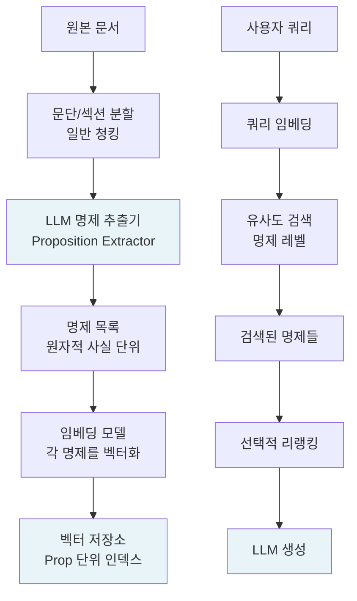

# 명제 기반 인덱싱 (Proposition Indexing)

## 개요

명제 기반 인덱싱(Proposition Indexing)은 문서를 단락이나 문장 단위로 분할하는 전통적인 [[chunking-strategies]] 대신, **하나의 원자적 사실(atomic fact)을 담는 최소 단위 명제(proposition)로 분해**하여 인덱싱하는 RAG 검색 기법이다. 2023년 Chen et al.이 제안한 Dense-X Retrieval 논문에서 처음 체계화되었다.

일반 청킹은 "관련 문서 덩어리를 가져온다"는 전략이지만, 명제 인덱싱은 "정확히 필요한 사실 하나를 가져온다"는 전략이다. 쿼리와 검색 대상의 의미적 입도(granularity)를 일치시키는 것이 핵심 아이디어다.

## 명제(Proposition)의 정의

명제는 다음 세 가지 조건을 모두 만족하는 텍스트 단위다:

1. **독립성(Self-containedness)**: 문서 맥락 없이도 단독으로 이해 가능
2. **원자성(Atomicity)**: 하나의 사실만 담고, 더 이상 분해할 수 없음
3. **최소성(Minimality)**: 그 사실을 표현하는 데 필요한 최소한의 언어로 구성

예를 들어 "Claude는 Anthropic이 2021년에 설립한 후 개발한 LLM이다"라는 문장은 두 개의 명제로 분해된다: (1) "Anthropic은 2021년에 설립되었다", (2) "Claude는 Anthropic이 개발한 LLM이다".

## 파이프라인 구조

위 흐름에서 핵심은 **LLM 명제 추출기**다. 이 단계에서 GPT-4 또는 전용 파인튜닝 모델이 각 문단을 입력받아 복수의 명제 문장으로 변환한다.

## 일반 청킹 대비 장단점

### 장점

- **정밀도 향상**: 쿼리가 요구하는 사실 단위와 검색 단위가 일치하므로 노이즈가 줄어든다
- **컨텍스트 절약**: LLM에게 전달되는 텍스트가 쿼리와 직접 관련된 명제만 포함되어 토큰 효율이 높다
- **다중 출처 합성 용이**: 서로 다른 문서의 명제들을 한 컨텍스트에 조합하기 쉽다
- **중복 억제**: 같은 사실이 여러 문서에 등장해도 명제 레벨에서 중복을 감지할 수 있다

### 단점

- **추출 비용**: LLM 호출로 명제를 생성하므로 인덱싱 단계의 비용과 시간이 크게 증가한다
- **추출 오류 전파**: LLM이 명제를 잘못 추출하거나 맥락을 잃으면 검색 품질이 저하된다
- **맥락 단절 위험**: 지나치게 원자화하면 명제 자체가 의미를 잃는 경우가 생긴다 (예: "그것은 2023년에 발표되었다" - '그것'이 무엇인지 불명확)
- **스케일 문제**: 명제 수가 청크 수보다 훨씬 많아져 벡터 스토어 크기가 급증한다

## 독립성 보장 기법

명제의 독립성(self-containedness)을 확보하기 위해 추출 시 다음 규칙을 적용한다:

- **대명사 해소**: "그는 -> 에릭 슈미트는", "이 기술은 -> 트랜스포머 어텐션은"
- **암묵적 주어 복원**: 생략된 주어를 명시적으로 포함
- **시간/공간 맥락 내재화**: "2023년 3월 발표된 [제품명]은 ..."

이 과정을 **명제 규범화(proposition normalization)**라고 부르며, 추출 프롬프트의 품질이 전체 파이프라인 성능을 결정한다.

## 하이브리드 적용 패턴

실무에서는 명제 인덱싱만 단독으로 쓰기보다 **상위 청크 + 하위 명제** 이중 인덱스를 구성하는 경우가 많다:

1. 전통적 청크 임베딩으로 후보 문단을 1차 검색 (리콜 확보)
2. 해당 문단에서 추출된 명제로 2차 정밀 검색 (정밀도 확보)
3. 최종적으로 명제 + 원본 문단 맥락을 함께 LLM에 제공

이 패턴은 [[rag-pipeline]]의 Two-Stage Retrieval 구조와 자연스럽게 결합된다.

## 평가 지표

명제 인덱싱 도입 효과는 다음 지표로 측정한다:

| 지표 | 설명 | 기대 방향 |
|------|------|-----------|
| Precision@K | 검색된 K개 중 관련 항목 비율 | 상승 |
| Context Token 수 | 생성 단계에 전달되는 평균 토큰 | 하락 |
| Faithfulness | 생성 답변이 검색 내용에 충실한 비율 | 상승 |
| Indexing Cost | 명제 추출 API 비용 | 상승 (trade-off) |

## 관련 문서
- [[hypothetical-questions-indexing]] -- 가상 질문 인덱싱 (Hypothetical Questions Indexing)

- [[chunking-strategies]] - 전통적 청킹 기법과의 비교 기준
- [[rag-pipeline]] - 명제 인덱싱이 통합되는 전체 RAG 파이프라인
- [[dense-retrieval]] - 명제 임베딩에 활용되는 밀집 검색 기법
- [[reranker-cross-encoder]] - 명제 검색 후 리랭킹으로 정밀도 추가 향상
