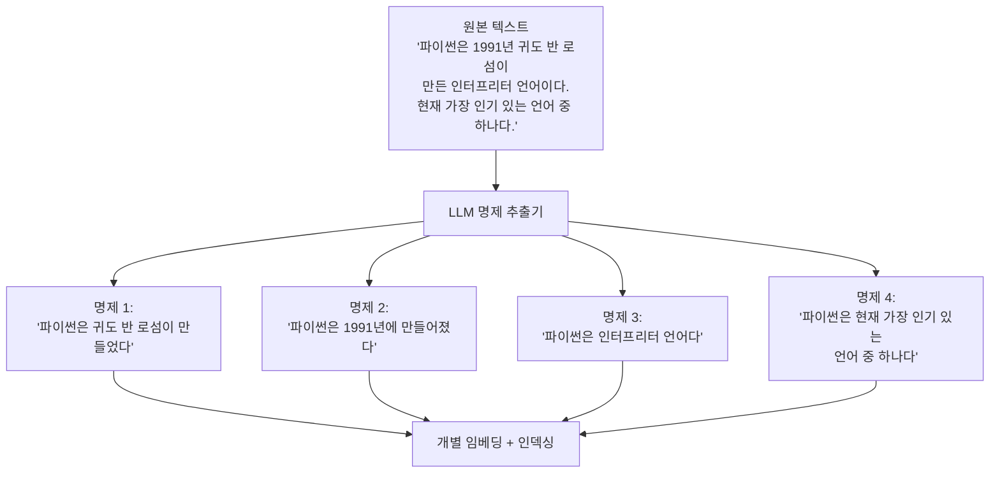

# 명제 단위 청킹

## 정의

명제 단위 청킹(propositional chunking)은 텍스트를 단어나 문장 기준이 아닌 **자기 완결적인 사실(proposition) 단위**로 분할하는 청킹 전략이다. 각 청크는 하나의 원자적(atomic) 주장이나 사실을 담으며, 해당 청크만 읽어도 완전한 의미를 파악할 수 있어야 한다.

LLM을 활용해 원본 텍스트에서 명제를 추출하는 방식이며, RAPTOR (Recursive Abstractive Processing for Tree-Organized Retrieval) 논문과 proposition indexing 연구에서 핵심 기법으로 소개되었다.



위 다이어그램은 하나의 단락에서 4개의 자기 완결적 명제를 LLM이 추출하는 과정을 나타낸다.

---

## 왜 명제 단위인가

### 전통적 청킹의 한계

단락이나 고정 길이로 청킹하면 하나의 청크 안에 여러 사실이 섞인다:

```
청크: "파이썬은 1991년 귀도 반 로섬이 만든 인터프리터 언어다.
       현재 웹 개발, 데이터 과학, AI/ML 분야에서 널리 쓰인다.
       GIL(전역 인터프리터 잠금)로 인해 멀티스레딩에 제약이 있다."
```

이 청크를 "파이썬의 GIL 문제"로 검색하면, 관련 없는 창시자/연도 정보까지 함께 검색된다. 임베딩이 여러 사실의 평균이 되어 **검색 정밀도**가 낮아진다.

### 명제 단위의 이점

각 청크 = 하나의 사실 -> 임베딩이 해당 사실을 정확하게 표현 -> 검색 쿼리와 의미적으로 더 잘 매칭된다.

---

## 구현

### LLM 기반 명제 추출

```python
from openai import OpenAI
import json

client = OpenAI()

PROPOSITION_EXTRACTION_PROMPT = """다음 텍스트에서 자기 완결적인 사실(명제)들을 추출하세요.

규칙:
1. 각 명제는 단독으로 읽어도 완전한 의미를 가져야 합니다
2. 대명사(이것, 그것, 그)를 구체적인 이름/용어로 바꾸세요
3. 하나의 명제 = 하나의 사실 (여러 사실을 한 문장에 묶지 마세요)
4. 원문에 없는 내용을 추가하지 마세요
5. JSON 배열로 반환하세요

텍스트:
{text}

출력 (JSON 배열):"""


def extract_propositions(text: str) -> list[str]:
    """텍스트에서 원자적 명제 목록을 추출."""
    response = client.chat.completions.create(
        model="gpt-4o-mini",
        messages=[
            {
                "role": "user",
                "content": PROPOSITION_EXTRACTION_PROMPT.format(text=text),
            }
        ],
        response_format={"type": "json_object"},
        temperature=0,
    )

    result = json.loads(response.choices[0].message.content)
    # 모델에 따라 반환 형식이 다를 수 있음 - 키 이름 유연하게 처리
    if isinstance(result, list):
        return result
    for key in ("propositions", "facts", "statements", "items"):
        if key in result:
            return result[key]
    return list(result.values())[0] if result else []
```

### 배치 처리 파이프라인

```python
from typing import Iterator
import time

def propositional_chunking_pipeline(
    documents: list[str],
    batch_size: int = 10,
    delay_seconds: float = 0.5,
) -> list[dict]:
    """대량 문서에 대한 명제 추출 파이프라인."""
    all_propositions = []

    for i in range(0, len(documents), batch_size):
        batch = documents[i:i + batch_size]

        for doc_idx, doc in enumerate(batch):
            try:
                propositions = extract_propositions(doc)
                for prop_idx, prop in enumerate(propositions):
                    all_propositions.append({
                        "proposition": prop,
                        "source_document_idx": i + doc_idx,
                        "proposition_idx": prop_idx,
                        "source_text": doc[:200],  # 원본 참조용
                    })
            except Exception as e:
                # 실패 시 원본 문서를 단일 청크로 폴백
                all_propositions.append({
                    "proposition": doc,
                    "source_document_idx": i + doc_idx,
                    "proposition_idx": 0,
                    "source_text": doc[:200],
                    "fallback": True,
                })

        if i + batch_size < len(documents):
            time.sleep(delay_seconds)  # API 속도 제한 준수

    return all_propositions
```

### 검색 시 원본 컨텍스트 연결

명제는 매우 짧아 검색 후 LLM에 전달할 때 맥락이 부족할 수 있다. 원본 청크 또는 문단을 함께 저장해 조회 시 병합하는 패턴:

```python
from dataclasses import dataclass

@dataclass
class PropositionChunk:
    proposition: str         # 검색 대상 (짧고 정밀)
    source_passage: str      # LLM에 전달할 원본 맥락 (길고 풍부)
    metadata: dict


def build_proposition_index(documents: list[str]) -> list[PropositionChunk]:
    """명제 인덱스 구축: 검색용(명제) + 생성용(원본) 분리."""
    chunks = []
    for doc in documents:
        propositions = extract_propositions(doc)
        for prop in propositions:
            chunks.append(PropositionChunk(
                proposition=prop,
                source_passage=doc,  # 검색 히트 시 원본 전달
                metadata={"length": len(prop)},
            ))
    return chunks
```

---

## 품질 검증

추출된 명제의 품질을 자동으로 검증하는 방법:

```python
VERIFICATION_PROMPT = """다음 명제가 원본 텍스트에서 올바르게 추출되었는지 검증하세요.

원본 텍스트: {source}
명제: {proposition}

검증 기준:
1. 원본에 포함된 정보인가? (Yes/No)
2. 자기 완결적인가? (Yes/No)
3. 원본에 없는 정보가 추가되었는가? (Yes/No)

JSON으로 응답: {{"in_source": bool, "self_contained": bool, "hallucinated": bool}}"""


def verify_proposition(source: str, proposition: str) -> dict:
    response = client.chat.completions.create(
        model="gpt-4o-mini",
        messages=[{
            "role": "user",
            "content": VERIFICATION_PROMPT.format(
                source=source, proposition=proposition
            ),
        }],
        response_format={"type": "json_object"},
        temperature=0,
    )
    return json.loads(response.choices[0].message.content)
```

---

## 장단점

### 장점

- **최고 수준의 검색 정밀도**: 청크 하나 = 사실 하나 -> 쿼리와 정확히 매칭
- **환각 감소**: 생성 단계에서 구체적인 사실 기반의 컨텍스트 제공
- **교차 참조 가능**: 동일 사실이 여러 문서에 표현된 경우 통합 가능
- **질문-답변 태스크에 탁월**: 특정 사실을 묻는 QA에 최적

### 단점

- **높은 비용**: 모든 문서를 LLM으로 처리 -> API 비용 및 처리 시간 급증
- **환각 위험**: 추출 LLM이 원본에 없는 명제를 생성할 수 있음 (검증 필요)
- **짧은 청크**: 명제 하나만으로는 맥락이 부족 -> 원본 문단을 병행 저장해야 함
- **구조 손실**: 텍스트의 서사적 흐름이나 논증 구조가 분해됨
- **인덱스 크기**: 하나의 단락에서 수십 개의 명제가 생성 -> 인덱스 크기 폭발

### 비용-품질 분석

| 전략 | 청킹 비용 | 검색 품질 | 인덱스 크기 |
|------|----------|----------|------------|
| 고정 길이 | 매우 낮음 | 낮음 | 기준 |
| 재귀 분할 | 낮음 | 중간 | 비슷 |
| 의미적 청킹 | 중간 | 높음 | 약간 증가 |
| **명제 단위** | **높음** | **매우 높음** | **2-5배** |
| 에이전트 청킹 | 매우 높음 | 최고 | 3-10배 |

---

## RAPTOR와의 연관

RAPTOR(Recursive Abstractive Processing for Tree-Organized Retrieval)는 명제 단위 청킹과 함께 **계층적 요약 트리**를 구축한다:

1. 원본 텍스트 -> 명제 추출
2. 명제들을 의미적으로 클러스터링
3. 각 클러스터를 LLM이 요약 -> 상위 레벨 청크
4. 요약들을 다시 클러스터링 -> 더 상위 레벨
5. 모든 레벨의 청크를 함께 인덱싱

```python
# RAPTOR 스타일 계층적 명제 인덱싱
propositions = extract_propositions(document)  # 1단계
clusters = cluster_propositions(propositions)   # 2단계 (RAPTOR)
summaries = [summarize_cluster(c) for c in clusters]  # 3단계
```

---

## 실무 권장 사항

### 언제 명제 단위 청킹을 선택하는가

- 정확한 사실 검색이 필수인 도메인 (의료, 법률, 금융)
- QA 데이터셋 구축 및 평가
- 인덱싱 비용보다 검색 품질이 중요한 경우
- 문서 수가 적고 품질이 최우선인 경우 (수천 건 이하)

### 하이브리드 접근

```python
def hybrid_propositional_chunking(
    documents: list[str],
    use_propositions_for: list[str] = ["QA", "factual"],
    use_semantic_for: list[str] = ["narrative", "summary"],
) -> list[str]:
    """문서 유형에 따라 청킹 전략을 선택."""
    chunks = []
    for doc in documents:
        doc_type = classify_document_type(doc)  # 별도 분류기
        if doc_type in use_propositions_for:
            chunks.extend(extract_propositions(doc))
        else:
            chunks.extend(semantic_chunking(doc))
    return chunks
```

---

## 관련 문서

- [[proposition-indexing]] - 명제 인덱싱 전략 심화
- [[chunking-strategies]] - 전체 청킹 전략 비교
- [[agentic-chunking]] - 에이전트가 청크 경계를 직접 결정하는 고급 방식
- [[raptor-tree-retrieval]] - 명제 기반 계층적 RAG
- [[semantic-chunking-strategies]] - 임베딩 유사도 기반 청킹
- [[hypothetical-questions-indexing]] - 명제와 유사한 질문 기반 인덱싱
- [[contextual-retrieval]] - Anthropic의 컨텍스트 강화 청킹
- [[rag-pipeline]] - RAG 전체 파이프라인에서의 위치
