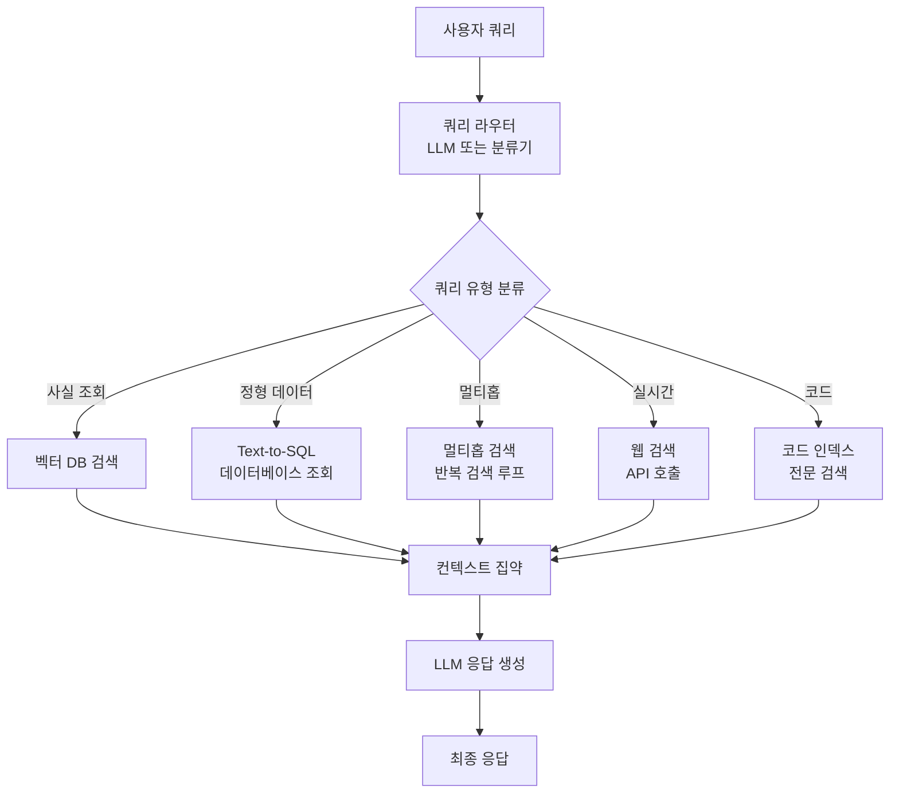
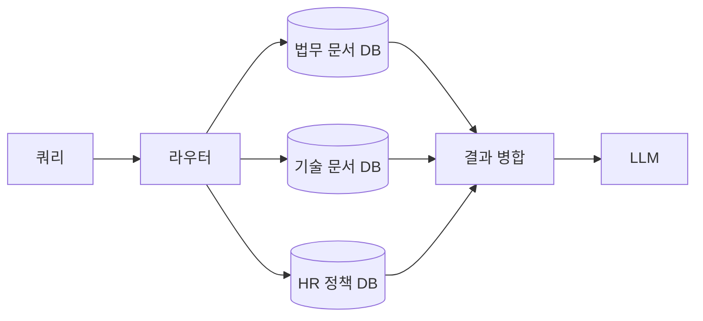

# 쿼리 라우팅 (Query Routing)

쿼리 라우팅(Query Routing)은 **사용자 쿼리의 유형, 의도, 복잡도를 분석하여 가장 적합한 검색 전략이나 데이터 소스로 연결하는 RAG 오케스트레이션 기법**이다. 단일 벡터 DB와 동일한 파이프라인으로 모든 쿼리를 처리하는 단순 구조를 탈피해, 쿼리 특성에 맞는 최적 경로를 동적으로 선택한다.

## 라우팅이 필요한 이유

실제 프로덕션 환경에서 쿼리는 극도로 다양하다.

- "Python에서 리스트 정렬하는 방법?" - 코드 검색
- "지난달 매출 현황은?" - SQL 기반 정형 데이터 조회
- "경쟁사 A와 B의 가격 차이를 비교해줘" - 멀티홉 검색 필요
- "오늘 날씨는?" - 실시간 웹 검색

이 모든 쿼리를 하나의 파이프라인으로 처리하면 레이턴시, 비용, 품질 모두 비최적이 된다. [[rag-pipeline]] 상위에서 라우터를 두어 각 쿼리를 맞춤 경로로 보내는 것이 쿼리 라우팅의 핵심이다.

## 라우팅 차원

쿼리는 세 가지 주요 축에서 분류된다.

**1. 유형(Type) - 무엇을 원하는가**

| 유형 | 특징 | 적합한 경로 |
|------|------|------------|
| 사실 조회 | 단일 정답 존재 | 벡터 검색 + 단일 청크 |
| 비교/분석 | 여러 소스 종합 | 멀티 검색 경로 |
| 생성/요약 | 넓은 컨텍스트 필요 | RAG + 긴 컨텍스트 |
| 코드 | 구조화된 형식 | 코드 특화 인덱스 |
| 수치 집계 | 정형 데이터 | SQL/데이터베이스 |

**2. 의도(Intent) - 어떤 목적인가**

정보 탐색(informational), 탐색 탐색(navigational), 트랜잭션(transactional) 등으로 분류한다. 의도 감지는 소형 분류 모델 또는 LLM 프롬프트로 수행한다.

**3. 복잡도(Complexity) - 얼마나 어려운가**

단일 홉으로 해결 가능한지, 멀티홉 추론이 필요한지에 따라 [[adaptive-rag]] 복잡도 분류와 연동된다.

## 라우팅 파이프라인



라우터 자체가 단일 목적지만 선택하는 게 아니라 **복수 경로를 병렬로 활성화**할 수도 있다. 예를 들어 "경쟁사 A와 B의 최근 가격 차이"는 내부 벡터 DB와 웹 검색을 동시에 수행한다.

## 라우터 구현 방식

**규칙 기반 라우터**
쿼리에 특정 키워드가 포함되면 경로를 결정하는 단순 방식. 레이턴시가 낮고 예측 가능하지만 커버리지가 좁다.

**LLM 프롬프트 라우터**
LLM에 쿼리와 라우팅 옵션을 제공하고 JSON으로 경로를 반환받는다. 유연하지만 추가 LLM 호출 비용이 발생한다.

```python
# 프롬프트 기반 라우팅 예시 (의사코드)
route = llm.invoke(
    f"다음 쿼리를 분류하라. 옵션: {route_options}\n쿼리: {query}\n출력: JSON"
)
```

**파인튜닝된 분류기**
소형 BERT 계열 모델을 라우팅 레이블로 파인튜닝. 프로덕션에서 레이턴시와 비용을 낮추는 데 적합하다.

**의미 유사도 라우팅**
각 경로의 대표 쿼리 임베딩을 미리 저장하고, 새 쿼리와의 코사인 유사도로 최근접 경로를 선택한다. 훈련 데이터 없이 구성 가능하다.

## 멀티 소스 라우팅

대규모 기업 환경에서는 여러 벡터 DB나 지식베이스 중 어디를 조회할지도 라우팅의 대상이 된다.



이때 각 DB의 메타데이터 스키마와 도메인 설명을 라우터에 제공하는 것이 중요하다.

## [[adaptive-rag]]와의 관계

[[adaptive-rag]]가 주로 복잡도 기준으로 검색 횟수를 결정한다면, 쿼리 라우팅은 그보다 넓은 개념으로 **어떤 검색 전략과 데이터 소스를 사용할지**를 결정한다. 두 개념은 상호 보완적이며 함께 사용될 때 시너지를 낸다.

## 한계 및 주의사항

- 라우터 자체의 오분류가 전체 파이프라인 품질에 큰 영향을 준다.
- 라우팅 경로가 많아질수록 테스트 매트릭스가 기하급수적으로 늘어난다.
- 실시간 라우팅 결정이 레이턴시를 추가하므로, 캐싱이나 소형 분류기를 통해 오버헤드를 최소화해야 한다.

## 관련 문서

- [[rag-pipeline]] - 라우팅이 위치하는 전체 RAG 파이프라인 구조
- [[adaptive-rag]] - 복잡도 기반 검색 전략 선택
- [[multi-hop-retrieval]] - 복잡한 쿼리에 적용되는 라우팅 대상 경로
- [[query-transformation]] - 라우팅 전 쿼리를 변환하여 분류 정확도를 높이는 기법
