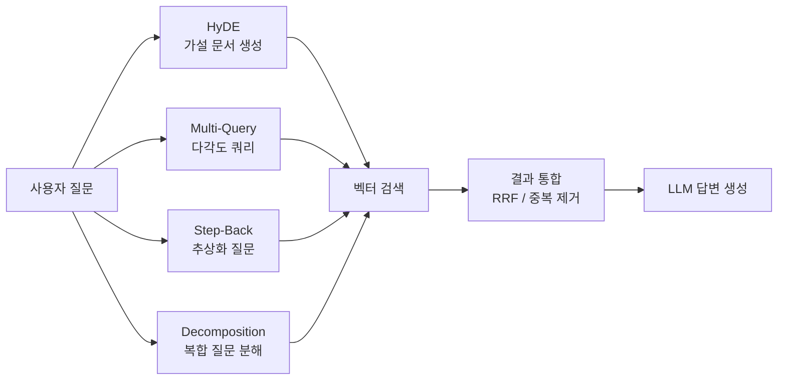

# 쿼리 변환과 확장 (Query Transformation)

## 개요

쿼리 변환(Query Transformation)은 사용자의 원래 질문을 그대로 검색에 사용하는 대신, LLM을 이용해 쿼리를 변형/확장하여 검색 품질을 높이는 기법이다. 검색 단계의 "인풋 최적화"로, 청킹이나 임베딩 개선과 독립적으로 적용 가능하다.

## 주요 기법



## HyDE (Hypothetical Document Embedding)

Gao et al. (2022). 쿼리로 직접 검색하는 대신, LLM이 쿼리에 대한 "가상의 답변 문서"를 생성하고 그 문서의 임베딩으로 검색한다.

```
1. 쿼리: "파이썬에서 GIL을 우회하는 방법은?"
2. LLM이 가상 문서 생성:
   "파이썬의 GIL(Global Interpreter Lock)을 우회하는 주요 방법으로는
    multiprocessing 모듈을 사용하거나, C 확장으로 구현하거나..."
3. 가상 문서의 임베딩으로 벡터 DB 검색
4. 검색된 실제 문서들로 최종 답변 생성
```

**왜 효과적인가?**
- 실제 문서 텍스트 스타일(document-side)로 검색 → 임베딩 공간에서 실제 답변 문서와 더 가까움
- 짧은 쿼리의 저품질 임베딩 문제 해소

**주의**: 가상 문서 생성 오류가 검색을 잘못 이끌 수 있음.

## Multi-Query (다각도 쿼리 생성)

LLM이 원래 질문을 여러 다른 표현으로 변환하고, 각각으로 검색한 결과를 합산.

```
원래 질문: "LLM 파인튜닝 비용을 줄이는 방법은?"

생성된 쿼리들:
1. "LLM fine-tuning cost optimization techniques"
2. "Parameter-efficient fine-tuning PEFT methods"
3. "LoRA QLoRA 학습 비용 비교"
4. "소규모 예산으로 언어 모델 학습하는 방법"
```

- 각 쿼리로 독립 검색 후 RRF로 결과 통합
- 한 표현으로 놓친 관련 문서를 다른 표현으로 커버
- 검색 횟수 = 생성 쿼리 수 만큼 증가 (비용 증가)

## Step-Back Prompting (추상화 질문)

Zheng et al. (2023). 구체적인 질문을 더 일반적인(abstract) 질문으로 변환하여 더 넓은 맥락을 검색.

```
구체적 질문: "2024년 3분기 Apple iPhone 출하량은?"
Step-Back 질문: "Apple의 iPhone 판매 트렌드와 분기별 실적은 어떻게 되나?"

→ 더 넓은 문서를 검색하여 맥락 풍부화
→ 최종 답변 생성 시 구체 + 일반 맥락 모두 활용
```

적합한 상황: 매우 구체적인 사실 질문, 배경 지식이 필요한 전문 도메인.

## Query Decomposition (복합 질문 분해)

복잡한 질문을 독립적으로 답변 가능한 하위 질문으로 분해.

```
복합 질문: "GPT-4와 Claude 3의 차이점과 각각 어떤 상황에 사용해야 하나?"

분해된 하위 질문:
1. "GPT-4의 주요 특성과 강점은?"
2. "Claude 3의 주요 특성과 강점은?"
3. "GPT-4와 Claude 3의 성능 비교 벤치마크는?"
4. "각 모델의 사용 사례와 비용 차이는?"

→ 각 하위 질문 독립 검색
→ 하위 답변들을 종합하여 최종 답변 생성
```

**Sequential Decomposition**: 이전 답변을 다음 질문에 활용 (Chain-of-Thought 검색).

## 기법 비교 및 적용 시나리오

| 기법 | 핵심 아이디어 | 추가 LLM 호출 | 적합한 상황 |
|------|-------------|-------------|-----------|
| HyDE | 가상 답변 문서로 검색 | 1회 | 쿼리 임베딩이 약한 경우 |
| Multi-Query | 다양한 표현으로 검색 | 1회 | 쿼리 표현 다양성 부족 |
| Step-Back | 추상화된 질문으로 검색 | 1회 | 배경 맥락이 필요한 경우 |
| Decomposition | 하위 질문으로 분해 | 1+N회 | 복합/다단계 질문 |

## 구현 예시 (LangChain)

```python
from langchain.retrievers.multi_query import MultiQueryRetriever
from langchain_openai import ChatOpenAI

llm = ChatOpenAI(temperature=0)
retriever = MultiQueryRetriever.from_llm(
    retriever=vectorstore.as_retriever(),
    llm=llm,
)
docs = retriever.invoke("LLM 파인튜닝 방법은?")
```

## 실무 권장

- **기본**: Multi-Query (구현 간단, 안정적 품질 향상)
- **키워드 매칭 약한 경우**: HyDE 추가
- **복잡한 쿼리**: Decomposition
- **지식 집약적 QA**: Step-Back 병행

비용 vs 품질: 모든 기법을 조합하면 LLM 호출이 많아지므로, 실제 요구사항에 맞게 선택적으로 적용.

## 관련 문서

- [[rag-evaluation-metrics]] - 쿼리 변환 효과 측정
- [[hybrid-search-rrf]] - 변환된 쿼리들의 결과 통합
- [[agentic-rag]] - 쿼리 재작성을 에이전트 루프로 반복
- [[contextual-retrieval]] - 문서 측 맥락 강화와 결합
