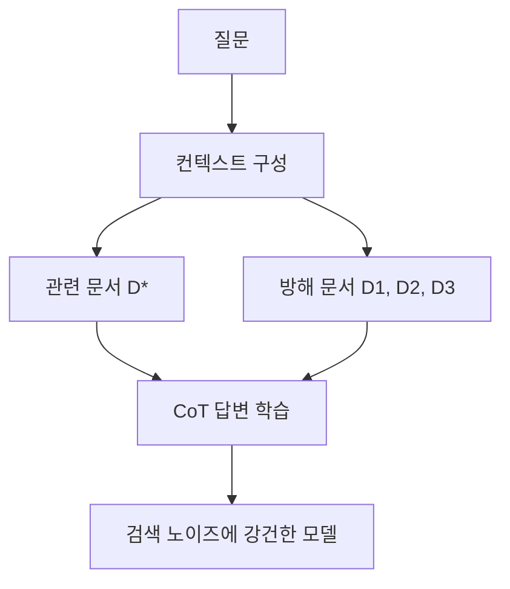

# RAFT (Retrieval Augmented Fine-Tuning)

Zhang et al. (2024)이 제안한 RAG 환경 특화 파인튜닝 기법. 검색된 문서 중 **관련 문서(oracle)**와 **방해 문서(distractor)**를 함께 제공하여 모델이 노이즈가 섞인 컨텍스트에서 올바른 정보를 추출하는 능력을 학습한다.

## 핵심 아이디어

기존 RAG는 검색 결과를 그대로 LLM에 전달하지만, 검색된 문서가 항상 관련 있지는 않다. RAFT는 학습 시 의도적으로 방해 문서를 섞어 모델이 **선별적 독해 능력**을 갖추게 한다.

## 학습 데이터 구성

- **P%** 확률: oracle 문서 + distractor 문서들 -> CoT 답변 (인용 포함)
- **(1-P)%** 확률: distractor 문서들만 -> 모델의 내재 지식으로 답변

이 혼합이 핵심: 모델이 "검색 결과가 유용할 때는 활용하고, 아닐 때는 자체 지식에 의존"하는 판단력을 학습.

## 도메인 RAG에서의 가치

의료, 법률, 금융 등 도메인 특화 RAG에서 RAFT 파인튜닝 후 도메인 QA 정확도가 20-30% 향상된 사례가 보고됨. [[domain-adaptation|도메인 적응]]의 RAG 버전.

## 관련 문서

- [[rag-pipeline]] -- RAG 파이프라인
- [[supervised-fine-tuning]] -- SFT
- [[domain-adaptation]] -- 도메인 적응
- [[rag-hallucination-reduction]] -- RAG 환각 감소
