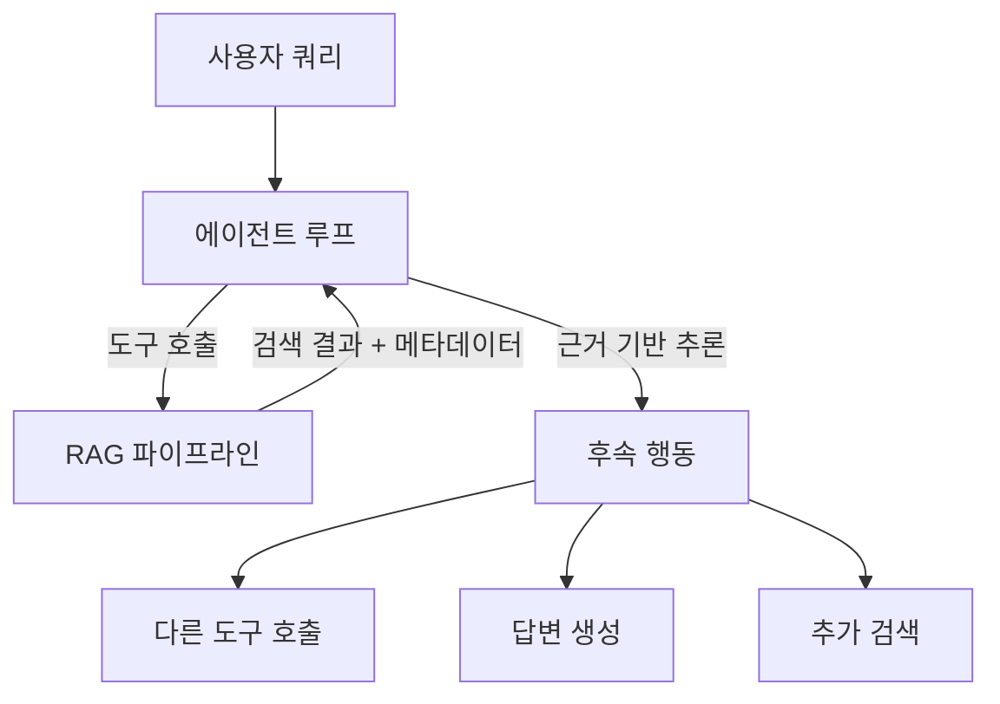

# RAG-에이전트 핸드오프

검색 파이프라인과 에이전트 루프를 통합하여, 검색 결과를 에이전트가 후속 행동의 **근거(evidence)**로 활용하는 아키텍처 패턴. [[agentic-rag|에이전틱 RAG]]의 구현 레벨 설계.

## 통합 패턴

## RAG-as-Tool vs RAG-as-Pipeline

| 측면 | RAG-as-Pipeline | RAG-as-Tool |
|------|----------------|-------------|
| 제어 | 고정 파이프라인 | 에이전트가 동적 결정 |
| 검색 시점 | 항상 | 필요할 때만 |
| 쿼리 변형 | 사전 정의 | 에이전트가 자율 변형 |
| 멀티홉 | 별도 구현 필요 | 에이전트 루프로 자연스럽게 |

## 실전 구현

LangGraph, CrewAI 등에서 RAG를 에이전트의 **도구(tool)**로 등록하고, 에이전트가 검색 필요성을 판단해 호출한다. 검색 결과에 소스/신뢰도 메타데이터를 포함시켜 [[grounding-attribution|그라운딩]]에 활용.

## 관련 문서

- [[agentic-rag]] -- 에이전틱 RAG
- [[rag-pipeline]] -- RAG 파이프라인
- [[tool-use-patterns]] -- 도구 사용 패턴
- [[grounding-attribution]] -- 그라운딩과 출처 귀속
