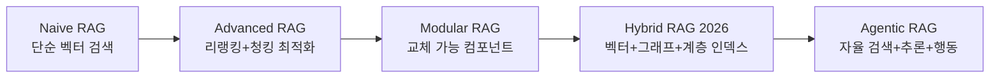

# RAG 아키텍처 진화 (2026)

단순 검색-생성 파이프라인에서 하이브리드(벡터+지식그래프+계층 인덱스) 엔터프라이즈 표준으로 진화한 2026년 RAG 아키텍처의 전체 지형.

## 개요

2026년의 RAG는 초기의 "검색기-생성기" 단순 파이프라인에서 정교한 엔터프라이즈 인텔리전스 아키텍처로 진화했다. LazyGraphRAG의 인덱싱 비용 0.1% 절감(full GraphRAG 대비 700배 저렴한 글로벌 쿼리), 하이브리드 검색의 표준화, 멀티모달 RAG 확장, 에이전트 RAG 패턴의 등장이 이 진화의 핵심 축이다. 이 페이지는 [[graphrag-in-production|GraphRAG / LightRAG / LazyGraphRAG]]를 넘어서 RAG 아키텍처 전반의 진화를 다룬다.

## 핵심 개념

### 하이브리드 검색: 프로덕션 기본선

2026년 하이브리드 RAG는 대부분의 엔터프라이즈에서 **프로덕션 기본선(production baseline)** 으로 자리잡았다. 전통적 시맨틱 검색만으로는 더 이상 충분하지 않으며, 벡터 검색과 어휘(lexical)/BM25 키워드 매칭을 병렬 실행한 뒤 결과를 병합하고 리랭킹하는 구조가 표준이다:

- **BM25 키워드 매칭**: 정확한 용어 일치가 필요한 경우 (규제 문서, 기술 용어)
- **밀집 시맨틱 벡터**: 의미적 유사도 기반 검색 (Pinecone, Azure AI Search 등)
- **메타데이터 필터링**: 구조화된 속성 기반 사전 필터링
- **컨텍스트 인식 리랭킹**: 트랜스포머 기반 크로스 인코더, 레이트 인터랙션 모델, 딥 퓨전 방식으로 검색 결과 재순위화

하이브리드 RAG는 일반적으로 4-8주 내 구현 가능하며, 정확한 용어 매칭과 시맨틱 검색을 동시에 제공하여 재현율(recall)과 정밀도(precision)를 모두 향상시킨다.

### 벡터 + 지식 그래프 통합

벡터 검색과 구조화된 택소노미/온톨로지를 결합한 [[graphrag-in-production|GraphRAG]] 계열은 LLM 기반 엔티티 추출, 지식 그래프 구축 엔진, 커뮤니티 탐지 알고리즘을 활용하여 관계 해석을 통해 결정론적 정확도 99%까지 달성했다. 이 하이브리드 접근은 multi-hop 질의와 글로벌 QA에서 특히 강점을 보이지만, 높은 인덱싱 비용과 유지보수 복잡성이 트레이드오프이다. 구현에 3-6개월이 소요되며, 법률 리서치, 제약 R&D, 규정 준수 감사, M&A 분석에 주로 적용된다.

### 에이전틱 RAG

수동 검색에서 자율 추론으로의 패러다임 전환이다. 에이전틱 RAG는 ReAct 또는 [[test-time-compute-scaling|Chain-of-Thought]] 프롬프팅을 구현하며, 태스크 분해, 도구 호출, 메모리 시스템, 반복적 정제 기능을 갖춘다. 오케스트레이터가 복잡한 요청을 단계별로 분해하고, 에이전트가 여러 시스템을 질의하여 결과를 종합한다. 다만 대부분의 엔터프라이즈 검색 유스케이스는 하이브리드 RAG로 충분하며, 에이전틱 RAG는 복잡한 멀티스텝 워크플로우에서 도구 오케스트레이션이나 크로스시스템 추론이 필요한 경우에만 권장된다. 구현에 3-9개월이 소요되고, 아이덴티티 관리, 도구 커넥터, 옵저버빌리티 프레임워크가 필수이다.

### 멀티모달 RAG

텍스트를 넘어 PDF의 이미지, 스캔 문서, 다이어그램, 대시보드, 비디오까지 처리하는 멀티모달 RAG가 확산되고 있다. 이미지, 오디오, 표형, 비디오 임베딩을 통합하여 전체론적(holistic) 추론을 수행한다.

## 기술 상세

### 8대 RAG 아키텍처 유형 (2026)

2026년 기준 엔터프라이즈에서 활용되는 주요 RAG 아키텍처는 다음과 같이 분류된다:

| 유형 | 핵심 메커니즘 | 지연 시간 | 복잡도 | 프로덕션 준비도 |
|------|------------|---------|-------|--------------|
| **Naive RAG** | 순수 벡터 임베딩 + 코사인 유사도 | 낮음 | 낮음 | 높음 |
| **Hybrid RAG** | 벡터 + BM25 병렬 검색 + 리랭킹 | 중간 | 중간 | 매우 높음 |
| **Graph RAG** | 지식 그래프 + 엔티티 추출 + 커뮤니티 탐지 | 중-고 | 높음 | 중간 |
| **Contextual RAG** | 섹션 헤더/위치 컨텍스트 보존 임베딩 | 중간 | 중간 | 높음 |
| **Adaptive RAG** | 쿼리 복잡도 기반 동적 라우팅 | 가변 | 중간 | 중간 |
| **Agentic RAG** | 자율 추론 + 도구 호출 + 메모리 | 가변 | 매우 높음 | 초기 |
| **Self-RAG** | 검색/생성 품질 자기 평가 + 반복 교정 | 높음 | 높음 | 초기 |
| **Modular RAG** | 교체 가능 독립 빌딩 블록 오케스트레이션 | 가변 | 높음 | 중간 |

### RAG 아키텍처 진화 단계

### 엔터프라이즈 아키텍처 선택 기준

2026년 핵심 질문은 "어떤 RAG 아키텍처가 우리 기업의 워크로드, 거버넌스 모델, 리스크 허용도에 맞는가"이다. 파운데이션 모델이 상품화(commoditize)됨에 따라, 차별화 요소는 데이터 오케스트레이션과 검색 전략으로 이동했다. 선택 시 고려할 5대 차원:

- **쿼리 복잡도**: 단순 FAQ vs. multi-hop 추론 vs. 멀티시스템 조율
- **거버넌스 민감도**: RBAC, 감사 로깅, PII 마스킹 요구 수준
- **비용 제약**: 인덱싱/추론 비용, 벤더 락인 회피
- **시스템 통합**: 기존 데이터 소스, API, 워크플로우와의 연동
- **확장성 전망**: 문서 규모, 사용자 수, 권한 체계의 성장 방향

### 고급 검색 기법

| 기법 | 용도 | 특징 |
|------|------|------|
| 크로스 인코더 리랭킹 | 정밀도 향상 | 쿼리-문서 쌍 직접 비교 |
| 레이트 인터랙션 모델 | 효율+품질 균형 | ColBERT 계열 |
| 적응적 청킹 | 문서 구조 보존 | 의미 단위 기반 분할 |
| 쿼리 재작성 | 검색 재현율 향상 | LLM 기반 쿼리 확장/재구성 |
| 계층 인덱스 | 글로벌+로컬 검색 | 요약-상세 다층 구조 |
| Self-RAG 반복 교정 | [[hallucination\|환각]] 감소 | 신뢰도 점수 기반 자기 평가 |

### LazyGraphRAG 비용 혁신

LazyGraphRAG는 full GraphRAG 대비 인덱싱 비용을 0.1%로 절감하면서 글로벌 쿼리 품질을 유지한다. 이로 인해 "비용이 감당 가능한 Graph RAG" 시대가 2026년에 본격화되었다.

## 관련 문서

- [[graphrag-in-production|GraphRAG / LightRAG / LazyGraphRAG in Production]]
- [[agentic-ai-production|Agentic AI 프로덕션 배포 패턴]]
- [[context-engineering|Context Engineering]]
- [[ai-hot-topics-2026-04|2026년 4월 AI 개발 핫토픽 100선]]
