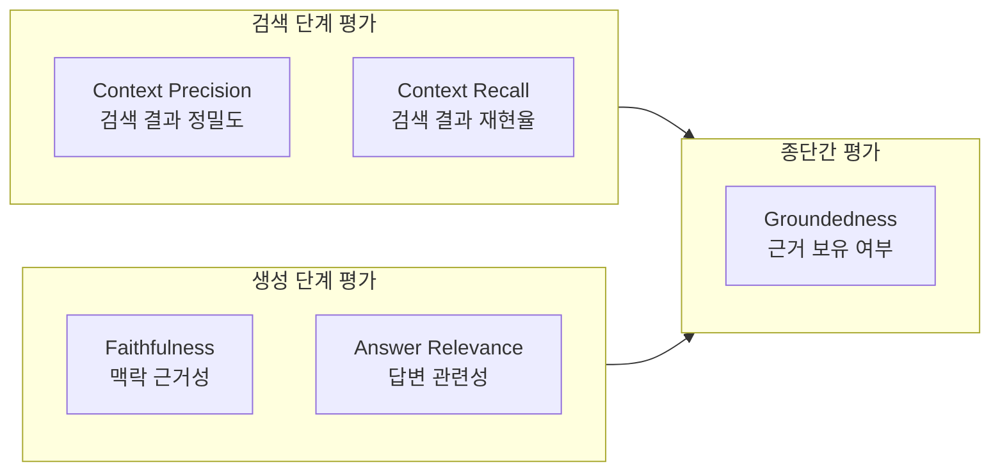
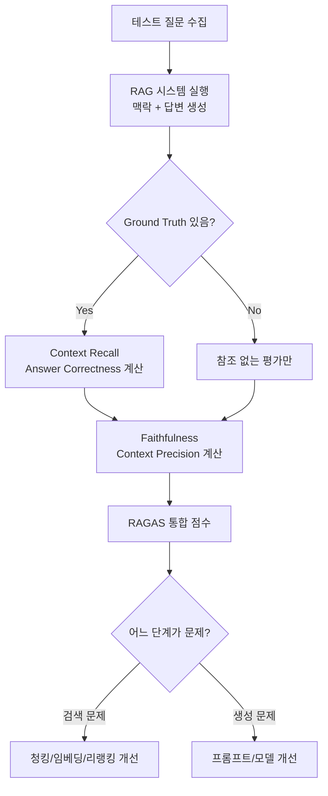

# RAG 평가 메트릭 (RAG Evaluation Metrics)

## 개요

RAG 시스템은 검색(Retrieval)과 생성(Generation) 두 단계로 구성되므로, 평가도 두 단계를 독립적으로 그리고 종합적으로 측정해야 한다. 단순한 정확도 하나로는 "검색이 나쁜가, 생성이 나쁜가"를 구분할 수 없다.

## RAG 평가 차원 체계



## 핵심 메트릭 정의

### Faithfulness (충실성 / 환각 방지)

생성된 답변의 각 클레임(claim)이 검색된 맥락(context)에 근거하는가.

$$\text{Faithfulness} = \frac{\text{맥락에 근거한 클레임 수}}{\text{전체 클레임 수}}$$

- 1.0: 모든 주장이 맥락에 있음
- 0.0: 순수 환각(hallucination)
- LLM이 판단자 역할: "이 클레임이 주어진 맥락에서 추론 가능한가?"

### Answer Relevance (답변 관련성)

생성된 답변이 원래 질문에 얼마나 관련 있는가. 맥락 근거와는 독립적.

- 높은 Faithfulness + 낮은 Answer Relevance = "맥락은 정확히 인용했지만 질문을 안 답함"
- LLM이 역방향 생성: 답변에서 질문을 역으로 생성하여 원 질문과 코사인 유사도 측정

### Context Precision (맥락 정밀도)

검색된 맥락 중 답변에 실제로 유용한 청크의 비율.

$$\text{Context Precision} = \frac{\text{유용한 청크 수}}{\text{전체 검색 청크 수}}$$

- 낮으면: 관련 없는 청크를 너무 많이 검색 (노이즈)
- Top-K 선택이나 리랭킹으로 개선 가능

### Context Recall (맥락 재현율)

정답에 필요한 정보를 검색 결과가 얼마나 포함하고 있는가. Ground Truth 필요.

$$\text{Context Recall} = \frac{\text{ground truth에서 맥락이 커버한 문장 수}}{\text{ground truth 전체 문장 수}}$$

- 낮으면: 필요한 청크를 못 찾아옴 (검색 누락)
- 청킹 전략, 임베딩 모델, Top-K 조정으로 개선

### Groundedness (근거 보유성)

답변이 검색 맥락에 의해 지지되는지를 이진 분류하는 더 단순한 지표.

- 일부 프레임워크에서 Faithfulness와 유사 개념으로 사용
- Azure AI Studio의 Groundedness: "답변이 문서에 기반하는가" Yes/No

## RAGAS 프레임워크

Shahul Es et al. (2023). 참조 데이터 없이 LLM을 판단자로 활용하는 RAG 평가 프레임워크.

```python
from ragas import evaluate
from ragas.metrics import faithfulness, answer_relevancy, context_precision, context_recall

result = evaluate(
    dataset,  # questions, answers, contexts, ground_truths
    metrics=[faithfulness, answer_relevancy, context_precision, context_recall],
)
```

- **참조 없는(Reference-free) 평가**: Ground Truth 없이 Faithfulness, Answer Relevance 계산 가능
- **참조 기반(Reference-based) 평가**: Ground Truth 필요한 Recall 계산
- LLM-as-a-judge: GPT-4, Claude 등을 판단자로 사용 (비용 발생)

## RAG 평가 파이프라인



## 지표별 개선 액션

| 낮은 지표 | 원인 | 개선 방법 |
|-----------|------|----------|
| Context Recall | 필요 청크 미검색 | 청크 크기 조정, 하이브리드 검색, Top-K 증가 |
| Context Precision | 노이즈 청크 과다 | 리랭킹 추가, Top-K 감소, 쿼리 변환 |
| Faithfulness | 환각 발생 | 프롬프트 강화("맥락에만 근거"), 온도 낮춤 |
| Answer Relevance | 질문 이탈 | 시스템 프롬프트 개선, 질문 재해석 로직 |

## 비용 절감 평가 전략

LLM 판단자 사용 비용이 높으므로:
- 소규모 골든 셋(50-100개 질문)으로 오프라인 평가
- 더 작은 판단 모델 사용 (GPT-4o-mini, Claude Haiku)
- 일부 메트릭은 규칙 기반으로 대체 (정확한 문자열 포함 여부)

## 관련 문서

- [[agentic-rag]] - 에이전틱 RAG의 평가 확장
- [[contextual-retrieval]] - 맥락 강화로 Context Recall 개선
- [[query-transformation]] - 쿼리 변환으로 검색 품질 향상
- [[reranker-cross-encoder]] - Context Precision 개선을 위한 리랭킹
