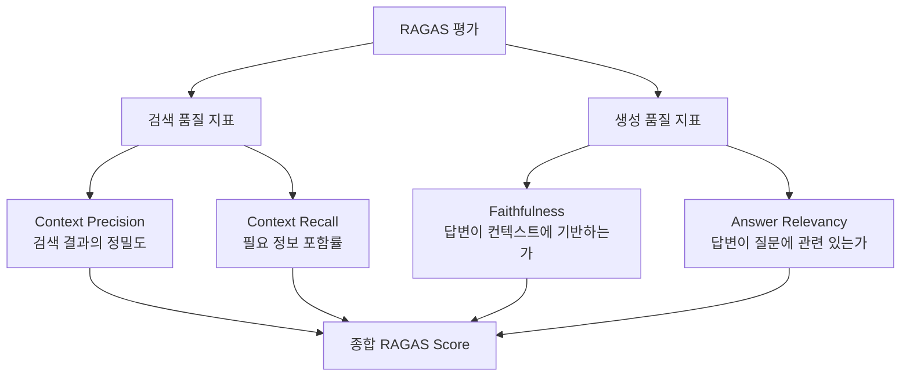
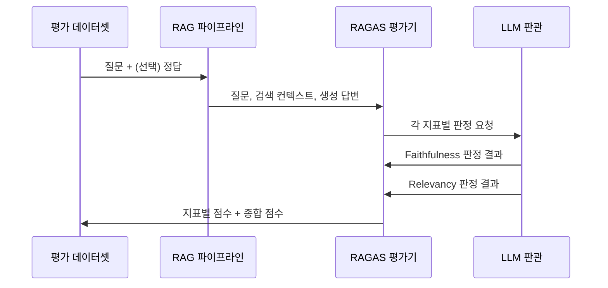

# RAG 평가 - RAGAS

RAGAS(Retrieval-Augmented Generation Assessment)는 **RAG 파이프라인을 자동으로 평가하기 위한 오픈소스 프레임워크**다. 2023년 Shahul Es et al.이 발표했으며, 인간 레이블 없이 LLM을 판관(judge)으로 사용하여 Faithfulness, Answer Relevancy, Context Precision, Context Recall 등의 지표를 자동 산출한다.

## 왜 RAG 평가가 어려운가

[[rag-pipeline]]의 품질은 검색과 생성이라는 두 구성요소가 상호작용하기 때문에, 단순히 최종 답변의 정확도만 측정하면 어느 단계에서 문제가 발생했는지 알 수 없다. 예를 들어 검색 결과는 완벽하지만 LLM이 이를 무시하고 환각을 출력할 수 있고, 반대로 LLM은 올바르게 동작하지만 검색 자체가 관련 없는 문서를 가져올 수도 있다.

RAGAS는 **검색 품질과 생성 품질을 분리해서 측정**하는 것을 핵심 설계 원칙으로 삼는다.

## 핵심 평가 지표



### Faithfulness (충실도)

생성된 답변의 각 주장(claim)이 검색된 컨텍스트 내에 근거가 있는지 측정한다.

$Faithfulness = \frac{\text{컨텍스트로 뒷받침되는 주장 수}}{\text{전체 주장 수}}$

LLM이 답변을 개별 주장으로 분해하고, 각 주장이 컨텍스트에서 추론 가능한지 다시 LLM으로 판정한다. 1에 가까울수록 환각이 적다.

### Answer Relevancy (답변 관련성)

생성된 답변이 원래 질문에 얼마나 관련 있는지 측정한다. 답변에서 역으로 가상의 질문들을 생성하고, 이 가상 질문들과 원래 질문의 임베딩 유사도를 계산한다.

$AnswerRelevancy = \frac{1}{N}\sum_{i=1}^{N} \cos(q_{gen_i}, q_{orig})$

완전히 관련 있지만 불완전한 답변은 점수가 낮아진다.

### Context Precision (컨텍스트 정밀도)

검색된 문서 중에서 실제로 정답 생성에 기여하는 문서의 비율. 관련 없는 청크를 많이 검색하면 이 지표가 낮아진다. 평균 정밀도(Average Precision) 방식으로 순위 가중치를 반영한다.

### Context Recall (컨텍스트 재현율)

정답에 필요한 정보가 검색된 컨텍스트 안에 포함된 비율. 정답(ground truth)을 개별 문장으로 분해하고, 각 문장이 컨텍스트에서 유추 가능한지 판정한다.

$ContextRecall = \frac{\text{컨텍스트로 뒷받침되는 GT 문장 수}}{\text{전체 GT 문장 수}}$

Context Recall을 측정하려면 정답(ground truth)이 필요하다는 점에서, Faithfulness·Answer Relevancy와 달리 레이블이 필요한 지표다.

## 평가 프로세스



## 레이블 필요 여부

| 지표 | 레이블 필요 | 측정 대상 |
|------|------------|----------|
| Faithfulness | 불필요 | 생성 품질 |
| Answer Relevancy | 불필요 | 생성 품질 |
| Context Precision | 필요 (정답) | 검색 품질 |
| Context Recall | 필요 (정답) | 검색 품질 |

레이블 없는 Faithfulness + Answer Relevancy 조합만으로도 빠른 반복 평가가 가능하며, 정식 벤치마크에서는 4개 지표를 모두 사용한다.

## [[evaluation-harness]]와의 관계

RAGAS는 [[evaluation-harness]] 중 RAG에 특화된 구현이다. 일반적인 LLM 평가 하니스(예: HELM, LM Evaluation Harness)는 단일 모델 성능에 초점을 맞추지만, RAGAS는 검색-생성 파이프라인 전체를 타겟으로 한다.

## 사용 예시 (Python)

```python
from ragas import evaluate
from ragas.metrics import faithfulness, answer_relevancy

result = evaluate(
    dataset=dataset,          # HuggingFace Dataset 형식
    metrics=[faithfulness, answer_relevancy],
)
print(result.to_pandas())
```

## 한계

- LLM 판관(judge)이 사용하는 모델에 따라 평가 결과가 달라진다.
- 판관 LLM 비용이 추가로 발생한다.
- 짧거나 단순한 답변에서 Answer Relevancy가 과도하게 낮게 나오는 경향이 있다.
- 한국어 등 비영어권에서 판정 품질이 영어 대비 낮을 수 있다.

## 관련 문서

- [[rag-pipeline]] - RAGAS가 평가하는 전체 RAG 파이프라인
- [[evaluation-harness]] - RAG 외 LLM 평가 체계 전반
- [[rag-hallucination-reduction]] - Faithfulness 점수를 높이기 위한 기법들
- [[rag-evaluation-metrics]] - RAGAS 외 다른 RAG 평가 지표 비교
