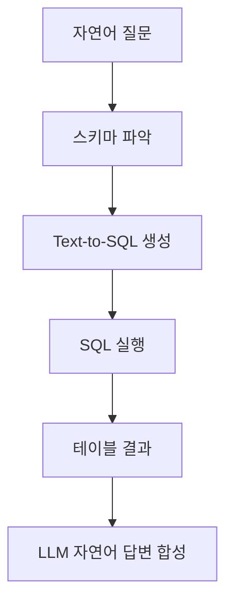

# 구조적 데이터 RAG

관계형 DB, JSON, CSV, 지식 그래프 등 정형 데이터를 자연어 질의로 접근하는 RAG 패턴. 비정형 텍스트 RAG와 달리 **스키마 이해 + 쿼리 생성**이 핵심 과제.

## 접근법

| 접근 | 원리 | 도구 |
|------|------|------|
| **Text-to-SQL** | LLM이 SQL 생성 | LlamaIndex SQL, LangChain SQL Agent |
| **테이블 직렬화** | 테이블을 마크다운/CSV로 변환 후 텍스트 RAG | [[table-rag]] |
| **그래프 쿼리** | 지식 그래프에서 서브그래프 검색 | [[knowledge-graph-rag]] |

## Text-to-SQL의 도전

- 스키마가 클 때 컨텍스트 한도 초과
- 조인, 서브쿼리 등 복잡 SQL 생성 오류
- 보안: SQL 인젝션 방지 필수

## 관련 문서

- [[table-rag]] -- 테이블 RAG
- [[knowledge-graph-rag]] -- 지식 그래프 RAG
- [[rag-pipeline]] -- RAG 파이프라인
