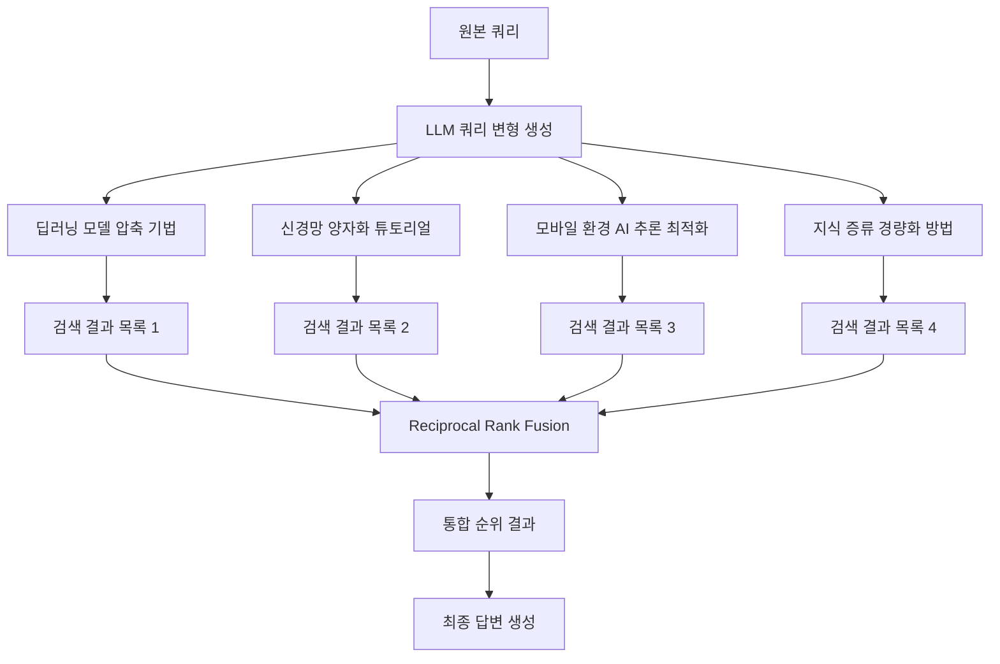
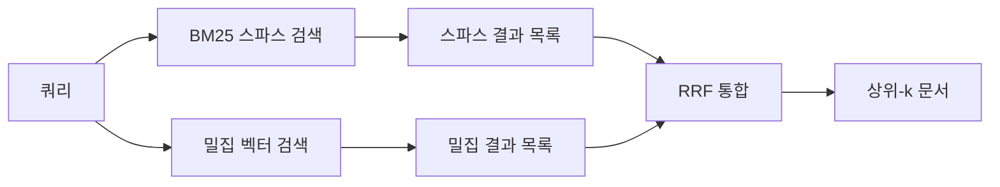

# RAG 퓨전 (RAG Fusion)

RAG 퓨전(RAG Fusion)은 단일 쿼리 대신 **LLM이 생성한 다수의 쿼리 변형**으로 독립 검색을 수행하고, 각 결과를 **역순위 퓨전(Reciprocal Rank Fusion, RRF)**으로 통합하는 RAG 기법이다. 단일 쿼리가 사용자 의도를 완전히 포착하지 못하는 문제를 다각도 관점으로 완화하며, [[rag-pipeline]]의 검색 단계에 최소한의 구조 변경으로 적용할 수 있다.

## 핵심 아이디어

사용자가 "딥러닝 모델 경량화 방법"을 묻는다고 하자. 이 단일 쿼리로는 양자화, 프루닝, 지식 증류, MobileNet 계열 아키텍처 등 다양한 관련 문서가 고르게 검색되기 어렵다. RAG 퓨전은 이 문제를 LLM의 쿼리 변형 능력으로 해결한다.



## 역순위 퓨전 (RRF) 알고리즘

RRF는 여러 순위 목록을 하나로 통합하는 알고리즘으로, 각 목록에서 문서의 **순위(rank)**만 사용하고 점수(score)는 무시한다. 이 속성 덕분에 서로 다른 스케일의 검색기(BM25, 코사인 유사도 등)를 쉽게 결합할 수 있다.

$$\text{RRF\_Score}(d) = \sum_{r \in R} \frac{1}{k + \text{rank}_r(d)}$$

- $R$: 모든 순위 목록의 집합
- $k$: 안정화 상수 (보통 60)
- $\text{rank}_r(d)$: 목록 $r$ 에서 문서 $d$의 순위 (1부터 시작)

여러 목록에서 상위권에 반복적으로 등장하는 문서일수록 RRF 점수가 높아진다. 특정 목록 하나에서만 1위인 문서보다 여러 목록에서 5위인 문서가 더 높은 점수를 받을 수 있다.

```python
from collections import defaultdict

def reciprocal_rank_fusion(
    ranked_lists: list[list[str]],
    k: int = 60
) -> list[tuple[str, float]]:
    """
    ranked_lists: 각 검색 목록, 요소는 문서 ID (순위 순서대로)
    """
    scores: dict[str, float] = defaultdict(float)
    for ranked_list in ranked_lists:
        for rank, doc_id in enumerate(ranked_list, start=1):
            scores[doc_id] += 1.0 / (k + rank)
    return sorted(scores.items(), key=lambda x: x[1], reverse=True)
```

## [[query-transformation]]과의 비교

| 항목 | RAG Fusion | HyDE | 서브쿼리 분해 |
|------|-----------|------|------------|
| 변환 방식 | 다중 쿼리 | 가상 문서 | 쿼리 분해 |
| 검색 횟수 | N배 증가 | 동일 | N배 증가 |
| 통합 방식 | RRF | 직접 검색 | 각각 검색 후 합산 |
| 복잡한 쿼리 | 중간 | 약함 | 강함 |
| 짧은 쿼리 | 강함 | 강함 | 약함 |

RAG Fusion은 [[query-transformation]] 범주에서 **병렬 확장 + 집계** 접근을 대표한다.

## 다중 검색기 결합으로 확장

RAG Fusion은 쿼리 변형 외에도 **이종 검색기** 결합에 활용된다. BM25(스파스)와 밀집 검색기(FAISS 등)에서 각각 검색한 결과를 RRF로 통합하면 하이브리드 검색보다 간단한 구현으로 유사한 효과를 얻는다.



이 패턴은 `hybrid-search-rrf.md`에서 별도로 다루며, RAG Fusion은 쿼리 다양화에, 하이브리드 검색은 검색기 다양화에 초점을 맞춘다는 점에서 구분된다.

## LangChain 구현 예시

```python
from langchain.retrievers import EnsembleRetriever
from langchain_core.output_parsers import StrOutputParser
from langchain_core.prompts import ChatPromptTemplate
from langchain_openai import ChatOpenAI

llm = ChatOpenAI(model="gpt-4o-mini")

query_gen_prompt = ChatPromptTemplate.from_template(
    "다음 질문을 다양한 관점으로 4가지 변형해라. 한 줄씩 출력.\n\n질문: {question}"
)

query_generator = query_gen_prompt | llm | StrOutputParser() | (lambda x: x.strip().split("\n"))

def rag_fusion_retrieve(question: str, retriever, k: int = 5):
    queries = query_generator.invoke({"question": question})
    queries.append(question)  # 원본 쿼리 포함

    all_results = [retriever.invoke(q) for q in queries]
    # RRF 적용
    fused = reciprocal_rank_fusion([[d.id for d in r] for r in all_results])
    top_ids = [doc_id for doc_id, _ in fused[:k]]
    return top_ids
```

## 한계와 주의사항

- **레이턴시**: 쿼리 변형 수만큼 검색이 병렬로 실행되므로 레이턴시가 증가한다. 병렬 처리를 기본으로 설계해야 한다.
- **비용**: LLM 쿼리 변형 + N배 검색 비용이 추가된다. 저비용 모델로 쿼리 변형을 수행하거나 변형 수를 2-3개로 제한하면 비용을 조정할 수 있다.
- **쿼리 변형 품질**: 생성된 쿼리가 원본과 너무 유사하면 다양성 이점이 없고, 너무 이탈하면 노이즈가 증가한다. 프롬프트 설계가 중요하다.
- **순위 목록 길이**: RRF는 각 목록에서 충분한 수의 문서(20-50개)가 있어야 안정적으로 동작한다. 목록이 너무 짧으면 RRF 점수 분산이 작아진다.

## 관련 문서

- [[rag-pipeline]] - RAG Fusion이 검색 단계에 삽입되는 전체 파이프라인
- [[query-transformation]] - 쿼리 변형 기법의 전체 범주
- [[hybrid-search-rrf]] - 검색기 이종 결합에 RRF를 적용하는 관련 기법
- [[adaptive-rag]] - RAG Fusion을 복잡 쿼리 경로에 통합하는 상위 프레임워크
