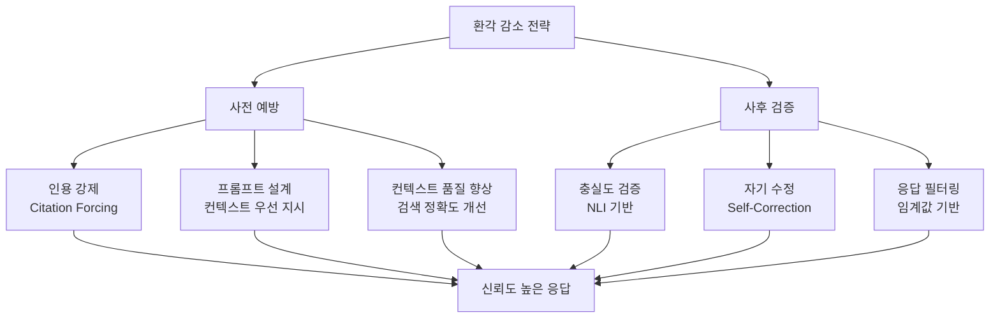
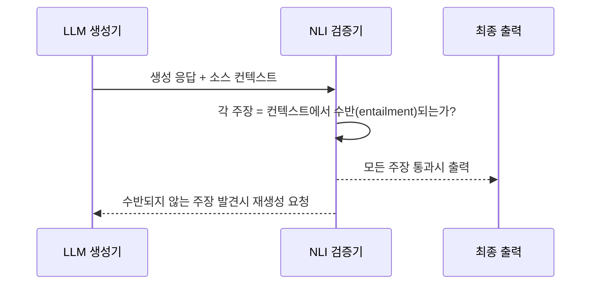

# RAG 환각 감소 기법

RAG 환각 감소(RAG Hallucination Reduction)는 **RAG 시스템에서 LLM이 검색된 컨텍스트와 무관하거나 모순되는 내용을 생성하는 현상(환각)을 억제하기 위한 기법들**의 총칭이다. RAG가 외부 지식을 제공하더라도 LLM이 그 컨텍스트를 무시하거나 내부 파라메트릭 지식을 우선시하면 환각이 발생한다.

## 환각의 유형

RAG 환각은 발생 원인에 따라 세 가지로 구분된다.

| 유형 | 설명 | 예시 |
|------|------|------|
| 컨텍스트 무시 | 검색된 근거를 활용하지 않고 파라메트릭 지식으로 생성 | 정확한 문서가 있음에도 다른 날짜를 출력 |
| 컨텍스트 왜곡 | 컨텍스트를 일부 참조하지만 사실관계를 변형 | "약 20%"를 "정확히 20%"로 단정 |
| 범위 초과 생성 | 컨텍스트에 없는 내용을 추론·보완하여 출력 | 명시되지 않은 원인을 추가로 제시 |

## 핵심 감소 기법 개요



## 1. 인용 강제 (Citation Forcing)

LLM이 각 주장마다 출처 청크를 명시하도록 강제하는 방법이다. 출처를 명시해야 하는 구조적 압박이 환각을 억제한다.

**프롬프트 설계 예시:**
```
다음 컨텍스트만을 사용하여 질문에 답하라.
각 주장에는 [출처 N] 형식으로 반드시 출처를 표기하라.
컨텍스트에 없는 내용은 "정보 없음"으로 답하라.

컨텍스트:
[1] ...
[2] ...

질문: ...
```

인용 번호를 검증하면 LLM이 존재하지 않는 번호를 만들어냈는지 쉽게 탐지할 수 있다.

## 2. 프롬프트 기반 컨텍스트 우선 지시

시스템 프롬프트에 "파라메트릭 지식보다 제공된 컨텍스트를 우선하라"는 명시적 지시를 추가한다. 단순하지만 효과적이며, 오픈소스 모델보다 지시 수행 능력이 높은 모델에서 더 잘 작동한다.

지시 강도에 따라 세 단계로 나눌 수 있다:
- 약: "가능하면 컨텍스트를 참고하라"
- 중: "반드시 컨텍스트에 기반해서만 답하라"
- 강: "컨텍스트 외 어떤 지식도 사용하지 말라. 모르면 모른다고 하라"

## 3. 충실도 검증 (Faithfulness Verification)

생성된 응답의 각 주장을 컨텍스트와 대조하여 사후에 검증한다. [[hallucination]] 감지에 주로 NLI(Natural Language Inference) 모델을 활용한다.



NLI 모델(예: DeBERTa 기반)은 입력-가설 쌍에 대해 수반(entailment), 중립(neutral), 모순(contradiction) 중 하나를 판정한다. "중립" 판정은 컨텍스트에서 지지되지 않는 주장을 의미하므로 환각 위험으로 분류한다.

## 4. 자기 수정 (Self-Correction / Self-RAG 방식)

[[grounding-attribution]] 개념을 활용해 LLM 자체가 생성 중 또는 생성 후에 컨텍스트와의 일치 여부를 판단한다.

**Self-RAG의 `[IsSup]` 토큰**: 생성된 각 문장 뒤에 "이 문장이 컨텍스트에 의해 지지되는가"를 판정하는 리플렉션 토큰을 삽입한다. 불지지(unsupported)로 판정되면 해당 문장을 버리거나 재생성한다.

**자기 비판(Self-Critique) 프롬프트**: 생성 후 별도 프롬프트로 "위 답변에서 컨텍스트로 뒷받침되지 않는 부분을 찾아라"고 요청하고, 발견된 부분을 수정한다.

## 5. 검색 품질 개선을 통한 근본 해결

환각의 상당 부분은 **관련 없는 청크가 컨텍스트에 포함**될 때 발생한다. LLM이 관련 없는 내용을 '보완'하려다 환각을 만든다.

- **재순위화(Reranking)**: [[reranking-and-cross-encoders]] 등으로 검색 결과 중 진짜 관련 있는 청크만 선별
- **컨텍스트 크기 제한**: 너무 많은 청크를 넣으면 LLM이 처리하기 어려워져 오히려 품질이 저하
- **[[corrective-rag]]**: 검색 결과의 관련도를 사전에 평가하고, 관련도가 낮으면 웹 검색으로 보완

## 지표: [[rag-evaluation-ragas]]의 Faithfulness 활용

환각 감소 기법의 효과는 RAGAS의 Faithfulness 지표로 정량 측정할 수 있다. 인용 강제 도입 전후의 Faithfulness 점수를 비교하면 기법 효과를 검증할 수 있다.

## 기법 선택 가이드

| 상황 | 권장 기법 |
|------|---------|
| 빠른 적용, 최소 개발 비용 | 프롬프트 설계 + 인용 강제 |
| 높은 신뢰도 필요 (의료, 법무) | NLI 기반 사후 검증 |
| 파이프라인 전면 개선 | 검색 품질 개선 + Corrective RAG |
| 모델 파인튜닝 가능 | Self-RAG 방식 훈련 |

## 관련 문서

- [[hallucination]] - 환각 현상의 일반적 정의와 분류
- [[grounding-attribution]] - 생성 내용을 소스에 귀속하는 기법 전반
- [[rag-evaluation-ragas]] - Faithfulness 지표로 환각 감소 효과를 정량화
- [[corrective-rag]] - 검색 결과 품질을 자동 평가하고 보완하는 RAG 변형
- [[self-rag]] - 리플렉션 토큰으로 환각을 자기 감지하는 프레임워크
