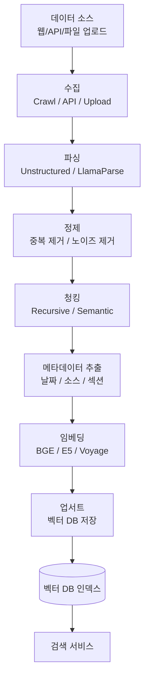
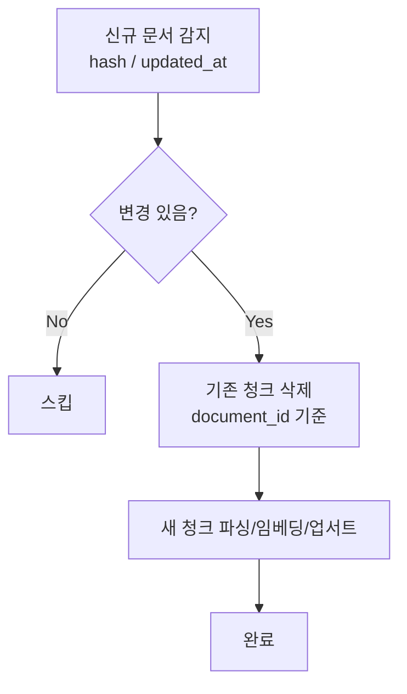

# RAG 인덱싱 파이프라인 (RAG Indexing Pipeline E2E)

## 개요

RAG 인덱싱 파이프라인은 원시 문서를 벡터 DB에 검색 가능한 형태로 저장하기까지의 전체 흐름이다. 검색 품질의 기반이 되는 단계로, 파이프라인 각 단계의 품질이 RAG 전체 성능의 천장을 결정한다.

## E2E 파이프라인 개요



## 1단계: 수집 (Ingestion)

데이터 소스 다양성에 따라 커넥터 설계가 복잡해진다.

| 소스 유형 | 방법 | 도구 |
|----------|------|------|
| 웹 페이지 | HTTP/크롤러 | Crawl4AI, Firecrawl |
| REST API | API 클라이언트 | 직접 구현 |
| 파일 업로드 | 멀티파트 업로드 | S3, GCS |
| 데이터베이스 | CDC(Change Data Capture) | Debezium |
| Notion/Confluence | OAuth API | 공식 SDK |

**증분 수집**: 전체 재인덱싱 대신 변경된 문서만 처리. 문서 해시 또는 `updated_at` 타임스탬프로 변경 감지.

## 2단계: 파싱 (Parsing)

원시 파일 포맷을 구조화된 텍스트로 변환.

### Unstructured

오픈소스 문서 파싱 라이브러리. PDF, DOCX, HTML, 이메일 등 40+ 포맷 지원.

```python
from unstructured.partition.pdf import partition_pdf

elements = partition_pdf("document.pdf", strategy="hi_res")
# Text, Title, Table, Image, ListItem 등 요소 타입 구분
```

### LlamaParse

LlamaIndex의 고품질 PDF 파싱 API (유료). 복잡한 표, 수식 처리에 강점.

```python
from llama_parse import LlamaParse

parser = LlamaParse(result_type="markdown")
documents = await parser.aload_data("complex_report.pdf")
```

### DocLing

IBM의 문서 파싱 라이브러리. 로컬 실행, 레이아웃 분석 강점.

## 3단계: 정제 (Cleaning)

- **중복 제거**: URL 정규화, 해시 기반 중복 문서 필터링
- **노이즈 제거**: 헤더/푸터, 광고, 네비게이션 메뉴, 쿠키 배너
- **최소 길이 필터**: 너무 짧은 청크(< 50 토큰) 제거
- **언어 감지**: 지원 언어 외 문서 제거 또는 분리 처리

## 4단계: 청킹 (Chunking)

파싱된 텍스트를 검색 단위로 분할. 전략은 [[chunking-strategies]] 참조.

**실전 설정 기본값:**
- Recursive Splitting: chunk_size=512, overlap=50
- 구조화 문서(Markdown): 헤더 기반 분할 우선

## 5단계: 메타데이터 추출

메타데이터는 필터링 검색(Filtered Search)과 출처 추적에 필수.

```python
metadata = {
    "source_url": "https://...",
    "document_id": "doc-12345",
    "created_at": "2024-01-15",
    "updated_at": "2024-03-20",
    "section": "Chapter 3: Methods",
    "page_number": 42,
    "document_type": "research_paper",
    "language": "ko",
}
```

**자동 메타데이터 추출**: LLM으로 각 청크의 요약, 주제, 엔티티 자동 생성.

## 6단계: 임베딩

배치 처리로 임베딩 비용 최적화.

```python
# 배치 임베딩 (API 호출 수 최소화)
chunks_text = [chunk.page_content for chunk in chunks]
embeddings = embedding_model.embed_documents(chunks_text)
# list of lists, 각 청크당 하나의 벡터
```

- 병렬 처리: `asyncio.gather()` 또는 ThreadPoolExecutor
- 캐싱: 이미 임베딩된 청크 재계산 방지

## 7단계: 업서트 (Upsert)

벡터 DB에 저장. 동일 문서 ID 존재 시 업데이트, 없으면 삽입.

```python
# Qdrant 예시
client.upsert(
    collection_name="docs",
    points=[
        PointStruct(
            id=chunk_id,
            vector=embedding,
            payload=metadata,
        )
        for chunk_id, embedding, metadata in zip(ids, embeddings, metadatas)
    ],
)
```

## 증분 업데이트 전략

전체 재인덱싱은 비용이 크므로, 변경 감지 후 증분 처리.



## 비용 최적화

| 단계 | 비용 절감 전략 |
|------|-------------|
| 파싱 | Unstructured 오픈소스 우선, LlamaParse는 복잡한 PDF만 |
| 임베딩 | 작은 배치보다 대형 배치로 처리, 캐싱 적용 |
| 벡터 DB | 양자화 활성화 (PQ/BQ로 저장 공간 50-90% 절감) |
| 재인덱싱 | 증분 업데이트로 전체 재처리 방지 |

## 모니터링

프로덕션 파이프라인에서 추적해야 할 지표:

- 문서 수집 성공/실패율
- 파싱 오류 비율 (포맷별)
- 평균 청크 크기 분포
- 임베딩 API 지연 및 오류율
- 업서트 처리 속도 (문서/분)
- 벡터 DB 인덱스 크기 증가 추이

## 관련 문서

- [[chunking-strategies]] - 청킹 전략 상세
- [[embedding-models-for-rag]] - 임베딩 모델 선택
- [[vector-db-comparison]] - 벡터 DB 선택
- [[multimodal-rag]] - 이미지/표 포함 파이프라인 확장
- [[rag-evaluation-metrics]] - 파이프라인 품질 측정
